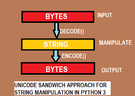
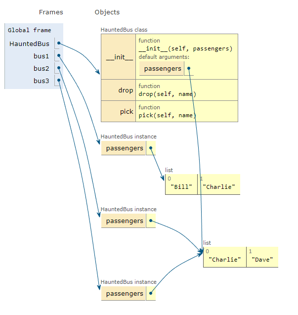

# Fluent Python by Luciano Ramalho

---

## Part I  - Prologue
## 1. The Python Data Model

---

## Part II - Data Structures
## 2. An Array of Sequences
## 3. Dictionaries and Sets
## 4. Text versus Bytes

---

## Part III - Functions as Objects
## 5. First-Class Functions
## 6. Design Patterns with First-Class Functions
## 7. Function Decorators and Closures

---

## Part IV - Object-Oriented Idioms
## 8. Object References, Mutability and Recycling
## 9. A Pythonic Object
## 10. Sequence Hacking, Hashing, and Slicing
## 11. Interfaces: From Protocols to ABCs
## 12. Inheritance: For Good or For Worse
## 13. Operator Overloading: Doing It Right

---

## Part V - Control Flow
## 14. Iterables, Iterators, and Generators
## 15. Context Managers and else Blocks
## 16. Coroutines
## 17. Concurrency with Futures
## 18. Concurrency with asyncio

---

## Part VI - Metaprogramming
## 19. Dynamic Attributes and Properties
## 20. Attribute Descriptors
## 21. Class Metaprogramming

---

# Part II - Data Structures

---

# 2. An Array of Sequences

## Overview of Built-In Sequences

There are 2 types of sequences:

* *Container sequences*: ```list```, ```tuple``` and ```collections.deque``` can hold items of different types.
* *Flat sequences*: ```str```, ```bytes```, ```bytearray```, ```memoryview``` and ```array.array``` hold items of one type.

*Container sequences* hold references to the objects that they contain while *flat sequences* simply just physically store the value of each item within its own memory.
*Flat sequences* are more compact but they can only hold primitive values.

Another way of grouping sequence types is by mutability:

* *Mutable sequences*: ```list```, ```bytearray```, ```array.array```, ```collections.deque``` and ```memoryview```
* *Immutable sequences*: ```tuple```, ```str``` and ```bytes```

## List Comprehensions and Generator Expressions

### List comprehensions

You can refer to list comprehensions as *listcomps* and generator expressions as *genexps*.

List comprehensions are a quick way of building a list. It's a much more quicker and readable way of building lists than using a classic for-loop.

Here is an example:

```Python
>>> even_numbers_to_100 = [x for x in range(101) if x % 2 == 0]
[0, 2, ..., 100]
```

List comprehensions, generator expressions and set & dict comprehensions have their own scope, just like functions.

Listcomps are also a lot easier to read when it comes to multiple loops.
Here is an example of the cartesian product using listcomps:

```Python
colors = ['black', 'white]
sizes = ['S', 'M', 'L']

tshirts = [(color, size) for color in colors for size in sizes]
print(tshirts)
"""
Output:

[('black', 'S'), ('black', 'M'), ('black', 'L'), ('white', 'S'), ('white', 'M'), ('white', 'L')]
"""
```

### Generator expressions

The difference between generator expressions and other types of comprehensions ( list, set or dict ) is that they are a lot faster since they only use generators. They don't build actual data structure inside the memory which makes them a lot faster but the only thing that you can do is iterate over its items, you can't manipulate the data inside of it.

> To initialize tuples, arrays and other types of sequences, you could also start from a listcomp, but a genexp saves memory because it yields items one by one using the iterator protocol instead of building a whole list just to feed another constructor.
> Genexps use the same syntax as listcomps, but are enclosed in parentheses rather than brackets.

Example of genexps:

```Python
(x for x in range(10**10+1) if x % 2 == 0)
```

This is a generator expression that built a generator with all the even numbers from 0 to 10**10. It looks a lot like a list comprehension but the difference is that it uses parentheses rather than brackets, as specified earlier.

It is also a lot faster. If you would try to execute the same comprehension but transform the genexp into a listcomp, it would have taken a lot longer since you would have been creating a whole new object inside the memory but the genexp only builds a generator.

Genexps are also widely used when working with files.

## Tuples as Records

Tuples can be used as immutable lists but also as records.
Each item in a tuple can hold data for one field meaning that you can assign specific values to specific fields and store them inside the tuple as a record.

> Tuples hold records: each item in the tuple holds the data for one field and the position of the item gives its meaning
> If you think of a tuple just as an immutable list, the quantity and the order of the items may or may not be important, depending on the context. But when using a tuple as a collection of fields, the number of items is often fixed and their order is always vital

## Tuple Unpacking

Tuple unpacking is used to unpack values from a tuple in specific variables.

> The most visible form of tuple unpacking is **parallel assignment**; that is, assigning items from an iterable to a tuple of variables, as you can see in this example:

```Python
>>> coordinates = (33.9425, -118.408056)
>>> latitude, longitude = coordinates # tuple unpacking
>>> latitude
33.9425
>>> longitude
-118.408056
```

If you don't care about a variable that is getting unpacked from a tuple you can give it the name ```_```:

```Python
>>> coordinates = (33.9425, -118.408056)
>>> _ , longitude = coordinates # tuple unpacking -> you only care about longitude
```

### Using ```*``` to grab excess items

When you are unpacking a tuple and there are a lot of values that you want to store into one single variable you can use the ```*``` operator.

> Defining function parameters with ```*args``` to grab arbitrary excess arguments is a classic Python feature.


```Python
>>> a, b, *rest = range(11)
>>> a
0
>>> b
1
>>> rest
[2, 3, 4, 5, 6, 7, 8, 9, 10]
```

> In the onctext of parallel assignment, the ```*``` prefix can be applied to exactly one variable, but it can appear in any position:

You can also use in the middle of unpacking:

```Python
>>> a, *rest, b = range(11)
>>> a
0
>>> b 
10
>>> rest
[1, 2, 3, 4, 5, 6, 7, 8, 9]
```

## Named Tuples

You can use named tuples to assign certain names to tuple fields and to directly grab their values using those specific names.

> Instances of a class that you build with ```namedtuple``` take exactly the same amount of memory as tuples because the field names are stored in the class. They use less memory than a regular object because they don't store attributes in a per-instance ```__dict__```.

## Tuples as Immutable Lists

The ```tuple``` supports all list methods that doesn't involve changing the data from within the data structure.

|Method|List|Tuple|Short description|
|------|----|-----|-----------------|
|```s.__add__(s2)```|||```s + s2``` - concatenation|
|```s.__iadd__(s2)```|| |```s += s2``` - in-place concatenation|
|```s.append(e)```|| |Append one element after last|
|```s.clear()```|| |Delete all items|
|```s.__contains__(e)```|||```e in s```|
|```s.copy()```|| |Shallow copy of the list|
|```s.count(e)```|||Count occurrences of an element|
|```s.__delitem__(p)```|| |Remove item at position ```p```|
|```s.extend(it)```|| |Append items from the iterable ```it```|
|```s.__getitem__(p)```|||```s[p]``` - get item at position|
|```s.__getnewargs__()```|||Support for optimized serialization with ```pickle```|
|```s.index(e)```|||Find position of first occurrence of e|
|```s.insert(p, e)```|||Insert element ```e``` before the item at position ```p```|
|```s.__iter__()```|||Get iterator|
|```s.__len__()```|||```len(s)``` - number of items|
|```s.__mul__(n)```|||```s * n``` - repeated concatenation|
|```s.__imul__(n)```|||```s *= n``` - in-place repeated concatenation|
|```s.__rmul__(n)```|||```n * s``` - reversed repeated concatenation|
|```s.pop([p])```|||Remove and return last item or item at optional position ```p```|
|```s.remove(e)```|||Remove first occurrence of element ```e``` by value|
|```s.reverse()```|||Reverse the order of the items in place|
|```s.__reversed__()```|||Get iterator to scna item from last to first|
|```s.__setitem__(p, e)```|||```s[p] = e``` - put ```e``` in position ```p```, overwriting existing items|
|```s.sort([key], [reverse])```|||Sort items in place with optional keyword arguments ```key``` and ```reverse```|

## Building Lists of Lists

When you are building a list of lists, especially using listcomps then you must pay atetntion and not use the same reference to the same list object.

Example of a tic tac toe 'board' done right:

```Python
>>> board = [['_'] * 3 for i in range(3)]
>>> board
>>> [['_', '_', '_'], ['_', '_', '_'], ['_', '_', '_']]
>>> board[1][2] = 'X'
>>> board
[['_', '_', '_'], ['_', '_', 'X'], ['_', '_', '_']]
```

You can see that the list has changed the way we wanted it to since every single list is its own object. We don't have multiple equal references inside the list of lists.

The following example will however not behave the way we indent it to:

```Python
>>> board = [['_'] * 3] * 3
>>> board
[['_', '_', '_'], ['_', '_', '_'], ['_', '_', '_']]
>>> board[1][2] = '0'
>>> board
[['_', '_', '0'], ['_', '_', '0'], ['_', '_', '0']]
```

This happens because we are building multiple lists that reference the same list object inside the heap.
What this actually does is:

```Python
row = ['_'] * 3
board = []
for i in range(3):
    board.appned(row)
```

## Augmented Assignment with Sequences

```>```

The augmented assignment operators ```+=``` and ```*=``` behave very differently depending on the first operand. To simplify the discussion, we will focus on augmented addition first (```+=```), but the concepts also apply to ```*=``` and to other augmented assignment operators.

The special method that makes ```+=``` work is ```__iadd__``` (for "in-place addition"). However, if ```__iadd__``` is not implemented, Python falls back to calling ```__add__```. Consider this simple expression:

```Python
>>> a += b
```

If *a* implements ```__iadd__```, that will be called.. In the case of mutalbe sequences (e.g, ```list```, ```bytearray```, ```array.array``` ), *a* will be changed in place (i.e, the effect will be similar to ```a.extend(b)``` ). However, when *a* does not implement ```__iadd__```, the expression ```a += b``` has the same effect as ```a = a + b```: this expression ```a + b``` is evealuted first, producing a new object, which is then bound to *a*. In other word, the identity of the object bound to *a* may or may not change, depending on the availability of ```__iadd__```. 

In general, for mutable sequences, it is a good bet that ```__iadd__``` is implemented and that ```+=``` happens in place. For immutalbe sequences, clearly there is no way for that to happen.

What i just wrote about ```+=``` also applies to ```*=```, which is implemneted via ```__imul__``.

Here is a demonstration of ```*=``` with a mutable sequence and then an immutable one:

```Python
>>> l = [1, 2, 3]
>>> id(l)
4311953800
>>> l *= 2
>>> l 
[1, 2, 3, 1, 2, 3]
>>> id(l)
4311953800
>>> t = (1, 2, 3)
>>> id(t)
4312681568
>>> t *= 2
>>> id(t)
4301348296
```

Repeated concatenation of immutable sequences is inefficient, becuase instead of just appending new items, the interpreter has to copy the whole target sequence to create a new one with new items concatenated.
```str``` is an exception to this description. Because string biulding with ```+=``` in loops is so common in the wild, CPython is optimized for this use case. ```str``` instances are allocated in memory with room to spare, so that concatenation does not require copying the whole string every time.

## Mutable sequences inside immutable sequences

Let's take a look at the following example:

```Python
t = (1, 2, [30, 40])
t[2] += [50, 60]
```

In this case, you will receive a ```TypeError``` and ```t``` will change to: ````1, 2, [30, 40, 50, 60]```.

You should never have mutable sequences inside immutable sequences since the operators will mess up.

> Augmented assignment is not an atomic operation

If you want to see the bytecode for what's happening under the hood use ```dis.dis()```:

```Python
dis.dis('t[2] += [50, 60]')
```

## list.sort and the sorted Built-In Function

The ```list.sort``` method sorts the items in place. That means that the sequence that you use it on is changed, it doesn't return a new sequence. Because of that, it **returns None**. It is important for methods that do something in place to return None to remind us that they don't return anything.

The ```sorted``` function however, builds a new sorted sequence of the given argument sequence.

> The ```list.sort``` method sorts a list in place - that is, without making a copy. It returns ```None``` to remind us that it changes the target object, and does not create a new list. 
> This is an important Python API convention: functions or methods that change an object in place should return ```None``` to make it clear to the caller that the object itself was chagned, and now new object was created. The same behavior can be seen, for example, in the ```random.shuffle``` function.

> The convention of returning ```None``` to signal in-place changes has a drawback: you cannot cascadde calls to those methods. In contrast, methods that return new objects (e.g, all ```str``` methods) can be cascaded in the fluent interface style.

> In contrast, the built-in function ```sorted``` creates a new list and returns it. In fact, it accepts any iterable object as an argument, including immutable sequences and generators. Regardless of the type of iterable given to ```sorted```, it always returns a newly created list.

Both ```list.sort``` and the ```sorted``` function have two optional keyword arguments:

* ```reverse```: If ```true```, it returns the sorted sequence in reversed order. Defaults to ```False```.
* ```key```: The ```key``` keyword argument is a function that will be applied to each item in the sequence. This can be very helpful for example when you have a sequence of objects and you want to sort them by a specific property.

## Managing Ordered Sequences with bisect

```>```

The ```bisect``` module offers two main functions - ```bisect``` and ```insort``` - that use the ***binary search algorithm*** to quickly find and insert item in any ***sorted sequences***.

### Searching with bisect

```bisect(haystack, needle)``` does a binary search for *needle* in a *haystack* - which must be a sorted sequence - to locate the position where *needle* can be inserted while maintaining *haystack* in ascending order. In other words, all items appearing up to that position are less than or equal to *needle*. You could use the result of ```bisect(haystack, needle)``` as the ```index``` argument to ```haystakc.insert(index, needle)``` - however, using ```insort``` does both steps and is faster.

### Inserting with bisect

Sorting is expensive, so once you have a sorted sequence, it's good to keep it that way. That is why ```bisect.insort``` was created.

You can use the ```bisect.insort(seq, item)``` to insert an ```item``` into a ```sequence``` in ascending order.

## Arrays

If a list only contains numbers, it's better to work with arrays ( ```array.array``` ). They ar emore efficient thatn lists and support all mutable sequence oprations. It also contains some additional methods for fast loading and saving ( e.g. ```.frombytes``` or ```.tofile``` )

> This module defines an object type which can compactly represent an array of basic values: characters, integers, floating point numbers. Arrays are sequence types and behave very much like lists, except that the type of objects stored in them is constrained. The type is specified at object creation time by using a type code, which is a single character. The following type codes are defined:

Here is the list of typecodes:


Whenever you start building an array, you must give it the underlying C type. You can also give it an optional initializer, which has to be an iterable. 

You can use methods like ```.tofile``` to put an entire array into a file ( using machine code ).

```Python
from array import array

with open("arrayfile.bin", "wb") as f:
    x = array('I', range(6))
    x.tofile(f)
```

The array data structure doesn't have the following methods in comparison to ```list```:

* ```clear()```
* ```copy()```
* ```__reversed__()```
* ```sort([key], [reverse])```

## Memory Views

```>```

The built-in ```memoryview``` class is a shared-memory sequence type that lets you handle slices of arrays wihtout copying bytes.

A memoryview is eseentially a generlized NumPy array structure in Python itlsef (without the math). It allows you to share memory between data-structures ( things like PIL images, SQLite databases, NumPy arrays, etc. ) without first copying. This is very important for large data sets.

Using notation similar to the ```array``` module, the ```memoryview.cast``` method lets you change the way multiple bytes are read or written as units without moving bits around ( just like the C ```cast``` operator ). ```memoryview.cast``` returns yet another ```memoryview``` object, alwyas sharing the same memory.

```Python
>>> numbers = array.array('h', [-2, -1, 0, 1, 2])
>>> memv = memoryview(numbers)
>>> len(memv)
5
>>> memv[0]
-2
>>> memv_oct = memv.cast('B')
>>> memv_oct.tolist()
[254, 255, 255, 255, 0, 0, 1, 0, 2, 0]
>>> memv_oct[5] = 4
>>> numbers
array('h', [-2, -1, 1024, 1, 2])
```

# 3. Dictionaries and Sets

> Hash tables are the engines behind Python's high-performance dicts.

Dictionaries and sets in python are implemented using hash-tables which makes them very fast and memory efficient.

## Generic Mapping Types

The ```collections.abc``` module provided the ```Mapping``` and ```MutableMapping``` abstract base classes to formalize the interfaces of ```dict``` and similar types.


Whenever you extend the built-in sequences, you usually directly extend the ```dict``` or ```collections.UserDict```. You'll rarely extend one of the ABCs. The ABCs make it easier to understand the interfaces.

> The main value of the ABCs is documenting and formalizing the minimal interfaces for mappings, and serving as criteria for ```isinstance``` tests in cod ethat needs to support mapping in a broad sense

```Python
>>> my_dict = {}
>>> isinstance(my_dict, abc.Mapping)
True
```

> Using ```isinstance``` is better than checking wheter a function argument is of ```dict``` type, because then alternative mapping types can be used.

All mapping types in python implement ```dict``` so the rule that keys must be *hashable* is a general rul in mapping. The values don't have to be *hashable*, only the keys.

> An object is hashable if it has a hash value which never changes during its lifetime ( it needs a ```__hash__()``` method ) and can be compaerd to other objects ( it needs an ```__eq__()``` method ). Hashable objects which compare equal must have the same hash value.

Given these ground rules, here are several ways of buildling dicts:

```Python
>>> a = dict(one=1, two=2, three=3)
>>> b = {'one': 1, 'two': 2, 'three': 3}
>>> c = dict(zip(['one', 'two', 'three'], [1, 2, 3]))
>>> d = dict([('two', 2), ('one', 1), ('three', 3)])
>>> e = dict({'three': 3, 'one': 1, 'two': 2})
>>> a == b == c == d == e
>>> True
```

## Dict Comprehensions

A *dictcomp* builds a dictionary by building **```key:value```** pairs from any iterable. Dict comps are build using curly braces ```{}```, unlike lists which use brackets ```[]``` and they need to be built using key value pairs:

```Python
some_list = list(zip(range(1, 11), range(11, 21)))
dictcomp = {a: b for a,b in some_list}
print(dictcomp)
# {1: 11, 2: 12, 3: 13, 4: 14, 5: 15, 6: 16, 7: 17, 8: 18, 9: 19, 10: 20}
```

## Mapping with Flexible Key Lookup

Sometimes you might need a mapping that returns a default value whenever a key is not found. You can solve this problem by:

* Using a ```collections.defaultdict``` instead of a plain ```dict```.
* Subclassing the basic ```dict``` type and adding overriding the  ```__missing__``` method.

> The mechanisms that makes ```defaultdict``` work by calling ```default_factory``` is actually the ```__missing__``` special method, a feature supported by all standard mapping types that we discuss next.

## The ```__missing__``` method

The ```__missing__``` method is not defined in the standard ```dict``` implementation but ```__dict__``` is aware of it. If you build a subclass that inherits from ```dict``` and provide a ```__missing__``` method, the standard ```dict.__getitem__``` will cal it whenever the given key is not found, instead of raising ```KeyError```.

> The ```__missing__``` method is just called by ```__getitem__``` (i.e., for the ```d[k]``` operator ). The presence of a ```__missing__``` method has no effect on the behavior of other methods that look up keys, such as ```get``` or ```__contains__``` ( which implementes the ```in``` operator ). This is why the ```default_factory``` or ```defaultdict``` works only with ```__getitem__```, as noted in the warning at the end of the previous section.

Example of an implementation of ```__missing__```:

```Python
class Test(dict):
    def __missing__(self, key):
        print("The key {0} couldn't be found. You are now inside the __missing__ method.".format(key))


if __name__ == "__main__":
    t = Test()
    t['a'] = 1
    t['b'] = 2
    t['c'] = 3

    print(t.keys())
    x = t['d']
    print("x is -- > {0}".format(x))

"""
Output:

dict_keys(['a', 'b', 'c'])
The key d couldn't be found. You are now inside the __missing__ method.
x is -- > None
"""
```

Another implementation example of the ```__missing__``` method:

```Python
class StrKeyDict0(dict):
    def __missing__(self, key):
        """Overriding fordict_keys(['a', 'b', 'c'])"""
        print("Entered missing with key -- > {0}".format(key))
        if isinstance(key, str):
            print("The instance of the missing key is of type string")
            raise KeyError(key)

        print("The instance of the missing key is not of type string")
        return self[str(key)]

    def get(self, key, default=None):
        """overriding for dict.get(key)"""
        try:
            return self[key]
        except KeyError:
            return default

    def __contains(self, key):
        """Overriding for >key in dict<"""
        return key in self.keys() or str(key) in self.keys()
```

## Subclassing ```UserDict```

Whenever we want to build a new mapping that inherits from ```dict``` it's almost always better to make it inherit from ```UserDict```.

The main reason is that the built-in ```dict``` class has some implementation shortcuts that force is to override methods and if we don't then bugs will occurr on the way that are very hard to find.

**```UserDict``` doesn't inherit from ```dict```, it has a ```dict``` instance inside of it that holds our items.**

Here is an example of how ```UserDict``` simplifies our ```StrKeyDict``` from the previous example:

```Python
class StrKeyDict0(dict):
    def __missing__(self, key):
        """Overriding fordict_keys(['a', 'b', 'c'])"""
        print("Entered missing with key -- > {0}".format(key))
        if isinstance(key, str):
            print("The instance of the missing key is of type string")
            raise KeyError(key)

        print("The instance of the missing key is not of type string")
        return self[str(key)]

    def get(self, key, default=None):
        """overriding for dict.get(key)"""
        try:
            return self[key]
        except KeyError:
            return default

    def __contains(self, key):
        """Overriding for >key in dict<"""
        return key in self.keys() or str(key) in self.keys()
```

> ```UserDict``` stores all keys as ```str``` and avoids unplesant surprises if the instance is built or updated with data containing nonstring keys.

```Python
class StrKeyDict(collections.UserDict):
    def __missing__(self, key):
        if isinstance(key, str):
            raise KeyError(key)

        return self[str(key)]

    def __contains__(self, key):
        return str(key) in self.data

    def __setitem__(self, key, item):
        self.data[str(key)] = item
```

This makes things a lot simpler since ```__contains__``` doesn't have to double check if the key or if the string version of the key is in keys it can just directly check the key in the ```data``` property of the ```UserDict``` which is the internal ```dict``` that holds our items.
The same goes for ```__setitem__``` since we can directly set all the items as strings, this is also what makes ```__contains__``` a lot easier to implement.

> Because ```UserDict``` subclasses ```MutableMapping```, the remaining methods that make ```StrKeyDict``` a full-fledged mapping are inherited from ```UserDict```, ```MutableMapping``` or ```Mapping```. The latter have several useful concrete methods, in spite of being abstract base classes ( ABCs ).

In the ```MutableMapping``` and ```Mapping``` classes there are 2 methods that are worth noting (```>```):

* **```MutableMapping.update```**
    * This powerful method can be called directly but is also used by ```__init__``` to load the instance from other mappings, from iterables of ```(key, value)``` pairs, and keyword arguments. Because it uses ```self[key] = value``` to add items, it ends up calling our implementation of ```__setitem__```.
* **```Mapping.get```**
    * In ```StrKeyDict0```, we had to code our own get to obtain results consistent with ```__getitem__```, but in the example were we used ```UserDict```, we inherited ```Mapping.get```, which is implemented exactly like ```StrKeyDict0.get``` ( the version where we inherited directly from the built-in ```dict``` class ).

## Immutable Mappings

Since *Python 3.3*, the ```types``` module has added a new wrapper class called ```MappingProxyType``` that receives a mapping and returns a ```mappingproxy``` instance. This instance is a ***read-only*** and ***dynamic*** view of the original mapping. That menas that we can't change anything to the original mapping but since it's dynamic, every time we make a change to the original mapping, the ```mappingproxy``` instance will have that change too.

Example:

```Python
from types import MappingProxyType

d = {1: 'A'}
d_proxy = MappingProxyType(d)
print(d)
print(d_proxy[1])
try:
    d_proxy[2] = 'B'
except TypeError as e:
    print(e)

d[2] = 'B'
print(d_proxy)
print(d_proxy[2])

"""
Output:
{1: 'A'}
A
'mappingproxy' object does not support item assignment
{1: 'A', 2: 'B'}
B
"""
```

## Sets items must be hashable


## ```set``` Literals

The syntax for ```set``` literals looks just like the math notation:

```Python
>>> a = {1, 2, 3}
>>> b = {1}
```

The only difference is that we can't have an empty set. In order to build an empty set you must use the ```set()``` constructor. If you are writing ```{}``` you are not creating an empty ```set```, you are creating an empty ```dict```.

```Python
>>> c = set()
```

Using the literal syntax ```{1, 2, 3}``` is ***faster than using the constructor***: ```set([1, 2, 3])```. That is because Python has to first build a list, find the set name and the finally pass the list, which also occupies memory inside the set. If you would be using the literal syntax, Python would use the special ```BUILT_SET``` bytecode.

> Literal ```set``` syntax like ```{1, 2, 3}``` is both ***faster and more readable*** than calling the constructor (e.g., ```set([1, 2, 3]))```. The latter form is slower because, to evaluate it, Python has to look up the ```set``` name to fetch the constructor, then build a list, and finally pass it to the constructor. In contrast, to process a literal like ```{1, 2 ,3}```, Python runs a specizlied ```BUILD_SET``` bytecode.

This is the difference in bytecode between the two operations:

```Python
>>> from dis import dis
>>> dis('{1}')
  1           0 LOAD_CONST               0 (1)
              2 BUILD_SET                1
              4 RETURN_VALUE
>>> dis('set([1])')
  1           0 LOAD_NAME                0 (set)
              2 LOAD_CONST               0 (1)
              4 BUILD_LIST               1
              6 CALL_FUNCTION            1
              8 RETURN_VALUE
```

There is however no special syntax to create ```frozenset``` instances, they must be buillt using the constructor:

```Python
>>> frozenset(range(10))
frozenset({0, 1, 2, 3, 4, 5, 6, 7, 8, 9})
```

## Set Comprehensions

Set comprehensions were added together with dict comprehensions in *Python 2.7*. ```set``` and ```dict``` comprehensions are very similar. The difference between them is that ```dict``` comprehensions need *key-value* pairs in order to be built while ```set``` comprehensions only need one value:

```Python
>>> even_number_set = {i for i in range(101) if i % 2 == 0}
>>> even_number_set
{0, 2, 4, 6, 8, 10, 12, 14, 16, 18, 20, 22, 24, 26, 28, 30, 32, 34, 36, 38, 40, 42, 44, 46, 48, 50, 52, 54, 56, 58, 60, 62, 64, 66, 68, 70, 72, 74, 76, 78, 80, 82, 84, 86, 88, 90, 92, 94, 96, 98, 100}
```

## Set Operations

The following diagram represents an overview of the methods that you can expect from mutable and immutable sets.

> Note that some operators and methods perform in-place changes on the target set (e.g, ```&=```, ```difference_update```, etc. ). Such operations make no sense in the ideal world of mathematical sets, and are not implemented in ```frozenset```.


## Hash Tables in Dictionaries

```>```

This is a high-level view of how Python uses a hash table to ipmlement a ```dict```. Many details are omittde - the ```CPython``` code has some optimization tricks - but the overall description is accurate.

A hash table is a sparse array (i.e, an array that always has empty cells). In standard data structure texts, the cells in a hash table are often called "buckets". In a ```dict``` hash table, there is a bucket for each item and it contains two fields: a reference to the key and a reference to the value of the item. BEcause all buckets have teh same size, access to an individual bucket is done by offset.

Python tries to keep at least 1/3 of the buckets empty; if the hash table beocmes too crowded, it is copied to a new location with room for more buckets.

To put an item in a hash table, the first step is to calculate the *hash value* of the item key, which is done with the ```hash()``` built-in function, explained next.

### Hashes and equality

The ```hash()``` built-in function works directly with built-in types and falls back to calling ```__hash__``` for user-defined types. If two objects compare equal, their has hvalues must also be equal, otherwise the has htable algorithm does not work. For example: because ```1 == 1.0``` is ```true```, ```hash(1) == hash(1.0)``` must also be true, even though the internal representation of an ```int``` and a ```float``` are very different. ( Because we just mentioned ```int```, here is a CPython implementation detail: the hash value of an int that fits in a machine word is the value of the ```int``` itself )

Also, to be effective as hash table indexes, hash values should scatter around the index space as much as possible. This means that, ideally, objects that are similar but not equal should have hash values that different widely.

Starting with *Python 3.3*, a random salt vlaue is added to the hashes of ```str```, ```bytes``` and ```datetime``` objects. The salt value is constant within a Python process but varies between interpreter runs. The random salt is a security measure to prevent a DOS attack. Details are in a note in the documentation for the ```__hash__``` special method.

### The hash table algorithm

To fetch the value at ```my_dict[search_key]```, Python calls ```hash(search_key)``` to obtain the *hash value* of ```search_key``` and uses the least significant bits of that number as an offset to look up a bucket in the hash table ( the number of bits used depends on the current size of the table ). If the found bucket is empty, ```KeyError``` is raised. Otherwise, the found bucket has an item - a ```found_key:found_value``` pair- and then Python checks wheter ```search_key == found_key```. If they match, that was the item sought: ```found_value``` is returned.

However, is ```search_key``` and ```found_key``` do not match, this is a *hash collision*. This happens because a hash function maps arbitrary objects to a small number of bits, and -in addition- the hash table is indexed with a subset of those bits. In order to resolve the collision, the algorithm then takes different bits in the hash, massages them in a particular way and uses the result as an offset to look up a different bucket. If that is empty, ```KeyError``` is raised; if not, either the keys match and the item value is returned or the collision resolution process is repeated.

Here is a diagram of the algorithm:


The process to insert or update an item is the same, except that when an empty bucket is located, the new item is put there and when a bucket with a matching key is found, the value in that bucket is overwritten with the new value.

Additionally, when inserting items, Python may determine that the hash table is too crowded an rebuild it to a new location with more room. As the hash table grows, so does the number of hash bits used as bucket offsets and this keeps the rate of collisions low.

This implementation may seem like a lot of work, but even with millions of items in a ```dict```, many seraches happen with no collisions and the average number of collisions per search is between one and two. Under normal usage, even the unluckiest keys can be found after a handful of collisions are resolved.

## Practical Consequences Of How Dict Works

### Keys must be hashable objects

An object is hashable if all of these requirements are met:

1. It supports the ```hash()``` function via a ```__hash__()``` method that always returns the same value over the lifetime of the object.
2. It supports equality via an ```__eq__()``` method.
3. If ```a == b``` is ```True``` then ```hash(a) == hash(b)``` must also be ```True```.

User-defined types are hashable by default because their has value is their ```id()``` and they all compare not equal.

If you implement a class with a custom ```__eq__``` method and you want the instances to be hashable, you must also implement a suitable ```__hash__```, to make sure that when ```a == b``` is ```True``` then ```hash(a) == hash(b)``` is also ```True```. Otherwise you are breaking an invariant of the hash table algorithm, with the grave consequence that dicts and sets will not handle your objects reliably. On the other hand, if a class has a custom ```__eq__``` that dpeneds on mutable state, its instnaces are not hashable and you must never implement a ```__hash__``` method in such a class.

### ```dict```s have significant memory overhead

Because a ```dict``` uses a hash table internally and hash table must be sparse to work, they are not space efficient. For example, if you are handling a large quantity of recors, it makes sense to store them in a list of tuples or named tuples instead of using a list of dictionaries in JSON style, with one ```dict``` per record. Replacing dicts with tuples reduces the memory usage in two ways: by removing the overhead of one hash table per record and by not sotring the field names again with each record.

For user-define types, the ```__slots__``` class attribute changes the storage of instance attributes from a ```dict``` to a ```tuple``` in each instance.

Keep in mind we are talking about space optimizations. If you are dealing with a few million objects and your machine has gigabytes of RAM, you should postpone such optimizations until they are actually waranted. ***Optimization is the altar where maintainability is sacrificed.***

### Key search is very fast

The ```dict``` implementation is an example of trading space for time: dictionaries have significant memory overhead, but they provide fast access regardless of the size of the dictionary - as long as it fits in memory.

### Key ordering depends on insertion order

When a hash collision happens, the second key ends up in a position that it would not normally occupy if it has been inserted first. So, a ```dict``` built as ```dict([(key1, value1), (key2, value2)])``` compares equal to ```dict([(key2, value2), (key1, value1)])``` but their key ordering may not be the same if the hashes of ```key1``` and ```key2``` collide.

### Adding items to a ```dict``` may change the order of existing keyso

Whenever you add a new item to a dict, the Python interpreter may decide that the hash table of that dictionary needs to grow. This entails building a new, bigger hash table and adding all current items to the new table. During this process, new  ( but different ) hash collisions may happen, with the result that the keys are likely to be ordered differently in the new hash table. All of this is implementation-dependent, so you cannot reliably predict when it will happen. If you are iterating over the dictionary keys and changing them at the same time, your loop may not scan alll the items as expected-not even the items that were already in the dictionary before you added to it.

This is why modifying the contents of a ```dict``` while iterating through it is a bad idea. If you need to scan and add items to a dictionary, do it in two steps: read the ```dict``` from start to finish and collect the needed additions in a second ```dict```. Then udpate the first one with it.

In Python 3, the ```.keys()```, ```.items()``` and ```.values()``` methods return dictionary views, which behave more like sets than the lists returned by these methods in Python 2. Such views are also dynamic: they do not replicate the contents of the ```dict``` and they immediately reflect any change to the ```dict```.

## How Sets Work - Practical Consequences

```>```

The ```set``` and ```frozenset``` types are also implemented with a hash table, except that each bucket holds only a reference to the element ( as if it were a key in a ```dict```, but without a value to go with it ). In fact, before ```set``` was added to the language, we often used dictionaries with dummy values just to perform fast membership tests on the keys.

We can summarize sets in a few words:

* Set elements must be hashable objects.
* Sets have a significant memory overhead.
* Membership testing is very efficient.
* Element ordering depends on insertion order.
* Adding elements to a set may change the order of other elements.

# 4. Text versus Bytes

## Character Issues

It is very easy to define a string. A string is a sequence of characters. It's however hard to describe what a character is.

The Unicode standards explicitly separates the identity of characters from specific bytes representations:

* The identity of a character - its *code point* - is a number from 0 to 1.114.111 ( base 10 ), shown in the Unicode standard as 4 to 6 hexadecimal digits with a "U+" prefix. For example, the code point for the letter A is U+0041, the Euro sign is U+20AC and the musical symbol G clef is assigned to code point U+1D11E.
* The actualy butes that represent a character depend on the *encoding* in use. ***An encoding is an algorithm that converts code point to byte sequences and vice versa***. The code point for A ( U+0041 ) is encoed as the single byte *\x41* in the UTF-8 encoding, or as the bytes *\x41\x00* in UTF-16LE encoding. As another example, the Euro sign ( U+20AC ) becomes three bytes in UTF-8 - *\xe\x82\xac* - but in UTF-16 it is encoded as two bytes: *\xac\x20*.

> ***Converting from code points to bytes is encoding; converting from bytes to code points is decoding.***

## Byte Essentials

There are two built-in types for binary sequences: the ```bytes``` type and the older ```bytearray``` type.

Each item in ```bytes``` or ```bytearray``` is an integer from 0 to 255. A slice of a binary sequences always produces a binary sequence of the same type - including slices of length 1:

```Python
>>> cafe = bytes('café', encoding='utf-8')
>>> cafe
b'caf\xc3\xa9'
>>> cafe[0]
99
>>> cafe[:1]
b'c'
>>> cafe_arr = bytearray(cafe)
>>> cafe_arr
bytearray(b'caf\xc3\xa9')
>>> cafe_arr[-1:]
bytearray(b'\xa9')
```

```>```

Although binary sequences are really sequences of integers, their literal notation reflects the fact that ASCII text is often embedded in them .Therefore, three different displays are used, depending on each byte value:

* For bytes in the printable ASCII range - from space to ```~``` - the ASCII character itself is used.
* For bytes conrresponding to tab, newline, carriage return and ```\``` ,  the esacpe sequences ```\t```, ```\n```, ```\r```, ```\\``` are used.
* For every other byte vlaue, a hexadecimal escape sequences is used (e.g., ```\x00``` is the null byte.)

Both ```bytes``` and ```bytearray``` support every ```str``` method except those that do formatting ( ```format```, ```format_map``` ) and a few other that depend on Unicode data, including ```casefold```, ```isdecimal```, ```isidentifier```, ```isnumeric```, ```isprintable``` and ```encode```. This means that you can use familiar string methods. The ```%``` operator does not work with binary sequences in Python 3.0 to 3.4, but should be supported in version 3.5 according to PEP 461.

Boinary sequences have a class method that ```str``` doesn't have, called ```fromhex```, which builds a binary sequence by parsing pairs of hex digits optionally separated by spaces:

```Python
>>> bytes.fromhex('31 4B CE A9')
b'1K\xce\xa9'
```

The other ways of building ```bytes``` or ```bytearray``` instances are calling their constructors with:

* A ```str``` and an ```encoding``` keyword argument.
* An iterable providing items with values from 0 to 255.
* A single integer, to create a binary sequence of that size initialized with null bytes.
* An object that implements that buffer protocol ( e.g, ```bytes```, ```bytearray```, ```memroyview```, ```array.array``` ); this copies the bytes from the source object to the newly created binary sequence.

Buildling a binary sequence from a buffer-like object is a low-level operation that may involve type casting:

```Python
>>> import array
>>> numbers = array.array('h', [-2, -1, 0, 1, 2])
>>> octets = bytes(numbers)
>>> octets
b'\xfe\xff\xff\xff\x00\x00\x01\x00\x02\x00'
```

Creating a ```bytes``` or ```bytearray``` object from any buffer-like source will alwyas copy the bytes. In contrats, ```memoryview``` objects let you share memroy between ibnary data strucutres. To extract structured information from binary sequences, the ```struct``` module is invaluable.

## Structs and Memory Views

```>```

The ```struct``` module provides functions to parse packed bytes into a tuple of fields of different types and to perform the opposite conversion, from a tuple into packed bytes. ```struct``` is used with ```bytes```, ```bytearray``` and ```memoryview``` objects.

The ```memoryview``` class does not ley you create or store byte sequences, but provides shared memory access to slices of data from other binary sequences, packed arrays and buffers such as Python Imaging Library (PIL) images, without copying the bytes.

```Python
import struct

if __name__ == '__main__':
    fmt = '<3s3sHH'  # struct format: < little-endian; 3s3s two sequences of 3 bytes; HH two 16- bit integers
    with open('earth.gif', 'rb') as fp:
        img = memoryview(fp.read())  # create memoryview from file contents in memory

        header = img[:10]  # then another memoryview by slicing the first one; no bytes are copied here
        print(bytes(header))  # convert the bytes for display only; 10 bytes are copied here.
        print(
            struct.unpack(fmt, header)  # unpack memoryview into tuple of: type, version, width and height
        )

        del header  # Delete references to release the memory associated with the memoryview instances

```

Note that slicing a ```memoryview``` returns a new ```memoryview```, without coyping bytes.

## Basic Encoders/Decoders

```>```

The Python distribution bundles more htan 100 *codecs* (encoder/decoder) for text to byte conversion and vice versa. Each codec has a name, like 'utf-8' and often aliases, such as 'utf8', 'utf_8' and 'U8' which you can use as the *encoding* argument in functions like ```open()```, ```str.encode()```, ```bytes.decode9)``` and so on.

## Understanding Encode/Decode Problems

```>```

Although there is a generic ```UnicodeError``` exception, the error reported is almost always more specific: either a ```UnicodeEncodeError``` ( when converting ```str``` to binary sequences ) or a ```UnicodeDecodeError``` ( when reading binary sequences into ```str``` ).

The first thing to note when you get a Unicode error is the exact type of the exception. Is it a ```UnicodeEncodeError```, a ```UnicodeDecodeError``` or some other error (e.g., ```SyntaxError```) that mentions an encodign problem? ***To solve the problem you have to understand it first.***

### Coping with ```UnicodeEncodeError```

Most non-UTF codecs handle only a small subset of the Unicode characters. When converting text to bytes, if a character is not defined in the target encoding, ```UnicodeEncodeError``` will be raised, unless special handling is provided by passing an ```errors``` argument to the encoding method or function.

```Python
if __name__ == '__main__':
    city = "Söme City"
    print(city.encode("utf-8"))
    print(city.encode("utf-16"))
    print(city.encode("cp437"))
    print(city.encode("cp437", errors='ignore'))
    print(city.encode("cp437", errors='replace'))
    print(city.encode("cp437", errors='xmlcharrefreplace'))
```

* The ```error='ignore'``` handler silently skips characters that cannot be encoded; this is usually a very bad idea.
* When encoding, ```error='replace'``` substitutes unencodable characters with ```'?'```; data is lost, but users will know something is amiss.
* ```'xmlcharrefreplace'``` replaces unencodable characters with an XML entity.

The ```codecs``` error handling is extensible. You may register extra strings for the ```errors``` argument by passing a name and an error handling functions to the ```codecs.register_error``` function.

### Coping with ```UnicodeDecodeError```

Not every byte holds a valid ASCII character and not every bute sequence is valid UTF-8 or UTF-16; therefore, when you assume one of these encodings while converting a binary sequence to text, you will get a ```UnicodeDecodeError``` if unexpected bytes are found.

On the other hand, many legacy 8-bit encodigns like *'cp1252'*, *'iso8859_1'* and *'koi8_r'* are able to decode any stream of bytes, including random noise, without generating errors. Therefore, if your program assumes the wrong 8-bit encoding, it will silently decode garbage.

> Garbled characters are known as gremlins or mojibake ( 文字化け )

### ```SyntaxError``` when loading modules with unexpected encoding

UTF-8 is the default source encodign for Python 3, just as ASCII was the default for Python 2. If you load a ```.py``` module containing non-UTF8 data and no encoding declaration, you get a message like this:

```SyntaxError: Non-UTF-8 code starting with '\xe1' in file x.py on line 1, but no encoding declared; see http://python.org/dev/peps/pep-0263 for details.```

Because UTF-8 is widely deployed in GNU/Linux and OSX systems, a likely scenario is opening a ```.py``` file created on Windows with ```cp1252```. Note that this error happens even in Python for Winodws, because the default encoding for Python 3 is UTF-8 across all platforms.

To fix this problem, add a magic ```coding``` comment at the top of the file:

```Python
# coding: cp1252

print("Hello world!)
```

Now that Python 3 source code is no longer limited to ASCII and defaults to the excellent UTF-8 encoding, the best 'fix' for source code in legacy encodings like 'cp1252' is to convert them to UTF-8 already and not bother with the ```coding``` arguments. 

## How to discovers the encoding of a byte sequence

```>```

You can't discover the encoding of a bytes sequence, you must be told what it is.

Some communication protocols and file formats, like HTTP nad XML, contain headers that explicitly tell us how the content is encoded. You can be sure that some bytes streams are not ASCII because bthey contain byte values over 127 and the way UTF-8 and UTF-16 are built also limits the possible byte sequences. But even then, you can never be 100% positive that a binary file is ASCII or UTF-8 just because certain bit patterns are not there.

However, considering that human languages also have their rules and restrictions, once you assumed that a stream of bytes is human *plain text* it may be possible to sniff out its encoding iusing heuristics and statistics. For example, if ```b'\x00'``` bytes are common, it is probably a 16- or 32- bit encoding, and not an 8-bit scheme, because null characters in plain text are bugs; when the bytes sequences ```b'\x20\x00'``` appears often, it is likely to be the space character (U+0020) in a UTF-16LE encoding, rather than the boscure U+200 EN QUAD character.

That is how the package Chardet - The Universal Character Encoding Detector works to identify one of 30 supported encodings. Chardet is a Python library that you can use in your program but also includes a command-line utility, ```chardetect```.

Although binary sequences of encoded text usually don't carry explicit hints of their encoding, the UTF formats may prepend a byte textual content.

## BOM: A Useful Gremling

```>```

```Python
>>> u16 = "El Niño".encode("utf-16")
>>> u16
b'\xff\xfeE\x00l\x00 \x00N\x00i\x00\xf1\x00o\x00'
```

The *BOM* - byte-order mark - is denoting the "little-endian" byte ordering of the Intel CPU where the encoding was performed.

On a little-endian machine, for each code points the last significant bytes comes first: the letter 'E', code point U+0045 (decimal 69), is encoded in byte offsets 2 and 3 as 69 and 0:

```Python
>>> list(16)
[255, 254, 69, 0, 108, 0, 32, 0, 78, 0, 105, 0, 241, 0, 111, 0]
```

On a big-endian PCU, the encoding would be reversed; 'E' would be encoded as 0 and 69.

To avoid confusing, the UTF-16 encoding preprends the text to be encoded with the speical character ```ZERO WIDTH NO-BREAK SPACE``` (U+FEFF), which is invisible. On a little-endian system, that is encoded as ```b'\xff\xfe``` (decimal 255, 254). Because, by design, there is no U+FFFE character, the byte sequence ```b'\xff\xfe'``` must mean the ```ZERO WIDTH NO-BREAK SPACE``` on a little-endian encoding, so the codec knows which byte ordering to use.

There is variant of UTF-16 - UTF-16LE - that is explicitly little-endian and another one explicilty big-endian, UTF-16BE. If you use them, a BOM is not generated:

```Python
>>> u16le = "El Niño".encode("utf-16le")
>>> list(u16le)
[69, 0, 108, 0, 32, 0, 78, 0, 105, 0, 241, 0, 111, 0]
>>> u16be = "El Niño".encode("utf-16be")
>>> list(u16be)
[0, 69, 0, 108, 0, 32, 0, 78, 0, 105, 0, 241, 0, 111]
```

If present, the BOM is supposed to be filetered by the UTF-16 codec, so that you only get the actual text contents of the file without the leading ```ZERO WIDTH NO-BREAK SPACE```. The standard says that if a file is UTF-16 and has no BOM, it should be assumed to be UTF-16BE (big-endian). However, the Intel x86 architecture is little-endian, so there is plentl of little-endian UTF-16 with no BOM in the wild.

This whole issue of endianness only affects encodings that use words of more than on e byte, like UTF-16 and UTF-32. One big advantage of UTF-8 is that it produces the same byte sequence regardless of machine endianness, so no BOM is needed. Nevertheless, some Windows applications add the BOM to UTF-8 files anyway - and Excel depends on the BOM to detect a UTF-8 file, otherwise it assumes the content is encoded with a Windows codepage. The character U+FEFF encoded in UTF-8 is the three-byte sequence ```b'\xef\xbb\xbf'```. So if a file starts with those three bytes, it is likely to be a UTF-8 file with a BOM. However, Python does not automatically assumes a file is UTF-8 just because it starts with ```b'\xef\xbb\xbf'```.

## Handling Text Files

```>```

The best practice for handling text is the "Unicode Sandwhich":




This means that ```bytes``` should be decoded to ```str``` as early as possible on input (e.g. when opening a file for reading). The "meat" of the sandwich is the business logic of your program, where text handling is done exclusively on ```str``` objects. You should never be encoding or decoding in the middle of other processing. On output, the ```str``` are encoded to bytes as late as possible. Most web frameworks work like that and we rarely touch ```bytes``` when using them. In Django, for example, your views should output Unicode ```str```; Django itself takes care of encodign the response to ```bytes```, using UTF-8 by default.

Python 3 makes it easier to follow the advice of the Unicode sandwich, becuase the ```open``` built-in does the necessary decoding when reading and encoding when writing files in text mode, so all you get from ```my_file.read()``` and pass to ```my_file.write(text)``` are ```str``` objects.

Therefore, using text file is simple. But if you rely on default encodings you will get bitten.

Example:

```Python
>>> open('cafe.txt', 'w', encoding='utf-8').write("café")
4
>>> open("cafe.txt").read()
'café'
```

The bug: I specified UTF-8 encodign when writing the filie but failed to do so when reading it, so PYthon assumed the system default encoding - Windows 1252 - and the trailing bytes in the file were decoded as characters 'é' instead of 'é'.

> Code that has to run on multiple machines or on multiple occasions should never depend on encoding defaults. Always pass an explicit ```encoding=``` argument when opening text files, because the default may change from one machine to then next, or form one day to the next.

This is how you could fix the bug:

```Python
import os

if __name__ == '__main__':
    fp = open("cafe.txt", "w", encoding="utf-8")
    print(fp)  # 1. By default, >open< operators in text mode and returns a >TextIOWrapper< object.
    fp.write("café")  # 2. The write method on a >TextIOWrapper< returns the number of Unicode characters written.
    fp.close()

    print(os.stat("cafe.txt").st_size)  # 3.  >>os.stat<< reports that the file holds 5 bytes; UTF-8 encodes 'é' as 2 bytes, 0xc3 and 0xa9

    fp2 = open("cafe.txt")
    print(fp2)  # 4. Opening a text file with no explicit encoding returns a >TextIOWrapper< with the encoding set to a default from the locale
    print(fp2.encoding)  # 5.  A >TextIOWrapper< object has an encoding attribute that you can inspect: cp1252 in this case
    print(fp2.read())  # 6. In the Windows >cp1252< encoding, the bytes 0xc3 is an "A" ( A with tilde ) and 0xa9 is the copyright sign
    fp2.close()

    fp3 = open("cafe.txt", encoding="utf-8")  # 7. Opening the same file with the correct encoding
    print(fp3)
    print(fp3.read())  # 8. The expected result: the same four Unicode characters for 'café'
    fp3.close()

    fp4 = open("cafe.txt", "rb")  # 9. The >'rb'< flag opens a file for reading in binary mode
    print(fp4)  # 10. The returned object is a >BufferedReader< and not a >TextIOWrapper<
    print(fp4.read())  # 11. Reading that returns bytes, as expected
```

## Encoding defaults: A Madhouse

```>```

The Python Unicode HOWTO says:

> on Windows, Python uses the name ```mbcs``` to refer to whatever the currently configured encoding is.

 The acronym MBCS stands for Multi Byte Character Set, which for Microsoft are the lgacy variable-width encodings like *gb2312* or *Shift_JIS* but not *UTF-8*.

> On GNU/Linux and OSX all of these encodings are s et to UTF-8 by default and have been for several years so I/O handles all Unicode characters. On Winodws, not only are different encodings used in the same system, but they are usually codepages like *'cp850'* or *'cp1252'* that support only ASCII with 127 additional characters that are not teh same from one encoding to the other. Therefore, Windows users are far more likely to face encoding errors unless they are extra careful.

To summarize, the most important encoding settings is that returned by ```locale.getpreferredencoding()```: it is default for opening text files and for ```sys.stdout/stdin/stderr``` when they are redirected to files. However, the documentation reads:

> ```locale.getpreferredencodign(do_setlocale=True)```
> Return the encoding used for text data, according to user preferences. User preferences are expressed differently on different systems and might not be available programmatically on some systems, so this function only returns a guess. [...]

***Therefore, the best advice about encoding defaults is : do not rely on them.***

## Normalizing Unicode for saner comparisons

```>```

String comparisons are complicated by the fact that Unicode has combining characters: diacritics and other marks that attach to the preceding character, appearing as one when printed.

For example, the word 'café' may be composed in two ways, using four or fiv code points, but the result looks exactly the same:

```Python
>>> s1 = 'café'
>>> s2 = 'cafe\u0301'
>>> s1, s2
('café', 'café')
>>> len(s1), len(s2)
(4, 5)
>>> s1 == s2
False
```

The code point U+0301 is the *COMBINING ACUTE ACCENT*. Using it after "e" renderes "é". ***In the Unicode standard, sequences like "é" and "e\u0301" are called "canonical equivalents"*** and applications are supposed to treat them as the same. But Python sees two different sequence of code points and considers them not equal.

The solution is to use ***Unicode normalization***, provided by the ```unicodedata.normalize``` function. The first argument to that function is one of four strings: ***'NFC', 'NFD', 'NFKC', 'NFKD'***. 

***Normalization Form C ( NFC ) composes the code points to produce the shortes equivalent strin***, while ***NFD decomposes, expanding composed characters into base characters and separate combining characters***. Both of these normalizations make comparisons work as expected:

```Python
>>> from unicodedata import normalize
>>> s1 = "café" # composed "e" with acute accent
>>> s2 = "cafe\u0301" # decomposed "e" and acute accent
>>> len(s1), len(s2)
(4, 5)
>>> len(normalize('NFC', s1)), len(normalize('NFC', s2))
(4, 4)
>>> len(normalize('NFD', s1)), len(normalize('NFD', s2))
(5, 5)
>>> normalize('NFC', s1) == normalize('NFC', s2)
True
>>> normalize('NFD', s1) == normalize('NFD', s2)
True
```

Western keyboards usually generate composed characters, so text typed by users will be in NFC by default. However, to be safe, it may be good to sanitize strings with ```normalize('NFC', user_text)``` before saving. NFC is also the normalization form recommended by the W3C in Character Model for the World Wide Web: String Matching and Searching (https://www.w3.org/TR/charmod-norm/).

Some single characters are normalized by NFC into another single character. The symbol for the ohm (Ω) unit of electrical resistentce is normalized to the Greek uppercase omega. They are visually identical but they compare unequal so it is essential to normalize to avoid surprises:

```Python
>>> from unicodedata import normalize, name
>>> ohm = '\u2126'
>>> name(ohm)
'OHM SIGN'
>>> ohm_c = normalize('NFC', ohm)
>>> name(ohm_c)
'GREEK CAPITAL LETTER OMEGA'
>>> ohm == ohm_c
False
>>> normalize('NFC', ohm) == normalize('NFC', ohm_c)
True
```

***In the acronyms for the other two normalization forms - NFKC and NFKD - the letter K stands for "compatibility". These are stronger forms of normalization, affecting the so-called "compatibility characters".*** Although one goal of Unicode is to have a single "canonical" code point for each character, some characters appear more than once for compatibility with preexisting standard. For example, the micro sign, 'y' ( U+00B5 ), was added to Unicode to support round-trip conversion to *latin1*, even though the same character is part of the Greek alphabet with code point U+03BC ( *GREEK SMALL LETTER MU* ). So, the micro sign is considered a "compatibility character".

***In the NFKC and NFKD forms, each compatibility character is replaced by a "compatibility decomposition" of one or more characters that are considered a "preferred" representation ,even if there is some formatiting loss*** - ideally, the formatting should be the responsability of external markup, not part of Unicode. To exemplify, the compatibility decomposition of the one half fraction '½' ( U+00BD ) is the sequence of three characters '1/2' and the compatibility decomposition of the micro sign 'µ' ( U+00B5 )is the lower case mu 'µ' ( U+03BC ). Curiously, the micro sign is considered a "compatibility character" but the ohm symbol is not. The end result is that NFC doesn't touch the micro sign but changes the ohm sybmol to capital omega, whilce NFKC and NKFD change both the ohm and hte micro into other characters.

Here is how NFKC works in practice:

```Python
>>> from unicodedata import normalize, name
>>> half = '½'
>>> normalize('NFKC', half)
'1⁄2'
>>> four_squared = '4²'
>>> normalize('NFKC', four_squared)
'42'
>>> micro = 'µ'
>>> micro_kc = normalize('NFKC', micro)
>>> micro, micro_kc
('µ', 'μ')
>>> ord(micro), ord(micro_kc)
(181, 956)
>>> name(micro), name(micro_kc)
('MICRO SIGN', 'GREEK SMALL LETTER MU')
```

NFKC and NFKD normalization should be applied with care and only in special cases - e.g., serach and indexing - and not for permanent storage, because these transformations cause data loss.

## Case Folding

```>```

Case oflding is essentially ***converting all text to lowercase, with some additional transformations.*** It is supported by the ```str.casefold()``` method ( new in Python 3.3 ).

For any string ```s``` containing only ```latin1``` characters, ```s.casefold()``` produces the same result as ```s.lower()```, with only two exceptions - the micro sign 'µ' is changed to the lowercase mu ( which looks the same in most fonts ) and the German Eszett or "sharp s" (ß) becomes "ss":

```Python
>>> from unicodedata import name
>>> micro = 'µ'
>>> name(micro)
'MICRO SIGN'
>>> micro_cf = micro.casefold()
>>> name(micro_cf)
'GREEK SMALL LETTER MU'
>>> micro, micro_cf
('µ', 'μ')
>>> eszett = "ß"
>>> name(eszett)
'LATIN SMALL LETTER SHARP S'
>>> eszett_cf = eszett.casefold()
>>> eszett, eszett_cf
('ß', 'ss')
```

As of Python 3.4, there are 116 code points for which ```str.casefold()``` and ```str.lower()``` return different results.

## Extreme "Normalization": Taking out diacritics

```>```

The Google Search secret sauce involves many tricks, but one of them apparently is ignoring diacritics (e.g., accents, cedillas, etc.) at least in some contexts. Removing diacritics is not a proper form of normalization because it often changes the meaning of words and may produce false positives when seraching. But it helps coping with some facts of life: people sometimes are lazy or ignorant about the correct use of diacritics and spelling rules change over time, meaning that accents come and go in living languages.

Outside of searching, getting ride of diacritics also makes for more readable URLs, at least in Latin-based languages.

Example:

```Python
import string
import unicodedata


def shave_marks(txt: str) -> str:
    """Remove all diacritic marks"""
    norm_txt = unicodedata.normalize('NFD', txt)  # Decompose all characters into base characters and combining marks
    shaved = ''.join(c for c in norm_txt if not unicodedata.combining(c))  # Filter out all combining marks

    return unicodedata.normalize('NFC', shaved)  # Recompose all characters


def shave_marks_latin(txt: str) -> str:
    """Remove all diacritic marks from Latin base characters"""
    norm_txt = unicodedata.normalize('NFD', txt)  # 1. Decompose all characters into base characters and combining marks
    latin_base = False
    keepers = []
    for c in norm_txt:
        if unicodedata.combining(c) and latin_base:  # 2. Skip over combining marks when base character is Latin.
            continue  # ignore diacritic on Latin base  char

        keepers.append(c)  # 3.  Otherwise, keep current character.

        # if it isn't combining char, it's a new base char
        if not unicodedata.combining(c):  # 4. Detect new base character and determine if it's Latin.
            latin_base = c in string.ascii_letters

    shaved = ''.join(keepers)
    return unicodedata.normalize('NFC', shaved)  # 5. Recompose all characters.

```

## Sorting Unicode Text

```>```

Python sorts sequences of any type by comparing the itmes in each sequence one by one. For strings, this means comparing the ocde points. Unfortuantely, this produces unacceptable results for anyone who uses non-ASCII characters.

```Python
>>> fruits = ['caju', 'atemoia', 'cajá', 'açaí', 'acerola']
>>> sorted(fruits)
['acerola', 'atemoia', 'açaí', 'caju', 'cajá']
```

Sorting rules vary for different locales, but in Portuguese and many languages that use the Latin alphabet, accents and cedillas rarely make a difference when sorint.g Diacritics affect sorting only in the rare case when they are the only difference between two words - in that case, the word with a diacritic is sorted after the plain word. So 'cajá' is sorted as 'caja' and must come before 'caju'.

The sorted fruits list should be:

```Python
['açaí', 'acerola', 'atemoia', 'cajá', 'caju']
```

The standard way to sort non-ASCII text in Python is to use the ```locale.strxfrm``` function which, according to the ```locale``` module docs, "transforms a string to one that can be used in locale-aware comparisons."

To enable ```locale.strxfrm```, you must first set a suitable locale for your application and pray that the OS suuports it.

```Python
>>> import locale
>>> locale.setlocale(locale.LC_COLLATE, 'pt_BR.UTF-8')
'pt_BR.UTF-8'
>>> fruits = ['caju', 'atemoia', 'cajá', 'açaí', 'acerola']
>>> sorted_fruits = sorted(fruits, key=locale.strxfrm)
>>> sorted_fruits
['açaí', 'acerola', 'atemoia', 'cajá', 'caju']
```

So you need to call ```setlocale(LC_COLLATE, <<your_locale>>)``` before using ```locale.strxfrm``` as the key when sorting.

There are a few caveats, though:

* Because local settings are global, calling ```setlocale``` in a library is not recommended. Your application or framework should set the locale when the process starts and should not change it afterwards.
* The locale must be installed on the OS, otherwise ```setlocale``` raises a ```locale.Error: unsupported locale setting``` exception.
* You must know how to spell the locale name. They are pretty much standardized in the Unix derivatives as ```'language_code.encoding'```, but on Windows the syntax is more cplicated: ```Language Name-Language Variant_Region Name.codepage``` Note that the Language Name, Language Variant and Region Name parts can have spaces inside them but the parts after the first are prefixed with special different characters: a hyphen, an underline character and a dot. All parts seem to be optional except the language name. For example: ```English_United States.850``` means Langugage name "English", region "United States" and codepage "850". The language and region names Windows understands are listed in the MSDN article Language Identifier Constants and Strings while Code Page Identifiers lists the numbers for the last part.
* The locale must be correctly implemented by the makers of the OS.

So the standard library solution to internationalized sorting works, but seems to be well supported only on GNU/Linux ( perhaps also on Windows, if you are an expert). Even then, it depends on locale settings, creating deployment headache.

***Fortunately, there is a simpler solution: the ```PyUCA``` library, available on PyPI.***

### Sorting with the Unicode Collaction Algorithm

James Tauber, prolific Django contributor has created PyUCA, a pure-Python implementation of the Unicode Collation Algorithm ( UCA ).

```Python
>>> import pyuca
>>> coll = pyuca.Collator()
>>> fruits = ['caju', 'atemoia', 'cajá', 'açaí', 'acerola']
>>> sorted_fruits = sroted(fruits, key=coll.sort_key)
>>> sorted_fruits
['açaí', 'acerola', 'atemoia', 'cajá', 'caju']
```

PyUCA does not take the locale into account. If you need to cusomatize the sorting, you can provide the path to a custom collation table to the ```Collator()``` constructor. Out of the box, it uses ```allkeys.txt```, which is bundled with the proejct. That's just a copy of the Default Unicode Collation Element Table from Unicode 6.3.0.

## The Unicode Database

```>```

The Unicode standard provides an entire database - in the form of numerous structured text files - that includes not only the table mapping code points to character names but also metadata about the individual charactes and how they are related. For example, the Unicode database records whether a character is printable, is a letter, is a decimal digit, or is some other numeric symbol That's how the ```str``` method ```isidentifier```, ```isprintable```, ```isdecimal``` and ```isnumeric``` works. ```str.casefol``` also uses infromation from a Unicode table.

The ```unicodedata``` module has functions that return character metadata; for instance, its official name in the standard, whether it is a combining character ( e.g., diacritic like a combining tilde ) and the numeric value of the symbol for humans ( not its code point ).

## ```str``` Versus ```bytes``` on os Functions

```>```

The GNU/Linux kernel is not Unicode savvy, so in the real world you may find filenames made of byte sequences that are not valid in any sensible encoding scheme and cannot be decoded to ```str```. File servers with clients using a variety of OSes are particularly prone to this problem.

In order to work around this issues, all ```os``` module functions that accept filenames or pathhnames take arguments as ```str``` or ```bytes```. Of one such functions is called with a ```str``` argument, the argument will be automatically converted using the codec named by ```sys.getfilesystemencodign()``` and the OS response will be decoded with the same codec. This is almost always what you want, in keeping with the Unicode sandwich best practice.

But if you must deal with ( and perhaps fix ) filenames that cannot be handled in that way, you can pass ```bytes``` arguments to the ```os``` functions to get ```bytes``` return values. This feature lets you deal with any file or pathname, no matter how many gremlins you may find.

To help with manual handling of ```str``` or ```bytes``` sequences that are file or pathnames, the ```os``` module provides special encoding and decoding functions:

> ```fsencode(filename)```
> Encodes ```filename``` ( can be ```str``` or ```bytes``` ) to ```bytes``` using the codec named by ```sys.getfilesystemeencoding()``` if ```filename``` is of type ```str```, otherwise returns the ```filename``` ```bytes``` unchanged.

> ```fsdecode(filename)```
> Decodes ```filename``` ( can be ```str``` or ```bytes``` ) to ```str``` using the codec named by ```sys.getfilesystemencoding()``` if ```filename``` is of type ```bytes```, otherwise returns the ```filename``` ```str``` method.

On Unix-derived platforms, these functions use the ```surrogateescape``` error handler to avoid choking on unexpected bytes. On Windows, the ```strict``` error handler is used.

## Using ```surrogateescape``` to deal with gremlins

```>```

A trick to deal with unexpected bytes or unknown encodigns is the ```surrogateescape``` codec error handler described in PEP 383 - Non-decodable Bytes in System Character Interfaces introduced in Python 3.1.

The idea of this error handler is to replace each nondecodable byte with a code point in the Unicode range from U+DC00 to U+DCFF that lies in the so-called "Low Surrogate Area" of the standard - a code space with no characters assigned, reserved for internal use in applications. On encoding, such code points are converted back to the byte values they replaced.

---

# Part III - Functions as Objects

---


# 5. First-Class Functions

Functions in Python are first-class objects. A first class object is a program entity that can be:

* Created at runtime
* Assigned to a variable or element in a data structure
* Passed as an argument to a function
* Retruend as the result of a function

> The term "first-class functions" is widely used as shorthand for "functions as first-class objects". It's not perfect because it seems to imply an "elite" among functions. In Python, all functions are first-class.

## Treating a function like an object

The function object itself is an instnance of the ```**function**``` class:

```Python
>>> def factorial(n):
    """returns n!"""
    return 1 if n < 2 else n * factorial(n - 1)
>>> factorial(42)
>>> factorial(42)
1405006117752879898543142606244511569936384000000000
>>> factorial.__doc__
'returns n!'
>>> type(factorial)
<class 'function'>
```

## Higher-order functions

***A function that takes a function as argument or returns a function as the result is a higher-order function.***

## Modern replacements for map, filter and reduce

The ```map``` and ```filter``` functions can be replaced by listcomps or genexps.

Example:

```Python
def factorial(n):
    """returns n!"""
    return 1 if n < 2 else n * factorial(n - 1)

>>> list(map(factorial, range(6)))
[1, 1, 2, 6, 24, 120]
>>> [factorial(n) for n in range(6)]
[1, 1, 2, 6, 24, 120]
>>> list(map(factorial, filter(lambda n: n % 2, range(6))))
[1, 6, 120]
>>> [factorial(n) for n in range(6) if n % 2 == 0]
[1, 2, 24]
```

The functions ```map``` and ```filter``` return generators, which are a form of iterators. That means that they can be subsituted by genexps.

The ```reduce``` function has been taken from the built-ins and put in the ```functools``` module.

The other reducing built-ins are ```all``` and ```any```:

* ```all(iterable)``` - Returns ```True``` if **every** element of the ```iterable``` is truthy; ```all([])``` returns ```True```.
* ```any(iterable)``` - Returns ```True``` if **any** element of the ```iterable``` is truthy; ```any([])``` returns ```False```.

## Anonymous Functions

**The ```lambda``` keyword creates an anonymous function within a Python expression.**

This syntax limits the body of the lambda functions since it can't make any assignments or use statements such as ```while```, ```try```, etc.

> Lundh's lambda Refactoring Recipe
> If you find a peice of code hard to understand because of a ```lambda```, Fredrik Lundh suggests this refactoring procedure:
> 1. Write a comment explaining what the heck the ```lambda``` does.
> 2. Study the comment for a while and think of a name that captures the essence of the comment.
> 3. Convert the ```lambda``` to a ```def``` statement, using that name.
> 4. Remove the comment.

The ```lambda``` syntax is just syntactic sugar: a ```lambda``` expression creates a function object just liek the ```def``` statement.

## The seven flavors of callable objects

The Python Data Model documentation lists seven callable types:

* **User-defined functions**
    * Created with ```def``` statements or ```lambda``` expressions
* **Built-in functions**
    * A function implemented in C ( for CPython ), like ```len``` or ```time.strftime```.
* **Built-in methods**
    * Methods implemented in C, like ```dict.get```
* **Methods**
    * Functions defined in the body of a class
* **Classes**
    * When invoekd, a class runs its ```__new__``` method to create an instace, then ```__init__``` to initialize it and finally the instance is returned to the caller. Because there is no ```new``` operator in Python, calling a class is like calling a function. ( Usually calling a class creates an instance of the same class, but other behaviors are possible by overriding ```__new__``` ).
* **Class instances**
    * If a class defines a ```__call__``` method, then its instances may be invoked as functions
* **Generator functions**
    * Functions or methods that use the ```yield``` keyword. When called, generator functions return a generatorobject.

You can check if something is callable in Python with the ```callable()``` method.

## Function introspection

```Python
>>> class C: pass
>>> obj = C()
>>> def func(): pass
>>> sorted(set(dir(func)) - set(dir(obj)))
['__annotations__', '__builtins__', '__call__', '__closure__', '__code__', '__defaults__', '__get__', '__globals__', '__kwdefaults__', '__name__', '__qualname__']
```

|Name|Type|Description|
|----|----|-----------|
|```__annotations__```|```dict```|Parameter and return annotations|
|```__call__```|```method-wrapper```|Implementation of the () operator; a.k.a. the callable object protocol|
|```__closure__```|```tuple```|The function closure, i.e., bindings for free variables (often is ```None```)|
|```__code__```|```code```|Function metaadta and function body compiled into bytecode|
|```__defaults__```|```tuple```|Default values for the formal parameters|
|```__get__```|```method-wrapper```|Implementation of the read-only descriptor protocol|
|```__globals__```|```dict```|Global variable of the module where the function is defined|
|```__kwdefaults__```|```dict```|Default values for the keyword-only formal parameters|
|```__name__```|```str```|The function name|
|```__qualname__```|```str```|The qualified function name, e.g. ```Random.choice``` ( see PEP-3155 )|

## From positional to keyword-only parameters

```>```

To specify keyword-only arguments when defining a function, name them after the argument prefixed with ```*```. 
If you don't want to support variable positional arguments but still want keyword-only arguments, put a ```*``` by itself in hte signature like this:

```Python
>>> def f(a, *b):
        return a, b
>>> f(1, b=2)
(1, 2)
```

## Retrieving information about parameters

```>```

Within function object, the ```__defaults__``` attribute holds a tuple with the default values of positional and keyword arguments. The default for keyword-only arguments appear in ```__kwdefaults__```. The names of the arguments, however, are found within the ```__code__``` attribute, which is a reference to a ```code``` object with many attributes of its own.

Example of ```__code__```:

```Python
def clip(text, max_len=80):
    """Return text clipped at the last space before or after max_len"""
    end = None
    if len(text) > max_len:
        space_before = text.rfind(' ', 0, max_len)
        if space_before >= 0:
            end = space_before
        else:
            space_after = text.rfind(' ', max_len)
            if space_after >= 0:
                end = space_after

    if end is None:  # no space were found
        end = len(text)

    return text[:end].rstrip()


if __name__ == '__main__':
    print(clip.__defaults__)
    print(clip.__code__)
    print(clip.__code__.co_varnames)
    print(clip.__code__.co_argcount)
    print(set(dir(clip.__code__)) - set(dir(object)), indent=10)
```

It's very hard to use the ```__code__``` attribute but there is a better way: the ```inspect``` module.

```Python
sig = signature(clip)
print(sig)
print(str(sig))
for name, param in sig.parameters.items():
    print("{0} : {1} = {2}".format(
        param.kind,
        name,
        param.default
    ))

"""
OUTPUT:
(text, max_len=80)
(text, max_len=80)
POSITIONAL_OR_KEYWORD : text = <class 'inspect._empty'>
POSITIONAL_OR_KEYWORD : max_len = 80
"""
```

```inspect.signature``` returns an ```inspect.Signature``` object, which has a ```parameters``` attribute that lets you read an ordered mapping of names to ```inspect.Parameter``` objects. Each ```Parameter``` instance has attributes such as ```name```, ```default``` and ```kind```. The special value ```inspect._empty``` denotes parameters with no defautl, which makes sense considering that ```None``` is a valid - and popular - default value.

The ```kind``` attribute holds one of five possible values from the ```_ParameterKind``` class:

* ```POSITIONAL_OR_KEYWORD```
    * A parameter that may be passed as a positional or as a keyword argument
* ```VAR_POSITIONAL```
    * A ```tuple``` of positional parameters
* ```VAR_KEYWORD```
    * A ```dict``` or keyword parameters
* ```KEYWORD_ONLY```
    * A keyword-only parameter
* ```POSITIONAL_ONLY```
    * A positional-only parameter; currently unspported by Python function delcaration syntax, but exemplified by existing functions implemented in C - like ```div mod``` - taht do not accept parameters passed by keyword.

Besides ```name```, ```default``` and ```kind```, ```inspect.Parameter``` objects have an ```annotation``` attribute that is usually ```inspect._empty``` but may contain function signature metadata provided via the new annotations syntax in Python 3.

An ```inspect.Signature``` object has a ```bind``` method that takes any number of arguments and binds them to the parameters in the signature, applying the usual rules for matching actual arguments to formal parameters.

## Function Annotations

The only thing python does with annotations is to store them in the ```__annotations__``` property. It doesn't check them, enforce them, validate them or anything else. It completly ignores them. Annotations have no meaning to the Python interpreter. They are just metadata that may be used by tools such as IDEs, frameworks, decorators or type hinting tools such as ```mypy```.

## Packages for functional programming

### The ```operator``` module

***The operator module provides function equivalents for arithmetic operators.***

Example:

```Python
from functools import reduce
from operator import mul


def fact(n):
    return reduce(mul, range(1, n + 1))
```

This module also provides you with the functions ```itemgetter``` and ```attrgetter```. They help you pick items from sequences or read attributes from objects.

Because ```itemgetter``` uses the ```[]``` operator, it supports not only  sequences but also mappings and any class that implements ```__getitem__```.

The ```attrgetter``` functions creates functions to extracts object attributes by name. If you pass ```attrgetter``` several attribute names as arguments, it also returns a tuple of values. In addition, if any argument name contains a ```.``` ( dot ) ```attrgetter``` navigates through nested objects to retrieve the attribute.

There is also a ```methodcaller``` function that is similar to ```itemgetter``` and ```attrgetter```. It creates a function on the fly. The function it creates calls a method by name on the object given as argument:

```Python
>>> from operator import methodcaller
>>> s = 'The time has come
>>> upcase = methodcaller('upper')
>>> upcase(s)
'THE TIME HAS COME'
>>> hiphenate = methodcaller('replace', ' ', '-')
>>> hiphenate(s)
'The-time-has-come'
```

Here is a list of functions defined in the ```operator``` module:

```Python
>>> import operator
>>> [name for name in dir(operator) if not name.startswith("_")]
['abs', 'add', 'and_', 'attrgetter', 'concat', 'contains', 'countOf', 'delitem', 'eq', 'floordiv', 'ge', 'getitem', 'gt', 'iadd', 'iand', 'iconcat', 'ifloordiv', 'ilshift', 'imatmul', 'imod', 'imul', 'index', 'indexOf', 'inv', 'invert', 'ior', 'ipow', 'irshift', 'is_', 'is_not', 'isub', 'itemgetter', 'itruediv', 'ixor', 'le', 'length_hint', 'lshift', 'lt', 'matmul', 'methodcaller', 'mod', 'mul', 'ne', 'neg', 'not_', 'or_', 'pos', 'pow', 'rshift', 'setitem', 'sub', 'truediv', 'truth', 'xor']
```

### Freezing arguments with functools.partial

```>```

```functools.partial``` is a higher-order function that allows partial application of a function. Given a function, a partial application produces a new callable with some of the arguments of the original function fixed. This is useful to adapt a function that takes one or more arguments to an API that requires a callback with fewer arguments.

Example:

```Python
>>> from operator import mul
>>> from functools import partial
>>> triple = partial(mul, 3)
>>> triple(7)
21
>>> list(map(triple, range(1, 10)))
[3, 6, 9, 12, 15, 18, 21, 24, 27]
```

It is also very useful when working with unicode normalization:

```Python
>>> import unicodedata, functools
>>> nfc = functools.partial(unicodedata.normalize, 'NFC')
>>> s1 = 'café'
>>> s2 = 'cafe\u0301'
>>> s1, s2
('café', 'café')
>>> s1 == s2
False
>>> nfc(s1) == nfc(s2)
True
```

The ```functools.partialmethod``` function does the same job as ```partial```, but is designed to work with methods.

# 7. Function Decorators and Closures

## Decorators 101

**A decorator is a callable that takes another functions as argument ( the decorated function ). The decorator can perform some prcoessing with the decorated functions and returns it or replaces it with another function or callable object.**

Example:

```Python
@decorate
def target():
    print("running target()")
```

Is the same as:

```Python
def target():
    print("running target()")

target = decorate(target)
```

The results are the same.

Example of a real decorator:

```Python
def deco(func):
    def inner():
        print("runnig inner()")

    return inner


@deco
def target():
    print("running target")


target()
print(target)
```

As you can see, decorators are just syntactical sugar since you can easily implement the concept of a decorator by just calling the decorator function and pass in the function that you want to decorate.

## When python executes decorators

Python executes decorators when the module is loaded. Decorators run exactly after the decorated function is deifined. They run at *import time* ( i.e. when a module is being loaded )

Example:

```Python
registry = []


def register(func):
    print("running register {0}".format(func))
    registry.append(func)
    return func


@register
def f1():
    print("running f1()")


@register
def f2():
    print("running f2()")


def f3():
    print("running f3()")


def main():
    print("running main()")
    print("registry -- > {0}".format(registry))
    f1()
    f2()
    f3()


if __name__ == '__main__':
    main()

"""
Output:


running register <function f1 at 0x00000261BD1AEEF0>
running register <function f2 at 0x00000261BD1AEF80>
running main()
registry -- > [<function f1 at 0x00000261BD1AEEF0>, <function f2 at 0x00000261BD1AEF80>]
running f1()
running f2()
running f3()
"""
```

This is how it looks like if the module is being imported:

```Python
>>> import registration
running register <function f1 at 0x00000261BD1AEEF0>
running register <function f2 at 0x00000261BD1AEF80>
>>> registration.registry
[<function f1 at 0x00000261BD1AEEF0>, <function f2 at 0x00000261BD1AEF80>]
```

Only the decorators are executed when the module is being imported, not the decorates functions too. The decorated functions only run when they are invoked, just like normal functions that are not decorated.

A real decorator is usually defined in one module and applied to functions in other modules. Most decortaors define an inner function and return it, rather than returning the function that was given as an argument.

## Variable Scope Rules

In order to understand closures, you must first understand the variable scope rules.
Take a look at the following example:

```Python
def f1(a):
    print(a)
    print(b)


f1(5)

"""
Output:
5
Traceback (most recent call last):
...
NameError: name 'b' is not defined
"""
```

As you can see, I've tried to access a variable that doesn't exist inside the function ```f1```. This is what happens when I build a global variable b:

```Python
def f1(a):
    print(a)
    print(b)

b = 10
f1(5)

"""
Output:

5
10
"""
```

Now it works because the function ```f1``` is accessing the global variable ```b``` from the outside.

Now look at this example:

```Python
def f1(a):
    print(a)
    print(b)
    b = 10


b = 10
f1(5)

"""
Output:
5
Traceback (most recent call last):
...
UnboundLocalError: local variable 'b' referenced before assignment
"""
```

We get an ```UnboundLocalError``` because Python sees that you've built the variable b inside the function ```f1``` so it hoists that variable at the top of the function, so it knows that it exists but it doesn't have a value since it's value is given to the variable ```b``` after the ```print(b)``` statement. So you get the error because Python ignores the global variable ```b``` since you have a local variable ```b``` that it hoists and then when you try to print the variable ```b``` Python can't do it because no values have been assigend to the variable yet.

If we want the variable to interpret ```b``` as a global value then we must use the ```global``` statement:

```Python
def f1(a):
    global b
    print(a)
    print(b)
    b = 10


b = 10
f1(5)

"""Output:
5
10
"""
```

If we compare bytescodes, this is what it looks like for the first function:

```Python
def f1(a):
    print(a)
    print(b)


b = 10
f1(5)
```

The bytecode:

```Python
>>> from dis import dis
>>> dis(f1)
  4           0 LOAD_GLOBAL              0 (print)
              2 LOAD_FAST                0 (a)
              4 CALL_FUNCTION            1
              6 POP_TOP

  5           8 LOAD_GLOBAL              0 (print)
             10 LOAD_GLOBAL              1 (b)
             12 CALL_FUNCTION            1
             14 POP_TOP
             16 LOAD_CONST               0 (None)
             18 RETURN_VALUE
```

Here is the bytecode for the example with ```global```:

```Python
def f1(a):
    global b
    print(a)
    print(b)
    b = 15


b = 10
f1(5)
```

Here is the bytecode:

```Python
>>> from dis import dis
>>> dis(f1)
  5           0 LOAD_GLOBAL              0 (print)
              2 LOAD_FAST                0 (a)
              4 CALL_FUNCTION            1
              6 POP_TOP

  6           8 LOAD_GLOBAL              0 (print)
             10 LOAD_GLOBAL              1 (b)
             12 CALL_FUNCTION            1
             14 POP_TOP

  7          16 LOAD_CONST               1 (15)
             18 STORE_GLOBAL             1 (b)
             20 LOAD_CONST               0 (None)
             22 RETURN_VALUE
```

> The CPython VM that runs the bytecode is a stack machine, so the operations *```LOAD```* AND *```POP```* refer to the stack.

## Closures

A closure in Python is just like a closure in JS. It holds variables from the closed stack frame that it came from as a return value.

> A closure is a function with an extended scope thatn encompasses nongloba variables referenced in the body of the function but not defined there. It does not matter wheter the function is anonymous or not; what matters is that it can access nonglobal variables that are defined outside its body.

Here is the example of a closure:

```Python
def make_averager():
    series = []

    def averager(new_value):
        series.append(new_value)
        total = sum(series)
        return total / len(series)

    return averager


if __name__ == '__main__':
    avg = make_averager()
    print(avg(10))
    print(avg(11))
    print(avg(12))

"""
Output:
10.0
10.5
11.0
"""
```

The ```series``` variable from the ```make_averager()``` is a local variable inside that function but when the ```make_averager()``` function returned the ```averager(new_value)``` function, its local scope has been gone since there is no stack frame left for it.

The ```series``` variable is a so called ***free variable***. This is a technical term meaning a **variable that is not obound in the local scope**.

The closure is the local scope of the function ```make_averager``` and the ```series``` variable is considerd a **free variable** inside the function ```averager```.

You can check for freevars and varnames inside the ```__code__``` property. You can also check for the closure inside the ```__closure__``` property:

```Python
def make_averager():
    series = []

    def averager(new_value):
        series.append(new_value)
        total = sum(series)
        return total / len(series)

    return averager


if __name__ == '__main__':
    avg = make_averager()
    print(avg(10))
    print(avg(11))
    print(avg(12))

    print(avg.__code__.co_varnames)
    print(avg.__code__.co_freevars)
    print(avg.__closure__)
    print([x.cell_contents for x in avg.__closure__])

"""
Output:
('new_value', 'total')
('series',)
(<cell at 0x000001CCC99A3BE0: list object at 0x000001CCC998B400>,)
[[10, 11, 12]]
"""
```

> The binding for ```series``` is kept in the ```__closure__``` attribute of the returned function ```avg```. Each item in ```avg.__closure__``` corresponds to a name in ```avg.__code__.co_freevars```. These items are ```cells``` and they have an attribute called ```cell_contents``` where the actual value can be found.

## The nonlocal declaration

Here is a way of improving our ```make_averager()``` function.
From this:

```Python
def make_averager():
    series = []

    def averager(new_value):
        series.append(new_value)
        total = sum(series)
        return total / len(series)

    return averager
```

We can do this:

```Python
def make_averager():
    count = 0
    total = 0

    def averager(new_value):
        count += 1
        total += new_value

        return total / count
```

The problem that we get here is the same problem that we've received in the ```f1``` function:

```Python
Traceback (most recent call last):
...
UnboundLocalError: local variable 'count' referenced before assignment
```

We didn't have this problem with the previous ```make_averager()``` because we didn't assigned anything to the ```series``` name, we only called ```series.append```.

**But with immutable types like numbers, strings, tuple, etc., all you can do is read, but never update.**
In our example, we wrote ```count += 1``` which is actually ```count = count + 1```. In this case, you are creating a local variable ```count```. It is no longer a **free variable**, as it should be, because we want to use the closure, so therefore it is not saved in the closure.

> The ```nonlocal``` declaration lets you flag a variable as a free varaible even when it is assigned a new value withing the function. If a new value is assigned to a ```nonlocal``` variable, the binding stored in the closure is changed.

So this is how we can implement ```make_averager()``` correctly:

```Python
def make_averager():
    count = 0
    total = 0

    def averager(new_value):
        nonlocal count, total

        count += 1
        total += new_value

        return total / count

    return averager
```

## ```functools.wraps```

The typical behavior of a decorator is to take in the function that it is given and replace the decorated function with a new function that (usually) accepts the same arguments and return whatever the decorated function was supposed to return.

The problem with most decorators is that they mask the ```__name__``` and ```__doc__``` properties of the decorated function. In order to prevent this, you can use the ```functools.wraps(func)``` function:

```Python
import functools

def decorator(func):
    @functools.wraps(func)
    def inner(*args, **kwargs):
        print("Before")
        func(*args, **kwargs)
        print("After")

    return inner
```

Now, the function ```func``` that will be given to the decorator ```decorator``` won't lose it's ```__name__``` and ```__doc__```.

## Decorators in the standard library

### Memoization with ```functools.lru_cache```

```>```

The decorator ```functools.lru_cache``` implements memoization: an optimization technique that works by saving the results of previous invocations of an expensive function, avoiding repeat computations on previously used arguments. The letter LRU stand for Least Recently Used, meaning that the growth of the cache is limited by discarding the entries that have not been read for a while.

Example of a clock decorator:

```Python
import time


def clock(func):
    def clocked(*args):
        t0 = time.perf_counter()
        result = func(*args)
        elapsed = time.perf_counter() - t0

        name = func.__name__
        arg_str = ', '.join(repr(arg) for arg in args)
        print('[%0.8fs] %s(%s) -> %r' % (elapsed, name, arg_str, result))

        return result

    return clocked
```

Now this is what the implementation of that looks like:

```Python
from clockdeco import clock


@clock
def fibonacci(n):
    if n < 2:
        return n

    return fibonacci(n - 2) + fibonacci(n - 1)


if __name__ == '__main__':
    print(fibonacci(6))

"""
Output:
[0.00000030s] fibonacci(0) -> 0
[0.00000030s] fibonacci(1) -> 1
[0.00003980s] fibonacci(2) -> 1
[0.00000020s] fibonacci(1) -> 1
[0.00000030s] fibonacci(0) -> 0
[0.00000020s] fibonacci(1) -> 1
[0.00001410s] fibonacci(2) -> 1
[0.00002780s] fibonacci(3) -> 2
[0.00008170s] fibonacci(4) -> 3
[0.00000020s] fibonacci(1) -> 1
[0.00000020s] fibonacci(0) -> 0
[0.00000020s] fibonacci(1) -> 1
[0.00002040s] fibonacci(2) -> 1
[0.00003420s] fibonacci(3) -> 2
[0.00000020s] fibonacci(0) -> 0
[0.00000020s] fibonacci(1) -> 1
[0.00001370s] fibonacci(2) -> 1
[0.00000010s] fibonacci(1) -> 1
[0.00000020s] fibonacci(0) -> 0
[0.00000020s] fibonacci(1) -> 1
[0.00001400s] fibonacci(2) -> 1
[0.00002970s] fibonacci(3) -> 2
[0.00005730s] fibonacci(4) -> 3
[0.00010470s] fibonacci(5) -> 5
[0.00020010s] fibonacci(6) -> 8
8

Process finished with exit code 0
"""
```

Now this is how you can reduce the number of executions for the recursive function, using ```functools.lru_cache()```:

```Python
import functools
from clockdeco import clock


@clock
@functools.lru_cache()
def fibonacci(n):
    if n < 2:
        return n

    return fibonacci(n - 2) + fibonacci(n - 1)


if __name__ == '__main__':
    print(fibonacci(6))

"""
Output:

[0.00000060s] fibonacci(0) -> 0
[0.00000060s] fibonacci(1) -> 1
[0.00004250s] fibonacci(2) -> 1
[0.00000020s] fibonacci(1) -> 1
[0.00000010s] fibonacci(2) -> 1
[0.00001430s] fibonacci(3) -> 2
[0.00007130s] fibonacci(4) -> 3
[0.00000010s] fibonacci(3) -> 2
[0.00000010s] fibonacci(4) -> 3
[0.00001380s] fibonacci(5) -> 5
[0.00009960s] fibonacci(6) -> 8
8
"""
```

The ```maxsize``` argument determines how many call results are stored. After the cache is full, older results are discarded to make room. For optimal performance, ```maxsize``` should be a power of 2. The ```typed``` argument, if set to ```True```, stores results of different argument types separately, i.e., distinguishin between float and integer arguments that are normally considered equal, like 1 and 1.0. Because ```lru_cache``` uses a ```dict``` to store the results and the keys are made from the positional and keyword arguments used in the calls, **all the arguments taken by the decorated function must be hashable**.

### Generic funcitions with single dispatch

Let's take a look at the the following function:

```Python
import html


def htmlize(obj):
    content = html.escape(repr(obj))
    return '<pre>{}</pre>'.format(content)


if __name__ == '__main__':
    print(htmlize({1, 2, 3}))
    print(htmlize(abs))
    print(htmlize('Heimlihc & Co.\n- a game'))
    print(htmlize(42))
    print(htmlize(['alpha', 66, {3, 2, 1}]))

"""
Output:

<pre>{1, 2, 3}</pre>
<pre>&lt;built-in function abs&gt;</pre>
<pre>&#x27;Heimlihc &amp; Co.\n- a game&#x27;</pre>
<pre>42</pre>
<pre>[&#x27;alpha&#x27;, 66, {1, 2, 3}]</pre>
"""
```

Now, let's say that we want the output of the function to depend on the types of data that the function is taking in as an argument. Because we don't have method or function overlaoding in Python. So we can't create variations of ```htmlize``` with different signatures for each data type we want to handle differently. A solution for this problem would be to either build an ```if/elif/elif...``` chain where we handle each data type in these ```if/elif``` statement or build multiple functions like ```htmlize_str```, ```html_int```, etc. The problem with this would be that we wouldn't be able to keep track of each function, we might forget that we didn't add a function for a certain data type and the ```if/elif``` chain might get way too long.

```>```

This is where ```functools.singledispatch``` helps us.

The new ```functools.dispatch``` decorator in Python 3.4 allows each module to contribute to the overall solution and lets you easiliy provide a specizlied function even for classes taht you can't edit. If you decorate a plain function with ```@singledispatch```, it beomces a *generic function*: a group of functions to perform the same operation in different ways, depending on the type of the first argument ( This is what is meant by the term single-dispatch. If more arguments were used to select the specific functions, we'd have a multiple-dispatch ).

Example:

```Python
import html
import numbers
from functools import singledispatch
from collections import abc


@singledispatch
def htmlize(obj):
    content = html.escape(repr(obj))
    return '<pre>{}</pre>'.format(content)


@htmlize.register(str)
def _(text):
    content = html.escape(text).replace("\n", "<br>\n")
    return "<p>{0}</p>".format(content)


@htmlize.register(numbers.Integral)
def _(n):
    return "<pre>{0} (0x{0:x})</pre>".format(n)


@htmlize.register(tuple)
@htmlize.register(abc.MutableSequence)
def _(seq):
    inner = "<li>\n</li>".join(htmlize(item) for item in seq)
    return "<ul>\n<li>" + inner + ("</li>\n</ul>")


if __name__ == '__main__':
    print(htmlize({1, 2, 3}))
    print(htmlize(abs))
    print(htmlize('Heimlihc & Co.\n- a game'))
    print(htmlize(42))
    print(htmlize(['alpha', 66, {3, 2, 1}]))

"""
Output:
<pre>{1, 2, 3}</pre>
<pre>&lt;built-in function abs&gt;</pre>
<p>Heimlihc &amp; Co.<br>
- a game</p>
<pre>42 (0x2a)</pre>
<ul>
<li><p>alpha</p><li>
</li><pre>66 (0x42)</pre><li>
</li><pre>{1, 2, 3}</pre></li>
</ul>
"""
```

When possible, register the specialized functions to handle ABCs (abstract classes) such as ```numbers.Integral``` and ```abc.MutableSequence``` instead of concrete implementations like ```int``` and ```list```. This allows your code to support a greater variety of comptabile types. For example, a Python extension can provide alternatives to the ```int``` type with fixed bit lengths as subclasses of ```numbers.Integral```.

Using ABCs for type checking allows your code to support existing or future classes that are either actual or virtual subclasses of those ABCs.

A notable quality of the ```singledispatch``` mechanism is that you can register specialized functions anywhere in the system, in any module. If you later add a module with a new user-defined type, you can easily provide a new custom function to handle that type. And you can write custom functions for clases that you did not write and can't change.

```@singledispatch``` is not designed to bring Java-style method overloading to Python. A single class with many overloaded variations of a method is better than a single function with a lengthy stretch of ```if/elif/elif/elif``` blcoks. But both solutions are flaws because they concentrate too much responsibility in a single code unit-the class or the function. The advantage of ```@singledispatch``` is supporting modular extension: each module can register a specialized function for each type it supports.

## Stacked Decorators

Stacked decorators work just like stacked functions:

```Python
@d1
@d2
def f():
    print('f')
```

is the same as:

```Python
def f():
    print('f')

f = d1(d2(f))
```

## Parameterized Decorators

In order to make a parameterzied decorator you must make a decorator factory that takes those arguments and returns a decorator, which is then applied to the function to be decorated.

Example:

```Python
registry = set()

def register(active=True):
    def decorate(func):
        print('running register(active=%s) -> decorate(%s)' % (active, func))

        if active:
            registry.add(func)
        else:
            registry.discard(func)

        return func

    return decorate


@register(active=False)
def f1():
    print('running f1()')

@register()
def f2():
    print('running f2()')

def f3():
    print('running f3()')
```

---

# Part IV - Object-Oriented Idioms

---

# 8. Object References, Mutability and Recycling

> ***Variables are labels, not boxes***

## Variables are not boxes

Take a look at the following example:

```Python
>>> class Gizmo:
        def __init__(self):
            print("Gizmo id: {0}".format(id(self)))
>>> x = Gizmo()
Gizmo id: 2512773658560
>>> y = Gizmo() * 10
Gizmo id: 2512774566368
Traceback (most recent call last):
  File "<pyshell#9>", line 1, in <module>
    y = Gizmo() * 10
TypeError: unsupported operand type(s) for *: 'Gizmo' and 'int'
>>> dir()
['Gizmo', '__annotations__', '__builtins__', '__doc__', '__loader__', '__name__', '__package__', '__spec__', 'x']
>>> [i for i in dir() if not i.startswith("__")]
['Gizmo', 'x']
```

As you can see, even if we don't have a variable pointing to the ```Gizmo()``` object that was created, we still have it in memory. This is why we say that variables are labels, not boxes.

> ***Because variables are mere lables, nothing prevents an object from having several labels assigned to it. When that happens, you have aliasing.***

## Identity, Equality and Aliases

Take a look at the following example:

```Python
>>> charles = {'name': 'Charles L. Dodgson', 'born': 1832}
>>> lewis = charles
>>> lewis is charles
True
>>> id(charles), id(lewis)
(2767009580544, 2767009580544)
>>> lewis['balance'] = 950
>>> charles
{'name': 'Charles L. Dodgson', 'born': 1832, 'balance': 950}
```

In this example, lewis and charles are aliases. ***Aliases are two variables bound to the same object.***

In *The Python Language Reference* "3.1. Objects, values and types" states:

> Every object has an indeitity, a type and a value. An object's identity never changes once it has been created; you may think of it as the object's address in memory. The ```is``` operator compares the identity of two objects; the ```id()``` function returns an integer representing its identity.

An object's id is implementation-dependent. In CPython, ```id()``` returns the memory address of an object but it could be something else inside the interpreter. It depends on the environment. The key is that ```id()``` returns a unique numeric label and it will never change during the life-time of the object.

## Chosing between ```==``` and ```is```

> ***The ```==``` operator comapres the values of object ( the data they hold ), while ```is``` compares their identities.

So if two objects have the same value, ```==``` will return ```True``` and if two objects are actually the same object, if they have the same address in memory, ```is``` will return ```True```.

The ```is``` operator is faster than ```==``` because it cannot be overloaded and Python just has two compare its memory address and it doesn't have to find special methods that must be executed. Besides, you change the behavior of ```=``` by implementing a ```__eq__``` method.

## The relative immutability of tuples

Tuples are containers that hold references to objects. The reference type,  if possible, can change and the tuple will still remain the same. The immutablity of tuples referes to the contents of the tuple, not to the immutability of its values (i.e. if you have a list inside the tuple, that list is allowed to change, without you changing the tuple, since the pointer inside the tuple points to the same list inside the memory).

Example:

```Python
>>> t1 = (1, 2, [30, 40])
>>> t2 = (1, 2, [30, 40])
>>> t1 == t2
True
>>> id(t1[-1])
3221356204160
>>> t1[-1].append(99)
>>> t1
(1, 2, [30, 40, 99])
>>> id(t1[-1])
3221356204160
>>> t1 == t2
False
```

The tuple ```t1``` is immutable, but the list inside of it isn't. The list inside of it is allowed to change without the tuple itself changing.

Here is the memory before appending something to the list inside the ```t1``` tuple:


Here is the memory afterwards:


You can see that, while the contents of the list inside the tuple have changed, the pointer inside the tuple hasn't, since it's pointing to the same list. However, since the contents of the two tuples ```t1``` and ```t2``` aren't the same, ```t1==t2``` will return ```False```.

## Copies are shallow by default

The easiest way to copy a list is to use the built-in constructor for the type itself:

```Python
>>> l1 = [3, [55, 44], (7, 8, 9)]
>>> l2 = list(l1)
>>> l2
[3, [55, 44], (7, 8, 9)]
>>> l2 == l1
True
>>> l2 is l1
False
```

The copies are equal, but refer to two different objects.
Let's take a look at the memory:


As you can see, there are two objects built, so the lists are not the same, which makes sense. However, the pointers inside the objects, point to the same internal list and tuple.

You can also copy mutable sequences using the ```[:]``` operator, so ```l2 = l1[:]```.

However, using ```[:]``` produces a shallow copy. A shallow copy means that only the outermost container will be copied, but the rest of the references inside the list will point to the same objects in memory ( just like we've seen above ). This saves a lot of memory and doesn't cause any problems, *iff the objects are immutable*. However, if they are mutable, we can get into bugs that are very hard to solve.

Example of another shallow copy with lists:

```Python
>>> l1 = [3, [66, 55, 44], (7, 8, 9)]
>>> l2 = list(l1)
>>> l1.append(100)
>>> l1[1].remove(55)
>>> print('l1: {0}'.format(l1))
l1: [3, [66, 44], (7, 8, 9), 100]
>>> print('l2: {0}'.format(l2))
l2: [3, [66, 44], (7, 8, 9)]
>>> l2[1] += [33, 22]
>>> l2[2] += (10, 11)
>>> print('l1: {0}'.format(l1))
l1: [3, [66, 44, 33, 22], (7, 8, 9), 100]
>>> print('l2: {0}'.format(l2))
l2: [3, [66, 44, 33, 22], (7, 8, 9, 10, 11)]
```

As you can see in the following diagram depicting the memory, the list ```l2``` is nothing but a shallow copy of ```l1```:


A new list has been created for ```l2```, however, the last 2 pointers inside the list haven't been pointed to new references that have been copied, they have been pointed to the same objects that were in ```l1``` as well.

Appending 100 to ```l1``` has no effect since ```l1``` and ```l2``` are references to two different objects, however, once you remove ```55``` from the list inside ```l1```, you can see that the changes are made inside the ```l2``` list as well. The changes are not really *made*, they are just there, since the pointer to the list from ```l2``` points to the same object as the pointer to the list from ```l1```. So every change that is made to list inside ```l1``` can be seen inside the list of ```l2``` since they are the same list.
The same goes when something is added to the list in ```l2```. Those changes can be seen in the ```l1``` list as well, as you can see from ```l2[1] += [33, 22]```.
**However, when we add something to the tuple using ```+=``` we are actually creating a new tuple**. This means that the pointer ```l2[2]``` is rebounded to a newly made object in memory.

Here is the memory of the program when it finishes:


The diagram above depicts the final state in memory of ```l1``` and ```l2```.
You can see that the pointer of the tuple has been rebounded to a new tuple inside the memory since the operator ```+=``` builds a new tuple.

## Deep and shallow copies of arbitrary objects

Sometimes, especially when working with primitive data types, shallow copies are all you need, but sometimes, you might need to make a deep copy (i.e, duplicates that do not share references of embedded objects).

You can use the ***```copy```*** module which provides the ```copy``` and ```deepcopy``` functions that return shallow and deep copies of arbitrary objects.

In some cases, a deep copy might be to deep. If you are internally working with a Singleton, you will never want that Singleton for example to be copied, you would want your copied pointer to the Singleton, to point to the exact same Singleton in memory. You can control the way objects are copied by using the ```__copy__``` and ```__deepcopy__``` methods.

Here is an example of how the ```copy``` module works:

```Python
import copy


class Bus:
    def __init__(self, passengers=None) -> None:
        if passengers is None:
            self.passengers = []
        else:
            self.passengers = list(passengers)

    def pick(self, name) -> None:
        self.passengers.append(name)

    def drop(self, name) -> None:
        self.passengers.remove(name)
        

bus1 = Bus(["Alice", "Bill", "Claire", "David"])
bus2 = copy.copy(bus1)
bus3 = copy.deepcopy(bus1)

print(id(bus1), id(bus2), id(bus3))

bus1.drop("Bill")
print(bus2.passengers)

print(id(bus1.passengers), id(bus2.passengers), id(bus3.passengers))

print(bus3.passengers)

"""
Output:

140348097540224 140348098546488 140348098021864
['Alice', 'Claire', 'David']
140348097583624 140348097583624 140348098026248
['Alice', 'Bill', 'Claire', 'David']
"""
```

The following is a diagram depicting the memory right after the initialization of the 3 busses, *before* ```bus1.drop("Bill")```:


As you can see, by making a shallow copy, the object ```bus2``` is has a pointer that points to the same list of passengers as ```bus1```.


## Function parameters as references

In Python there is only pass by sharing or pass by object which means that according to the object it will changes it value i.e. depending if it is mutable or not but you will not be able to change the type of the object.

> The only mode of paramter passing in Python is ***call by sharing***.

> Call by sharing means that each formal parameter of the function gets a copy of each reference in the arguments. In other words, the parameters inside the function become aliases of the actual arguments.

> The result of this scheme is that a function may change any mutable object passed as a parameter, but it cannot change hte identity of those objects (i.e., it cannot altogether replace an object with another)

Example:

```Python
def f(a, b):
    a += b
    return a


if __name__ == '__main__':
    x = 1
    y = 2
    print("-"*50)
    print(f(x, y))
    print(x, y)

    a = [1, 2]
    b = [3, 4]
    print("-"*50)
    print(f(a, b))
    print(a, b)

    t = (10, 20)
    u = (30, 40)
    print("-"*50)
    print(f(t, u))
    print(t, u)

"""
Output:
--------------------------------------------------
3
1 2
--------------------------------------------------
[1, 2, 3, 4]
[1, 2, 3, 4] [3, 4]
--------------------------------------------------
(10, 20, 30, 40)
(10, 20) (30, 40)
"""
```

Here is a diagram depicting the memory in the last moment:


## Mutable types as parameter defaults is a bad idea

> ***You should avoid mutable objects as default values for parameters.***

The reason for this is that the mutable object that is set as a default value is built in memory when the module is loaded. That means that every object that will be built will point to the same default mutable sequence in memory, which is, in most cases, not what you want.

Take a look at the following example:

```Python
class HauntedBus:
    """A bus model haunted by ghost passengers"""

    def __init__(self, passengers=[]) -> None:
        self.passengers = passengers

    def pick(self, name) -> None:
        self.passengers.append(name)

    def drop(self, name) -> None:
        self.passengers.remove(name)


if __name__ == '__main__':
    bus1 = HauntedBus(["Alice", "Bill"])
    print(bus1.passengers)
    bus1.pick("Charlie")
    bus1.drop("Alice")
    print(bus1.passengers)

    bus2 = HauntedBus()
    bus2.pick("Charlie")
    print(bus2.passengers)

    bus3 = HauntedBus()
    print(bus3.passengers)
    bus3.pick("Dave")
    print(bus2.passengers)
    print(bus2.passengers is bus3.passengers)
    print(bus1.passengers)

"""
Output:

['Alice', 'Bill']
['Bill', 'Charlie']
['Charlie']
['Charlie']
['Charlie', 'Dave']
True
['Bill', 'Charlie']
"""
```

You can see that the ```bus3.passengers``` is not empty after building the ```bus3``` instance since the pointer to the ```passengers``` list points to the same list in memory. 

The following diagram depicts the last state of the memory:




```self.passengers``` becomes an alias for the default value of the ```passengers``` parameter. **The problem is that each default value is evaluted when the function is deifined i.e. usually when the module is loaded.**

This is how you can verify the alias:

```Python
>>> HauntedBus.__init__.__defaults[0] is bus2.passengers
True
```

## Defensive programming with mutable parameters

As previously seen, it is not a good idea to set mutable values are your default parameters. In order to solve this problem, you can implement the default sequence inside the method, so that the objects won't have pointers directing to the same default mutable sequence in memory:

```Python
class TwilightBus:
    """A bus model that makes passengers vanish"""

    def __init__(self, passengers=None) -> None:
        if passengers is None:
            self.passengers = []
        else:
            self.passengers = passengers

    def pick(self, name) -> None:
        self.passengers.append(name)

    def drop(self, name) -> None:
        self.passengers.remove(name)
```

The only problem that we might have with this is that the ```self.passengers = passengers``` assignment makes the pointer ```self.passengers``` point to the exact same object passed. In our case we might want to change it to point to a different list inside the memory that just has different values. We can change this by building a shallow list of the passed in object:

```Python
if passengers is None:
    self.passengers = []
else:
    self.passengers = list(passengers)
```

> Unless a method is explicitly intended to mutate an object received as argument, you should think twice before aliasing the argument object by simply assigning it to an instance variable in your class. If in doubt, make a copy.

## ```del``` and garbage collection

The operator ```del``` doesn't actually remove objects from memory. What it actually does it, it removes references that point to a specific object in memory. In CPython, the garbage collection algorithm works by counting the number of references that point to a certain object. So if there are no more references that point to an object, then the object is deleted. We call that object unreachable, therefore we delete it. An object can also become unreachable if it only works if another object is referenced in memory and if that object is deleted, then the object gets deleted as well.

After an object is deleted in Python, the ```__del__``` method, if implemented, is called.

```>```

***The ```del``` statement deletes name, not objects.***

An object may be garbage collected as a result of a ```del``` command, but only if the variable deleted holds the last reference to the object, or if the object becomes unreachable ( if two objects refer to each other, they may be destroyed if the garabeg collection determines that they are otherwise unreachable because their only references are their mutual references ). Rebinding a variable may also cause the number of references to an object to reach 0, causing its destruction.

There is a ```__del__``` special method, but it does not cause the disposal of the instance, and should not be called by your code. ```__del__``` is invoked by the Python interpreter when the instance is about to be destroyed to give it a chance to release external resources.

***In CPython, the primary algorithm for garbage collection is reference counting.***

Essentially, each object keeps count of how many references point to it. As soon as the *refcount* reaches 0, the object is immediately destroyed: CPython calls the ```__del__``` method on the object ( if defined ) and then frees the memory allocated to the object. In CPython, 2.0, a generational garbage collection algorithm was added to detect groups of objects involved in reference cycles - which may be unreachable even with outstanding references to them, when all the mutual references are contained within the group. Other implementations of Python have more sophisticated garbage collectors that do not rely on reference counting, which means the ```__del__``` method may not be called immediately when there are no more references to the object.

The following is an example showing that objects are deleted when there are no more references pointing to them:

```Python
s1 = {1, 2, 3}
s2 = s1

def deleted():
    print("The object got deleted")

ender = weakref.finalize(s1, deleted)
print(ender.alive)
del s1
print(ender.alive)
s2 = 'spam'
print(ender.alive)
```

## Weak references

As previously mentioned, the number of references to an object is vital for its lifetime. If an object has no references attached to it, it is deleted by the garbage collector.

There are cases, however, where you might want to have a reference to an object, but not a stong reference. A strong reference is a reference that stops the object from getting deleted. However, you might need a so called weak reference in some cases. A weak reference is just like an observer. It doesn't add up to the reference count of the object, meaning that if all strong references to that object get deleted, the weak reference will point to ```None```. 

To summarize:

A weak reference is something like a normal reference ( strong-reference ) but it doesn't add up to the reference count. It works like an observer. If the object's reference count reaches 0, the weak reference will point to ```None```.

The following section is from the book.

```>```

The presence of references is what keeps an object alive in memory. When the reference count of an object reaches 0, the garbage collector disposes of it. But sometimes it is useful to have a reference to an object that does not keep it around longer than necessary. **A common use case is a cache.**

***Weak references to an object do not increase its reference count.***
***The object that is the target of a reference is called the referent.*** 
Therefore, we say that a *weak reference* does not prevent the *referent* from being garbage collected.

Example:

```Python
import weakref

a_set = {0, 1}
wref = weakref.ref(a_set)
print(wref)
print(wref())
a_set = {2, 3, 4}
print(wref())
print(wref() is None)

"""
Output:

<weakref at 0x0000019B684B57B0; to 'set' at 0x0000019B684AE6C0>
{0, 1}
None  
True  
True 
"""
```

Invoking ```wref()``` returns the referenced object.

The ```weakref``` module documentation maeks the point that the ```weakref.ref``` class is actually a low-level interface intended for advanced uses, and that most programs are better served by the use of the ```weakref``` collections and ```finalize```. In other words, consider using ```WeakKeyDictionary```, ```WeakValueDictionary```, ```WeakSet``` and ```finalize``` ( which use weak references internally ) instead of creating and handling your own ```weakref.ref``` instances by hand. But in practice, most of the time Python programs use the ```weakref``` collections.

## The WeakValueDictionary Skit

The ```WeakValueDictionary``` is just like a normal dictionary. The only difference is that the keys are weak references to certain objects and once the objects get deleted, the item in the dictionary, where the value now points to ```None```, is deleted.

```>```

The class ```WeakValueDictionary``` implements a mutable mapping where the values are weak reference to objects. When a referred object is garbage collection elsewhere in the program, the corresponding key is automatically removed from ```WeakValueDictionary```. 
**This is commonly used for caching.**

```Python
class Cheese:
    def __init__(self, kind):
        self.kind = kind

    def __repr__(self):
        return 'Cheese(%r)' % self.kind


if __name__ == '__main__':
    import weakref

    stock = weakref.WeakValueDictionary()
    catalog = [
        Cheese('Red Leicester'),
        Cheese('Tilsit'),
        Cheese('Brie'),
        Cheese('Parmesan'),
    ]

    for cheese in catalog:
        stock[cheese.kind] = cheese

    print(sorted(stock.keys()))
    del catalog
    print(sorted(stock.keys()))
    del cheese
    print(sorted(stock.keys()))


"""
Output:

['Brie', 'Parmesan', 'Red Leicester', 'Tilsit']
['Parmesan']
[]
"""
```

You can see, in print statement in the middle : ```['Parmesan']```. We still have a value left and that is because of the for loop which holds a reference to the last variable in the list, more specifically the ```cheese``` variable from ```for cheese in catalog``` is a pointer to the last element from the list, therefore it didn't get deleted.

A temporary variable may cause an object to last longer than expected by holding a reference to it. This is usually not a problem with local variables: they are destroyed when the function returns. But in the example above, the ```for``` loop variable ```cheese``` is a gloval variable and will never go away unless explicitly deleted.

A counterpart to the ```WeakValueDictionary``` is the ```WeakKeyDictionary``` in which the keys are weak references. The ```weakref.WeakKeydictionary``` documentation hints on possible uses:

> [A ```WeakKeyDictionary```] can be used to associated additional data with an object owned by other parts of an application without adding attributes to those objects. This cna be especially useful with objects that override attribute accesses.

The ```weakref``` module also provides a ```WeakSet```, simply described in the docs as "Set class that keeps weak references to its elements. An element will be discarded when no strong reference to it exists any more." If you need to build a class that is aware of every one of its instances, a good solution is to create a class attribute with a ```WeakSet``` to hold the references to the instances. Otherwise, if a regular ```set``` was used, the instances would never be garbage collectted, because the class itself would have strong references to them, and classes live as long as the Python process unless you deliberately delete them.

*These collections, and weak references in general, are limited in the kinds of objects they can handle.*

## Limitations of weak references

Not every Python object may be the target, or referent, of a weak reference. 

***Basic ```list``` and ```dict``` instances may not be referents, but a plain subclass of either can solve this problem easily:***

```Python
class MyList(list):
    """list subclass whose instances may be weakly referenced"""

a_list = MyList(range(10))

# a_list can be the raget of a weak reference
wref_to_a_list = weakref.ref(a_list)
```

A ```set``` instnace can be a referent. User-defined types can also be referents. ```int``` and ```tuple``` instances however, cannot be targets of weak reference, even if subclasses of those types are created.

Most of these limitations are implementation details of CPython that may not applly to other Python interpreters.

## Tricks Python plays with immutables

```>```

The next section discusses some Python implenetation details that are not really important for *users* of Python. They are shortcuts and optimizations done by the CPython core developers, which should not bother you when using the language, and that may not apply to other Python implementations or even future version of CPython. Nevertheless, while experimenting with aliases and copies you may stumbled upon these tricks, so I felt they were worth mentioning.

For a tuple, ```t```, ```t[:]``` does not make a copy, but returns a reference to the same object. You also get a reference to the same tuple if you write ```tuple(t)```. If the argument is a tuple, the return value is the same object.

A tuple built from antoher is actually the same exact tuple:

```Python
t1 = (1, 2, 3)
t2 = tuple(t1)
print(t2 is t1) # True
t3 = t1[:]
print(t3 is t1) # True
```

```t1```, ```t2``` and ```t3``` are bound to the same object.

The same behavior can be observed with instances of ```str```, ```bytes```, and ```frozenset```. ```fs.copy()``` has the same effect: it cheats and returns a reference to the same object, and not a copy at all.

The sharing of string literals is an optimizations technique called *interning*. CPython uses the same technique with small integers to avoid unecessary duplication of "popular" numbers like 0, -1, and 42. Note that CPython does not intern all strings or integers, and the criteria it uses to do so is an undocumented implementation detail.

Interning is a feature for internal use of the Python interpreter.

The tricks discussed in this section, including the behavior of ```frozenset.copy()``` are "white lies"; they save memory and make the interpreter faster. Do not worry about them, they should not give you any trouble becuase they only apply to immutable types.

# 9. A Pythonic Object

> "Never, ever use two leading undescores. This is annoyingly private." - Ian Bicking, Creator of *pip*, *virtualenv*, *Paste* and *many* other projects

Thanks to the Python data model, your user-defined types can behave as naturally as the built-in types. And this can be accomplished without inheritance, in the spirit of *duck typing*: you must implemented hte methods needed for your objects to behave as expected.

## Object representations

```>```

Every object-oriented language has at least one standard way of getting a string representation from any object. Python has two:

* ```repr()```
    * Return a string representing the object as the developer wants to see it.
* ```str()```
    * Return a string representing the object as the user wants to see it.

As you know, we implement the special methods ```__repr__``` and ```__str__``` to support ```repr()``` and ```str()```.

There are two additional special methods to support alternative representations of objects: ```__bytes__``` and ```__format__```. The ```__bytes__``` method is analogous to ```__str__```: it's called by ```bytes()``` to get the object represented as a byte sequence. Regarding ```__format__```, both the built-in function ```format()``` and the ```str.format()```` method call it to get string displays of objects using special formatting codes.

## ```classmethod``` Versus ```staticmethod```

```>```

```classmethod``` is used to define a method that operators on the class and not on instances. ```classmethod``` changes the way the method is called, so it receives the calss itself as the first argument, instead of an instance. Its most common use is for alternative constructors, like ```frombytes```.
By convention, the first parameter of a class method should be named ```cls``` (but Python doesn't care how it's named).

In contrats, the ```staticmethod``` decorator changes a method so that it receives no special first argument. In essence, a static method is just like a plain function that happens to live in a calss body, instead of being defined at the module level.

```Python
class Demo:
    @classmethod
    def classmeth(*args):
        return args

    @staticmethod
    def statmeth(*args):
        return args


if __name__ == '__main__':
    print(Demo.classmeth())
    print(Demo.classmeth('spam'))

    print(Demo.statmeth())
    print(Demo.statmeth('spam'))

"""
Output:

(<class '__main__.Demo'>,)
(<class '__main__.Demo'>, 'spam')
()
('spam',)
"""
```

No matter how you invoke it, ```Demo.calssmeth``` receives the ```Demo``` class as the first argument.

## Private and "protected" attributes in Python

```>```

Consider this scenario: someone wrote a calss named ```Dog``` that used a ```mood``` instance attribute interally, without exposing it. You need to subcalss ```Dog``` as ```Beagle```. If you create your own ```mood``` instance attribute without being aware of the name clash, you will clobber the ```mood``` attribute used by the methods inherited from ```Dog```. This would be a pain to debug.

To prevent this, if you name an instance attribute in the form ```__mood``` ( two leading underscores and zero or at most one trailing underscore), Python stores the name in the instance ```__dict__``` prefixed with a leading underscore and the class name, so in the ```Dog``` calss, ```__mood``` becomes ```_Dog__mood```, and in ```Beagle``` it's ```_Beagle__mood``. This language feature goes by the name of *name mangling*.

***Name mangling is about safety, not security: it's designed to prevent accidental access and not intentional wrongdoing.***

Anyone who knows how private names are mangled can read the private attribute directly.

This is the full quote from the prolific Ian Bicking, cited at the beginning of this chapter:

> Never, ever use two leading underscores. This is annoyingly private. If name clashes are a concern, use explicit name mangling instead (e.g., ```_MyThing_blahblah```). This is essentially the same thing as double-underscore, only it's transparent where double underscore obscures.

The single underscores prefix has no special meaning to the Python interpreter when sed in attribute names, but it's a very storng convention among Python programmers that you should not access such attributes from outside the class. It's easy to respect the privacy of an object that makrs its attrbitues with a single ```_```, just as it's easy to respect the  convention that variables in ```ALL_CAPS``` should be treated as constants.

In modules, a single ```_``` in front of a top-level name does have an effect: if you write ```from mymod import *``` the names with a ```_``` prefix are not impoted from ```mymod```. However, you can still write ```from mymod import _privatefunc```. This is explained in the Python Tutorial, seciton 6.1.

Attributes with a single ```_``` prefix are called *"protected"* in some corners of the Python documentation. The practice of "protecting" attributes by convention with the form ```self._x``` is widespread, but calling that a "protected" attribute is not so common. Some even call that a "private" attribute.

## Saving space with the ```__slots__``` class attribute

```>```

By default, Python stores instance attributes in a per-instance ```dict``` named ```__dict__```. Dictionaries have a signification memory overhead because of the underlying hash table used to provide fast access. If you are dealing with millions of instances with few attributes, the ```__slots__``` class attribute can save a lot of memory, by letting the interpreter store the instance attributes in a ```tuple``` instaed of a ```dict```.

> A ```__slots__``` attribute inherited from a superclass has no effect. Python only takes into account ```__slots__``` attributes defined in each calss individually.

To define ```__slots__```, you create a class attribute with that name and assign it an iterable of ```str``` with identifiers for the instnace attributes. I like to use a ```tuple``` for that, because it conveys the message that the ```__slots__``` definition cannot change.

Exmaple:

```Python
class Vector:
    __slots__ = ("x", "y")

    # methods
```

By defining ```__slots__``` in the class, you are telling the interpreter: "These are all the instance attributes in this class." Python then stores them in a tuple-like strucutre in each instance, avoiding the memory overhead of the per-instance ```__dict__```. This can make a huge difference in memory usage if you have millions of instnaces active at the same time.

When ```__slots__``` is specified in a calss, its instnaces will not be allowed to have any other attributes apart from those name in ```__slots__```. This is really a side effect, anod not the reason why ```__slots__``` exists. It's considered bad form to use ```__slots__``` just to prevent users of your class from creating new attributes in the instnaces if they want to. ***```__slots__``` should be used for optimizations, not for programmer restraint.***

It may be possible, however, to "save memory and eat it too": if you add the ```__dict__``` name to the ```__slots__``` list, your instnaces will keep attributes named in ```__slots__``` in the per-instnace tuple, but will also support dynamically created attributes, which will be stored in the usual ```__dict__```. Of coures, having ```__dict__``` in ```__slots__``` may entirely defeat its purpose, depending on the number of static and dynamic attributes in each instance nad how they are used. ***Careless optimization is even worse than premature optimization.***

There is another special per-instance attribute that you may want to keep: the ```__weakref__``` attribute is necessary for an object to support weak references. That attribute is present by default in instances of user-define classes. However, if the class defines ```__slots__```, and you need the instances to be targets of weak references, then you need to include ```__weakref__``` among the attributes named in ```__slots__```.

### The problem with ```__slots__```

The ```__slots__``` class attribute may provide significant memory saving if properly used, but htere are a few caveats:

* You must remember to redeclare ```__slots__``` in each subclass, because the inherited attribute is ignore by the interpreter.
* Instances will only be able to have the attributes listed in ```__slots__```, unless you inlcude ```__dict__``` in ```__slots__``` (but doing so may negate the memory savings).
* Instances cannot be targets of weak references unless you remember to include ```__weakref__``` in ```__slots__```.

If your program is not handling millions of instnaces, it's probably not worth the trouble of creating a somewhat unusual and tricky class whose instances may not accept dyanmic attributes or may not support weak references. Like any optimization, ```__slots__``` should be used only if justified by a present need and when its benefit is proven by careful profiling.

# 10. Sequence Hacking, Hashing, and Slicing

> "Don't check wheter it *is*-a duck: check wheter it *quacks*-like-a duck, *walks*-like-a duck, etc, etc, depending on exactly what subset of duck-like behavior you need to play oyur language-games with." - Alex Martelli, (*comp.lang.python, Jul.26, 2000*)

## User defined sequence types

It is important to make sure that for every collection type that may contain a large number of items, since ```repr``` is used for debugging, use the ```reprlib``` module to produce limited-length representations. You don't want a single large object to psan across thousands of lines in your console or log files.

```Python
import reprlib

print(reprlib.repr(x))
```

```>```

That function produces safe representations of large or recusrive structures by limiting the length of the output string and marking the cut with ```'...'```. You want, for example, the ```repr``` of a Vector to look like ```Vector([3.0, 4.0, 5.0])``` and not ```Vector(array('d', [3.0, 4.0, 5.0]))```, because the fact that there is an ```array``` inside a Vector is an implementation detail. Because there constructor calls build identical ```Vector``` objects, I prefer the simpler syntax using a ```list``` argument.

***Because of its role in debugging, calling ```repr()``` on an object should never raise an exception.*** If something goes wrong inside your implementation of ```__repr__```, you must deal with the issue and do your best to produce some serviceable output that gives the user a chance of identifying the target object.

## Protocols and duck typing

```>```

***In the context of object-oriented programming, a protocol is an informal interface, define only in documentation and not in code.*** 

For example, the sequence protocol in Python entails just the ```__len__``` and ```__getitem__``` methods. Any class ```Spam``` that implements those methods with the standard signature and semantics can be used anywhere a sequence is expected. Wheter ```Spam``` is a subclass of this or that is irrelevant; all that matters is that it provides the necessary methods.

```Python
import collections

Card = collections.namedtuple('Card', ['rank', 'suit'])


class FrenchDeck:
    ranks = [str(n) for n in range(2, 11)] + list("JQKA")
    suits = 'spades diamonds clubs hearts'.split()

    def __init__(self):
        self._cards = [Card(rank, suit) for suit in self.suits
                                        for rank in self.ranks]

    def __len__(self):
        return len(self._cards)

    def __getitem__(self, position):
        return self._cards[position]
```

The ```FrenchDeck``` class takes advantage of many Python facilities because it implements the sequence protocol, even if that is not declared anywhere in the code.

***We say that it is a sequence because it behaves like one, and that is what matters. This became known as duck typing.***

**Because protocls are informal and unenforced, you can often get away with implementing just part of a protocol, if you know the specific ocntext where a class will be used. For example, to support iteration, only ```__getitem__``` is required; there is no need to provide ```__len__```.**

# 11. Interfaces: From Protocols to ABCs

> ABCs, like descriptors and metacalsses, are tools for building frameworks. Therefore, only a very small minority of Python developers can create ABCs without imposing unreasonable limitations and needless work on fellow programmers.

## Interfaces and protocols in python culture

```>```

A useful complementary ***definition of interface*** is: ***the subset of an object's public methods that enable it to play a specific role in the system.***

That's what is implied when the Python documentation mentions *"a file-like object"* or *"an interable"*, without specifying a class.

***Protocols are independent of inheritance.***
***A class may implement several protocols, enabling its instances to fulfill several roles.***

***Protocols are interfaces, but because they are informal - defined only by documentation and conventions-protocols cannot be enforced like formal interfaces can.***

***A protocol may e partially implemneted in a particular class, and that's OK.***

Sometimes all a specific API requires from a *"file-like object"* is that it has a ```.read()``` method that reutnrs bytes. The remaining file methods may or may not be relevant in the context.

*"X-like object"*, *"X protocol"* and *"X interface"* are synonyms.

## Python Digs Sequences

***The philosophy of the Python data model is to cooperate with essential protocols as much as possible.***

Thsi is how the formal ```Sequence``` interface is defined as an ABC:


Python gives a special treatment to anything that resembles a sequence. Iteration in Python represents an extreme fomr of duck typing sine the interpreter tries two different methods to iterate over objects.

## Monkey-Patching to implement a protocol at runtime

> *monkey-patching*: ***changing a class or module at runtime, without touching the source code.***
> *duck-typing*: ***operating with objects regardless of their types, as long as they implement certain protocols.***

> When you follow established protocols, you improve your chances of leveraging existing standard library and third-party code, thanks to duck typing.


Here is an example of monkey patching. Take a look at the following ```FrenchDeck``` class:

```Python
import collections

Card = collections.namedtuple("Card", ["rank", "suit"])


class FrenchDeck:
    ranks = [str(n) for n in range(2, 11)] + list("JQKA")
    suits = 'spades diamonds clubs hearts'.split()

    def __init__(self):
        self._cards = [Card(rank, suit) for suit in self.suits
                       for rank in self.ranks]

    def __len__(self):
        return len(self._cards)

    def __getitem__(self, position):
        return self._cards[position]
```

Now take a look at this code:

```Python
>>> from FrenchDeck import FrenchDeck
>>> from random import shuffle
>>> deck = FrenchDeck()
>>> shuffle(deck)
Traceback (most recent call last):
...
TypeError: 'FrenchDeck object does not support item assignment
```

The error that you get is very straight-forward. The french deck doesn't allows you to insert items. Since you can't change the source code in this sitatuation, you use monkey-patching to add a new method to the class at runtime:

```Python
>>> def set_card(deck, position, card):
        deck._cards[position] = card
>>> FrenchDeck.__setitem__ = set_card
>>> shuffle(deck)
>>> deck[:5]
[...]
```

You have to remember the ```self``` argument, which doesn't have to be named ```self``` since in our case we named it ```deck```. After building the ```set_card``` method, we assigned it to be the ```__setitem__``` method from the ```FrenchDeck```.

## Alex Martelli's Waterfowl

```>```

***goose typing means: ```isinstance(obj, cls)``` is now just fine... as long as ```cls``` is an abstract base class- in other words, ```cls```'s metaclass is ```abc.ABCMeta```***.

You can find many useful existing abstract classes in ```collections.abc``` ( and additional ones in the ```numbers``` module of *The Python Standard Library*).

Python's ABCs add one major practical advantage: the ***```register```*** class method, which lets end-user code "declare" that a certain class becomes a "virtual" subclass of an ABC (for this purpose the registered class must meet the ABC's method name and signature requirements, and more importantly the underlying semantci contract- but it need not have been developed with any awareness of the ABC, and in particular need not inherit from it!). This goes a long way toward breaking the rigidity and strong coupling that make inheritance something to use with much more caution than typically practice by most OOP programmers...

Sometimes you don't even need to register a class for an ABC to recognize it as a subclass!
That's the case for the ABCs whose eesence boils down to a few special methods. For example:

```Python
>>> class Struggle:
...    def __len__(self): return 23
...
>>> from collections import abc
>>> isinstance(Struggle(), abc.Sized)
True
```

As you can see, ```abc.Sized``` recognized ```Struggle``` as "a subclass" with no need for registration, as implementing the special method named ```__len__``` is all it takes.

Besides coining the "goose typing", Alex makes the point that inheriting from an ABC is more than implementing the required methods: it's also a clera declaration of intent by the developer. That intent can also be made explicit through registering a virtual subclass.

In addition, the use of ```isinstance``` and ```issubclass``` becomes more acceptable to test against ABCs. In the past, these functions worked against duck typing, but with ABCs they become more flexible. After all, if a component does not implement an ABC by subclassing it, it can always be registered after the fact so it passes those explicit type checks.

However, even with ABCs, you should beware that excessive use of ```isinstance``` checks may be a *code smell* - a symptom of bad OO design. It's usually *not* OK to have a chain of *if/elif/elif* with *isinstance* checks performing different actions depending on the type of an object: you should be useing polymorphism for that - i.e., designing your classes so that the interpreter disptaches calls to the proper methods, instead of you hardcoding the dispatch logic in *if/elif/elif* blocks.

On the other hand, it's usually OK to perform an ```isinstance``` check against an ABC if you must enforce an API contract: "Dude, you have to implement this if you want to call me,". That's particularly useful in systems that have a plug-in architecture. Outside of frameworks, duck typing is often simpler and more flexible than type checks.

Alex wrote:

> ABCs are meant to encapsulate very general concepts, abstractions, introduced by a framework - things like "a sequence" and "an exact number". [Readers] most likely don't need to write any new ABCs, just use existing ones correctly, to get 99.9% of the benefits without serious risk of misdesign.

## Subclassing an ABC

Take a look at the following class:

```Python
import collections

Card = collections.namedtuple("Card", ["rank", "suit"])


class FrenchDeck2(collections.MutableSequence):
    ranks = [str(n) for n in range(2, 11)] + list("JQKA")
    suits = 'spades diamonds clubs hearts'.split()

    def __init__(self):
        self._cards = [Card(rank, suit) for suit in self.suits
                       for rank in self.ranks]

    def __len__(self):
        return len(self._cards)

    def __getitem__(self, position):
        return self._cards[position]

    def __setitem__(self, position, value):
        self._cards[position] = value

    def __delitem__(self, position):
        del self._cards[position]

    def insert(self, position, value):
        self._cards.insert(position, value)
```

Since we are subclassing ```collections.MutableSequence``` we are forced to implement ```__delitem__``` and ```insert```.

> ***Python does not check for the implementation of the abstract methods at import time (when the module is loaded and compiled), but only at runtime when we actually try to instantiate the class.***

If we don't implement the abstract methods, we get a ```TypeError```. It doesn't matter if the ```__delitem__``` and ```insert``` methods have no functionality, they must be implemented.

This is how the ```MutableSequence``` looks like:


## ABCs in the Standard Library

```>```

### ABCs in ```collections.abc```

The following diagrams represent the ABCs inside the ```collections.abc``` module:


A review of the clusters:

* ```Iterable```, ```Container``` and ```Sized```
    * Every collection should either inherit from these ABCs or at least implement comptaible protocols. ```Iterable``` supports iteration with ```__iter__```, ```Container``` supports the ```in``` operator with ```__contains__```, and ```Sized``` supports ```len()``` with ```__len__```.
* ```Sequence```, ```Mapping``` and ```Set```
    * These are the main immutable collection types, and each has a mutable subclass.
* ```MappingView``` 
    * In Python 3, the objects returned from the mapping methods ```.items()```, ```.keys()```, and ```.values()``` inherit from ```ItemsView```, ```KeysView```, and ```ValuesView```, respectively. The first two also inherit the rich interface of ```Set```.
* ```Callable``` and ```Hashable```
    * These ABCs are not so closely related to collections, but ```collections.abc``` was the first package to define ABCs in the standard library, and these two were demed important enough to be included. Their main use is to support the ```isinstance``` built-in as a safe way of determining wheter an object is callable or hashable. For callable detection, there is the ```callable()``` built-in function - but there is no equivalent ```hashable()``` function, so ```isinstance(my_obj, Hashable)``` is the preferred way to test for a hashable object.
* ```Iterator```
    * Note that iterator subclasses ```Iterable```.

### The number towers of ABCs

The ```numbers``` package defines the so-called *"numerical tower"*, where ```Number``` is the topmost superclass, ```Complex``` is its immedaite subclass, and so on, down to ```Integral```:

* ```Number```
* ```Complex```
* ```Real```
* ```Rational```
* ```Integral```

So if you need to check for an integer, use ```isinstance(x, numbers.Integral)``` to accept ```int```, ```bool``` ( which subclasses ```int``` ) or other integer types that mya be provided by external libraries that register their with the ```numbers``` ABCs. And to satisfy your check, you or the users of your API may always register any compatible type as a virtual subclass of ```numbers.Integral```.

If, on the other hand, a value can be a floating-point type, you write ```isinstance(x, numbers.Real)```, and your code will happily take ```bool```, ```int```, ```float```, ```fractions```. ```Fraction```, or any other noncompelx numerical type provided by an external library, such as ```NumPy```, which is suitably registered.

## Building a virtual subclass

***An essential characteristic of goose typing is the ability to register a class as a ```virtual subclass``` of an ABC, even if it does not inherit from it.***

By building a virtual subclass you are not inheriting from a class but what you are actually doing is promising that a class implements the interface defined in the ABC and python will believe you without checking. If something goes wrong, you'll get a runtime exception.

***This is done by calling a ```register``` method on the ABC. The registered class then becomes a virtual subclass of the ABC, and will be recognized as such by functions like ```issubclas``` and ```isinstance````, but it will not inherit any methods or attributes from the ABC.***

The ```register``` method can be either used as a normal function or as a decorator.

> Virtual subclasses do not inherit from their registered ABCs, and are not checked for conformance to the ABC interface at any time, not even when they are instantiated. It's up to the subcalss to actually implement all the methods needed to avoid runtime errors.

An example:


```Python
from random import randrange
from Tombola import Tombola


@Tombola.register
class TomboList(list):
    def pick(self):
        if self:
            position = randrange(len(self))
            return self.popo(position)
        else:
            raise LookupError('pop from empty TomboList')

    load = list.extend

    def loaded(self):
        return bool(self)

    def inspect(self):
        return tuple(sorted(self))

# Tombola.register(TomboList)
```

There is also a special method and an attribute that you can use to test subclasses and registries:

* ```__subclasses__()```
    * Method that returns a list of the immediate subclasses of the calss. The list does not include virtual subclasses.
* ```_abc_registry```
    * Data attribute - available only in ABCs - that is bound to a ```WeakSet``` with weak references to registered virtual subclasses of the abstract class.

## Geese can behave as ducks

```>```

In his *Waterfowl* and ABCs essay, Alex shows that a class can be recognized as a virtual subclass of an ABC even without registration. Here is his example again, with an added test using issubclass

```Python
>>> class Struggle:
...    def __len__(self): return 23
...
>>> from collections import abc
>>> isinstance(Struggle(), abc.Sized)
True
>>> isinstance(Struggle, abc.Sized)
True
```

Class ```Struggle``` is considered a subclass of ```abc.Sized``` by the ```issubclass``` function (and, consequently, by ```isinstance``` as well) because ```abc.Sized``` implement a special class method named ```__subclasshook__```.

Abstract base calsses can override the ```__subclasshook__``` method to customize the behavior of ```issubclass```.

```Python
class Sized(metaclass=ABCMeta):
    __slots__ = ()

    @abstractmethod
    def __len__(self):
        return 0

    @classmethod
    def __subclasshook__(cls, C):
        if cls in Sized:
            if any("__len__" in B.__dict__ for B in c.__mro__):
                return True

        return NotImplemented
```

# 12. Inheritance: For Good or For Worse

## Subclassing Built-In Types Is Tricky

Take a look at the following example. Our ```__setitem__``` override is ignored by the ```__init__``` and ```__update``` methods of the built-in dict:

```Python
class DoppelDict(dict):
    def __setitem__(self, key, value):
        super().__setitem__(key, [value] * 2)


if __name__ == '__main__':
    dd = DoppelDict(one=1)
    print(dd)
    dd['two'] = 2
    print(dd)
    dd.update(three=3)
    print(dd)

"""
Output:

{'one': 1}
{'one': 1, 'two': [2, 2]}
{'one': 1, 'two': [2, 2], 'three': 3}
"""
```

Here is another example where the ```__getitem__``` method is bypassed by ```dict.update```:

```Python
class AnswerDict(dict):
    def __getitem__(self, key):
        return 42

if __name__ == '__main__':
    ad = AnswerDict(a='foo')
    print(ad['a'])
    d = {}
    d.update(ad)
    print(d['a'])
    print(d)

"""
Output:

42
foo
{'a': 'foo'}
"""
```

You can solve this problems by inheriting from the ```collections``` containers like ```UserDict```, ```UserList```, ```UserString```, etc.:

```Python
import collections


class DoppelDict(collections.UserDict):
    def __setitem__(self, key, value):
        super().__setitem__(key, [value] * 2)


class AnswerDict(collections.UserDict):
    def __getitem__(self, item):
        return 42


if __name__ == '__main__':
    dd = DoppelDict(one=1)
    print(dd)
    dd['two'] = 2
    print(dd)
    dd.update(three=1)
    print(dd)

    print("-"*50)

    ad = AnswerDict(a='foo')
    print(ad['a'])
    d = {}
    d.update(ad)
    print(d['a'])
    print(d)

"""
Output:

{'one': [1, 1]}
{'one': [1, 1], 'two': [2, 2]}
{'one': [1, 1], 'two': [2, 2], 'three': [1, 1]}
--------------------------------------------------
42
42
{'a': 42}
"""
```

> Subclassing built-in types like *dict* or *list* or *str* directly is error-pronse because the built-in methods mostly ignore user-defined overrides. Instead of subclassing the built-ins, derive your classes from the ```collections``` module using ```UserDict```, ```UserList```, and ```UserString``` which are desgined to be easily extended.

## Coping with multiple inheritance

```>```

### 1. Distinguish interface inheritance from implementation inheritance

When dealing with multiple inheritance, it's useful to keep straight the reasosn why subclassing is done in the first place. The main reasons are:

* Inheritance of interface creates a subtype, implying an "is-a" relationship.
* Inheritance of implementation avoids code duplication by reuse.

In practice, both uses are often simultaneous, but whenever you can make the intent clear, do it. Inheritance for code reuse is an implementation detail, and it can often be replaced by composition and delegation. On the other hand, interface inheritance is the backbone of a framework.

### 2. Make interfaces explicit with ABCs

In modern Python, if  aclass is desgiend tto define an interface, it should be an explicit ABC.

### 3. Use Mixins for code reuse

If a class is desgiend to provide method implementations for reuse by multiple unrelated subclasses, without implying an "is-a" relationship, it should be an explicit *mixin* class. 

***Conceptually, a mixin does not define a new type; it merely bundles methods for reuse.***

***A mixin should never be instantiated, and concrete classes should not inherit only from a mixin.***

***Each mixin should provide a single specific behavior, implementing few and very closesly related methods.***

### 4. Make mixins explicit by naming

There is no formal way in Python to state that a calss is a mixin, so it is highly recommended that they are named with a *...Mixin* suffix.

### 5. An ABC May also be a mixin; The reverse is not true

Because an ABC can implement concrete methods, it works as a mixin as well. An ABC also defines a type, which a mixin does not. And an ABC can be the sole base class of any other class, while a mixin should never be subclasses alone except by another, more specialized mixin - not a common arrangement in real code.

One restriction applies to ABCs and not to mixins: the concrete methods implemented in an ABC should only collaborate with methods of the same ABC and its superclasses. Thsi implies that concrete methods in an ABC are always for convenience, because everything they do, a user of the class can also do by calling other methods of the ABC.

### 6. Don't subclass from more than one concrete class

Concrete classes should have zero or at most one concrete superclass. 
In other words, all but one of the superclasses of a concrete class hsould be ABCs or mixins.
For example, in the following code, if ```Alpha``` is a concrete class, then ```Beta``` and ```Gamma``` must be ABCs or mixins:

```Python
class MyConcreteClass(Alpha, Beta, Gamma):
    """This is a concrete class: it can be instantiated."""
    # ... more code ...
```

### 7. Provide aggregate classes to users

If some combination of ABCs or mixins is particularly useful to client code, provide a class that brings them together in a sensible way. Grady Booch calls this an *aggregate class*: "A class that is constructed primarily by inheriting from mixins and does not add its own structure or behavior is called an *aggregate class*".

For example, here is the complete source code for ```tkinter.Widget```:

```Python
class Widget(BaseWidget, Pack, Place, Grid):
    """Internal class.

    Base class for a widget which can be positioned with the geometry managers Pack, Place or Grid."""
    pass
```

The body of ```Widget``` is empty, but the class provides a useful service: it brings together four superclasses so that anyone who needs to create a new widget does not need to remember all those mixins, or wonder if they need to be declared in a certain order in a ```class``` statement.

### 8. "Favor object composition over class inheritance"

This quote comes straight from the *Design Patterns* book.
Once you get comfortable with inheritance, it's too easy to overuse it. Placing objects in a neat hierarchy appeals to our sense of order; programmers do it just for fun.

However, favoring composition leads to more flexible designs. Fore xample, in the case of the ```tkinter.Widget``` class, instead of inheriting the methods from a llgeometry maangers, widget instnaces could hold a reference to a geometry manager, and invoke its methods. After all a ```Widget``` should not "be" a geometry manager, but could use the services of one via delegation. Then you could add a new geometry manager without touching the widget class heirarchy and without worrying about name clashes. Even with single inheritance , this principle enhances flexibility, because subclassing is a form of tight coupling, and tall inheritacne trees tend to be brittle.

Composition and delegation can replace the use of mixins to make behaviors available to different classes, but cannot replace the use of interface inheritance to define a hierarchy of types.

# 13. Operator Overloading: Doing It Right

## Operator Overloading 101

These are the limitations Python imposes when working with operator overloading:

* We cannot overload operators for the built-in types.
* We cannot create new operators, only overload existing ones.
* A few operators can't be overloaded: ```is```, ```and```, ```or```, ```not``` (but the bitwise ```&```, ```|```, ```~``` can).

## When ```x``` and ```+x``` are not equal

The first case when ```x``` is not equal to ```+x``` is when you change hte arithmetic context of the ```decimal.Decimal``` class:

```Python
import decimal

ctx = decimal.getcontext()  # Get a reference to the current global arithmetic context
ctx.prec = 40  # Set the precision of the arithmetic context to 40

one_third = decimal.Decimal('1') / decimal.Decimal('3')  # Computer 1/3 using the current precision
print(one_third)  # Inspect the result; there are 40 digits after the decimal point.

print(one_third == +one_third)  # one_third == +one_third is True

ctx.prec = 28  # Lower precision to 28 - the default for Decimal arithmetic in Python 3.4

print(one_third == +one_third)  # Now one_third == +one_third is False

print(+one_third)  # Inspect +one_third; there are 28 digits after the '.' here.
```

```+one_third``` produces a new ```Decimal``` instance from the value of ```one_third```, but using the precision of the current arithmetic context.

The second case is when using ```Counter``` from ```collections``` since ```Counter``` addition discards from the result any item with a negative or 0 count. The prefix ```+``` is a shortcut for adding an empty ```Counter```, therefore it produces a new ```Counter``` preserving only the tallies that are greater than 0:

```Python
from collections import Counter

ct = Counter("abracadabra")
print(ct)
ct['r'] = -3
ct['d'] = 0
print(ct)
print(+ct)
```

## Overloading + for vector addition

> ***Special methods implementing unary or infix operators should never change their operands. Expressions with such operators are expected to produce results by creating new objects.***

This is how python analyzes ```a+b```:

1. If ```a``` has ```__add__```, call ```a.__add__(b)``` and return result unless it's ```NotImplemented```.
2. If ```a``` doesn't have ```__add__```, or calling it returns ```NotImplemented``` check if ```b``` has ```__radd__```, then call ```b.__radd__(a)``` and retun result unless it's ```NotImplemented```.
3. If ```b``` doesn't have ```__radd__```, or calling it returns ```NotImplemented```, raise ```TypeError``` with an *unsupported operand types* message.

The ```__radd__``` method is called the "reflected" or "revrsed" version of ```__add__```.

Here is the flowchart for computing ```a+b```:


> Do not confuse ```NotImplemented``` with ```NotImplementedError```. The first, ```NotImplemented```, is a special singleton value that an infix operator special mehtod should ```return``` to tell the interpreter it cannot handle a given operand. In contrast, ```NotImplementedError``` is an exception that stub methods in abstract classes ```raise``` to warn that they must be overwritten by subclasses.

When implementing ```__add__``` and ```__radd__``` it's better to use a ```try/except``` clause inside the ```__add__``` method and return ```NotImplemented``` in the case of a ```TypeError``` so that you can give a signal to the user that the operands are not valid:

```Python
def __add__(self, other):
    try:
        # ... #
    except TypeError:
        return NotImplemented

def __radd__(self, other):
    return self + other
```

> If an infix operator method raises an exception, it aborts the operator dispatch algorithm. In the particular case of ```TypeError```, it is often better to catch it and return ```NotImplemented```. Thsi allows the interpreter to try calling the reversed operator method, which may correctly handle the computation with the swapped operands, if they are of different types.

## Operators and their dunder methods


> In general, if a forward infix operator method (e.g., ```__mul__```) is designed to work only with operands of the same type as ```self```, it's useless to implement the corresponding reverse method (e.g., ```__rmul__```) because that, by definition, will only be invoked when dealing with an operand of a different type.

---

# Part V - Control Flow

---

# 14. Iterables, Iterators, and Generators

> When I see patterns in my programs, I consider it a sign of trouble. The shape of a program should reflect only the problem it needs to solve. Any other regularity in the code is a sign, to me at least, that I'm using abstractions that aren't powerful enough - often that I'm generating by hand the expansions of some macro that I need to write.
>
> \- Paul Graham, Lisp *hacker and venture capitalist*


***Iteration is fundamental to data processing.***

When scanning datasets that don't fit in memory, we need a way to fetch the data lazily, that is, one at a time and only when we need it. This is what the *Iterator pattern* is about.

> Every generator is an iterator: generators fully implement the interator interface. But an iterator - as defined in the GoF book - retrieves tiems from a collection, while a generator can produce items "out of thin air."

Every collection in Python is *iterable*, and iterators are used internally to support:

* ```for``` loops
* Collection types construction and extension
* Looping over text files line by line
* List, dict, and set comprehensions
* Tuple unpacking
* Unpacking actual parameters with ```*``` in function calls

## Why sequences are iterable: The ```iter``` function

Whenever the interpreter needs to iterate over an object ```x```, it automatically calls ```iter(x)```.

The ```iter``` built-in function:

1. Checks wheter the object implements ```__iter__```, and calls that to obtain an iterator.
2. If ```__iter__``` is not implemented, but ```__getitem__``` is implemented, Python creates an iterator that attempts to fetch items in order, starting from index 0 (zero).
3. If that fails, Python raises ```TypeError```, usually saying "```C``` object is not iterable," where ```C``` is the class of the target object.

Python sequences are iterable because they implement ```__getitem__```. The standard sequences also implement ```__iter__``` and **when you are building a sequence that is meant to be iterable, implement ```__iter__``` as well, not only ```__getitem__``` since the special handling of ```__getitem__``` exists only for backwards compatibility reasons and may be gone in the future**.

(***TLDR***: Implement ```__iter__```, not only ```__getitem__``` when building sequences)

There is also an extreme form of duck typing going on in Python with iterable sequences: An object is considered iterable not only when it implements the special method ```__iter__``` but also when it implements ```__getitem__``` if ```__getitem__``` accepts ```int``` keys starting from 0.

In the goose-typing approach: An object is considered iterable if it implements ```__iter__```. There is no subclassing or registration required because ```abc.Iterable``` implements the ```__subclasshook__``` method:

```Python
from collections import abc

class Foo:
    def __iter__(self):
        pass

print(issubclass(Foo, abc.Iterable)) # True

f = Foo()
print(issubclass(f, abc.Iterable)) # True
```

> The most accurate way to check wheter an object ```x``` is iterable is to call ```iter(x)``` and handle a ```TypeError``` exception if it isn't. This is more accurate than using ```isinstance(x, abc.Iterable)```, because ```iter(x)``` also considers the legacy ```__getitem__``` method, while the Iteralbe ABC doesn't.

Use ```try/except``` instead of checking if something is an iterable, if you are going to iterate over it right away. You can check if it's an iterable with ```isinstance```if you are holding onto the object then iterating over it later.

## Iterables Versus Iterators

```>```

**This is the definition of an iterable:**

> Any object from which their ```iter``` built-in function can obtain an iterator.
> Objects implementing an ```__iter__``` method returning an *iteartor* are iterable.
> Sequences are always iterables; as are objects implementing a ```__getitem__``` method that takes 0-based indexes.

The standard interface for an iterator has two methods:

> ```__next__```
> Returns the next available item, raising ```StopIteration``` when there are no more items.

> ```__iter__```
> Returns ```self```; this allows iterators to be used where an iterable is expected, for example, in a ```for loop```.

The ```Iterable``` and ```Iterator``` ABCs. The methods in *italic* are abstract. A concrete ```Itearble.__iter__``` should return a new ```Iterator``` instance. A concrete ```Iterator``` must implement ```__next__```. The ```Iterator.__iter__``` method just returns the instance itself.


The ```Iterator``` ABC implements ```__iter__``` by doing ```return self```. This allows an iterator to be used wherever an iterable is required.

This is the source code for ```abc.Iterator```:

```Python
class Iterator(Iterable):

    __slots__ = ()

    @abstractmethod
    def __next__(self):
        'Return the next item from the iterator. When exhausted, raise StopIteration'
        raise StopIteration

    def __iter__(self):
        return self

    @classmethod
    def __subclasshook__(cls, C):
        if cls is Iterator:
            return _check_methods(C, '__iter__', '__next__')
        return NotImplemented
```

The ```Lib/types.py``` module source code has a comment that says:

```Python
# Iterators in Python aren't a matter of type but of protocol.  A large
# and changing number of builtin types implement *some* flavor of
# iterator.  Don't check the type!  Use hasattr to check for both
# "__iter__" and "__next__" attributes instead.
```

> Taking into account the advice from ```Lib/types.py``` and the logic implemented in ```Lib/_collections_abc.py```, **the best way to check if an object ```x``` is an iterator is to call ```isinstance(x, abc.Iterator)```**. Thanks to ```Iterator.__subclasshook__```, this test works even if the class of ```x``` is not a real or virtual subclass of ```Iterator```.

Because the only methods required of an iterator are ```__next__``` and ```__iter__```, there is no way to check wheter there are remaining items, other than to call ```next()``` and catch ```StopIteration```. Also, it's not possible to "reset" an iterator. If you need to start over, you need to call ```iter(...)``` on the iterable that built the iterator in the first place. Calling ```iter(...)``` on the iterator itself won't help, because - as mentioned - ```Iterator.__iter__``` is implemented by returning ```self```, so this will not reset a depleted iterator.

This is the definition for ```iterator```:

> Any object that implements the ```__next__``` no-argument method that returns the next item in a series or raises ```StopIteration``` when there are no more items. Python interators also implement the ```__iter__``` method so they are *itearble* as well.

## The common cause of errors in building iterables and iterators

```>```

**A common cause of errors in building iterables and iterators is to confuse the two.**

To be clear: iterables have an ```__iter__``` method that instantiates an ew iterator every time. Iterators implement a ```__next__``` method that returns individual items, and an ```__iter__``` method that returns ```self```.

Therefore, ***iterators are also iterable, but iterables are not iterators***.

***An iterable should never act as an iterator over itself.*** In other words, iterables must implement ```__iter__```, but not ```__next__```.

On the other hand, ***iterators should always be iterable. An iterators ```__iter__``` should just return ```self```***.

## How a generator function works

**Any python function that contains the ```yield``` keyword is a generator function: when called, it returns a generator object.
A generator function is a generator factory.**

A generator function returns a generator object that wraps the body of the function.
When you use the ```next(...)``` function on a generator object, you gete the next *yielded* value from the function body. When the function body returns, the generator object raises ```StopIteration```.

## A lazy implementation

The ```Iterator``` interface is designed to be lazy: ```next(iterator)``` produces one item at a time and only when you call ```next()```. The opposite of lazy is eager.

> Whenver you are using Python 3 and start wondering "Is there a lazy way of doing this?", often the answer is "Yes."

## A generator expression

```>```

A generator expression can be understood as a lazy version of a list comprehension: it does not eagerly build a list, but returns a generator that will lazily produce the items on demand. In other words, if a list comprehension is a factory of lists, a generator expression is a factory of generators.

## Generator function in the standard library

> ***When implementing generators, know what is available in the standard library, otherwise there's a good chance you'll reinvent the wheel.***

### Filtering generator functions


Example:


### Mapping generator functions


Example:


### Generator functions the merge multiple input iterables


Example:


### Generator functions that expand each input item into mulitple output items


Example:


### Rearranging generator functions


Example:


### Built-in funcitons that read iterables and return single values


## Yield from

Take a look at the following example:

```Python
def chain(*iterables):
    for iterable in iterables:
        for item in iterable:
            yield item


s = "ABC"
t = {1, 2, 3}

if __name__ == '__main__':
    print(list(chain(s, t))) # ['A', 'B', 'C', 1, 2, 3]
```

You can write the same thing using ```yield from```:

```Python
def chain(*iterables):
    for iterable in iterables:
        for item in iterable:
            yield item
```

***```yield from``` is not just syntactical sugar***. It establishes a transparent bidirectional connection between the caller and the sub-generator. It is often used in Coroutines (Chapter 16).

## A closer look at the ```iter``` function

As we've seen, Python calls ```iter(x)``` when it needs to iterate over an object ```x```.

But ```iter``` has another trick: it can be called with two arguments to create an iterator from a regular function or any callable object. In this usage, th efirst argument must be a callable to be invoked repeatedly (with no arguments) to yield values, and the second argument is a sentinel: a marker value which, when returend by the callable, causes the iterator to raise ```Stopiteration``` instead of yielding the sentinel.

The following example shows how to use ```iter``` to roll a six-sided dice until a 1 is rolled:

```Python
from random import randint


def d6():
    return randint(1, 6)


if __name__ == '__main__':
    d6_iter = iter(d6, 1)
    print(d6_iter)

    for roll in d6_iter:
        print(roll)
```

The ```iter``` function here returns a ```callable_iterator```. The ```for``` loop in the example may run for a very long time, but it will never display ```1``` (when it comes to ```1```, it stops the whole iteration), because that is the sentinel value. As usual with iterators, the ```d6_iter``` object in the example becomes useless once exhausted. To start over, you must rebuild the iterator by invoking ```iter(...)``` again.

# 15. Context Managers and else Blocks

The ```with``` statement ests up a temporary context and reliably tears it down, under the control of a context manager object. This preventes errors and reduces boilerplate code making APIs at the same time safer and easier to use.

## Do This, Then That: else Blocks Beyond if

```>```

The ```else``` clause can be used not only in ```if``` statements but also in ```for```, ```while```, and ```try``` statements.

The semantics of ```for/else```, ```while/else```, and ```try/else``` are closely related, but very different from ```if/else```.

Here are the rules:

* ```for```
    * The ```else``` block will run only if and when the ```for loop``` runs to completion (i.e., not if the ```for``` is aborted with a ```break```).
* ```while```
    * The ```else``` block will run only if and when the ```while``` loop exits because the condition became ```falsy``` (i.e., not when the ```while``` is aborted with a ```break```).
* ```try```
    * The ```else``` block will only run if no exception is raised in the ```try``` block. The official docs also state: "Exceptions in the ```else``` clause are not handled by the preceding except clauses. **The body of a ```try``` block should only have the statements that may generate the expected exceptions.**

Here is an example:

```Python
t1 = tuple([1, 2, 3, 4, 5])
t2 = tuple()

if __name__ == '__main__':
    for x in t1:
        print(x)
    else:
        print("After for-loop-iteration over t1")

    i  = 0
    while i < len(t1):
        print(t1[i])
        i += 1
    else:
        print("After while-loop-iteration over t1")

    try:
        # print(1 + t3)
        print(t1)
    except Exception as e:
        print(e)
    else:
        print("The try-block didn't raise any exception.")

"""
Output:

1
2
3
4
5
After for-loop-iteration over t1
1
2
3
4
5
After while-loop-iteration over t1
(1, 2, 3, 4, 5)
The try-block didn't raise any exception.
"""
```

In Python,```try/except``` is commonly used for control flow, and not just for error handling. There's even an acronym/slogan for that documented in the official Python glossary:

* ***EAFP***
    * Easier to ask for forgiveness than permission. This common Python coding style **assumes the existence of valid keys or attributes and catches exceptions if the assumption proves false.** This clean and fast style is characterized by the presence of *many try and except statements*. The technique contrats with the *LBYL* style common to many other languages such as C.
* ***LBYL***
    * Look before you leap. This coding style explicitly **tests for pre-conditions before making calls or lookups.** This style contrats with the EAFP approach and is charracterized by the presence of many if statements. In a multi-threaded environment, the LBYL approach can risk introduction a race condition between "the looking" and "the leaping". For example, the code, if key in maaping: return mapping[key] can fail if another thread removes key from mapping after the test, but before the lookup. This issue can be solved with locks or by using the EAFP approach.

## Context managers and with Blocks

```>```

Context manager objects exist to control a ```with``` statement, just like iterators exist to control a ```for``` statement.

The ```with``` statement was designed to simplify the ```try/finally``` pattern, which guarantees that some operation is performed after a block of code, even if the block is aborted because of an exception, a ```return``` or ```sys.exit()``` call. The code in the ``finally``` clause usually releases a critical resource or restores some previous state that was temporarily changed.

The context manager protocol consists of the ```__enter__``` and ```__exit__``` methods. At the start of the ```with```, ```__enter__``` is invoked on the context manager object. The role of the ```finally``` clause is played by a call to ```__exit__``` on the ocntext manager object at the end of the ```with``` block.

The most common example is making sure a file object is closed.

## The ```contextlib``` Utilities

```>```

Before rolling your own context manager classes, take a look at ```contextlib``` utilities. The ```contextlib``` module includes classes and other functions that are more widely applicable:

* ```closing```
    * A function to build context managers out of ojbect that provide a ```close()``` method but don't implement the ```__enter__```/```__exit__``` protocol.
* ```suppress```
    * A context manager to temporarily ignore specified exceptions.
* ```@contextmanager```
    * A decorator that lets you build a context manager from a simple generator function, instead of creating a class and implementing the protocol.
* ```ContextDecorator```
    * A base class for defining class-based context managers that can also be used as function decorators, running the entire function within a manged context.
* ```ExisStack```
    * A context manager that lets you enter a variable number of context managers. When the ```with``` block ends, ```ExitStack``` calls the stacked context managers' ```__exit__``` methos in LIFO order (last entered, first exited). Use this class when you don't know beforehand how many context managers you need to enter in your ```with``` block; for example, when opening all files from an arbitrary list of files at the same time.

## Using ```@contextmanager```

```>```

The ```@contextmanager``` decorator reduces the boilerplate of creating a context manager: instead of writing a whoel class with ```__enter__```/```__exit__``` methods, you just implement a generator with a single yield that should produce whatever you want the ```__enter__``` method to return.

In a generator decorated with ```@contextmanager```, ```yield``` is used to split the body of the function in two parts: everything before the ```yield``` will be executed at the beginning of the ```with``` block when the interpreter calls ```__enter__```; the code after ```yield``` will run when ```__exit__``` is called at the end of the block.

Example:

```Python
class LookingGlass:
    def __enter__(self):
        import sys
        self.original_write = sys.stdout.write
        sys.stdout.write = self.reverse_write
        return 'JABBERWOCKY'

    def reverse_write(self, text):
        self.original_write(text[::-1])

    def __exit__(self, exc_type, exc_val, exc_tb):
        import sys
        sys.stdout.write = self.original_write

        if exc_type is ZeroDivisionError:
            print('Please DO NOT divide by zero!')
            return True
```

can also be written as:

```Python
import contextlib


@contextlib.contextmanager
def looking_glass():
    import sys
    original_write = sys.stdout.write

    def reverse_write(text):
        original_write(text[::-1])

    sys.stdout.write = reverse_write

    yield 'JABBERWOCKY'

    sys.stdout.write = original_write
```

Esentially the ```contextlib.contextmanager``` decorator wraps the function in a class that implements the ```__enter__``` and ```__exit__``` methods.

The ```__enter__``` method of that class:

1. Invokes the generator function ahd holds on to the generator object - let's call it ```gen```.
2. Calls ```next(gen)``` to make it run to the ```yield``` keyword.
3. Returns the value yielded by ```next(gen)```, so it can be bound to a target variable in the with/as form.

When the ```with``` block terminates, the ```__exit__``` method:

1. Checks if an exception was passed as ```exc_type```; if so, ```gen.throw(exception)``` is invoked, causing the exception to be raised in the ```yield``` line inside the generator function body.
2. Otherwise, ```next(gen)``` is called, resuming the execution of the generator function body after the ```yield```.

# 16. Coroutines

## What is a coroutine

```>```

A line such as ```yield item``` produces a value that is received by the caller of ```next(...)```, and it also gives way, suspending the execution of the generator so that the caller may proceed until it's ready to consume another value by invoking ```next()``` again. ***The caller pulls values from the generator.***

A coroutine is syntactically like a generator: *just a function with the ```yield``` keyword in its body*. However, in a coroutine *```yield``` usually apperas on the rihgt side of an expression* (e.g. ```value = yield```), and it may or may not produce a value - if there is no expression after the  ```yield``` keyword, the generator yields ```None```. The coroutine may receive data from the caller, which uses ```.send(value)``` instead of ```next(...)``` to feed the coroutine. ***Usually, the claler pushes values into the coroutine.***

It is even possible that no data goes in or out through the ```yield``` keyword. ***Regardless of the flow of data, ```yield``` is a control flow device that can be used to implement cooperative multitasking: each coroutine yields control to a central scheduler so that other coroutines can be activated.***

***When you start thinking of ```yield``` primarily in terms of control flow, you have the mindset to understand coroutines.***

Python coroutines are the produce of a series of enhancements to the humble generator functions.

## How coroutines evolved from generators

The ```yield``` keyword can be used in an expression, and the ```.send(value)``` method was added to the generator API. Using ```.send(...)```, the caller of the generator can post data that then becomes the value of the ```yield``` expression inside the generator function. This allows a generator to be used as a coroutine: ***a procedure that collaborates with the caller, yielding and receiving values form the caller.***

In addition to ```.send()```, PEP 342 also added ```.throw()``` and ```.close()``` methods that respecitvely allows the caller to throw an exception to be handled inside the generator, and to terminate it.

## Basic behavior of a generator used as a coroutine

The following code is the simplest demonstration of a coroutine:

```Python
def simple_coroutine():  # A coroutine is defined as a generator function: with yield in its body
    print('-> coroutine started')
    x = yield  # yield is used as an expression; when the coroutine is desgiend just to receive data from the client it yields None - this is implicit because there is no expression to the right of the yield keyword

    print('-> coroutine received: {0}'.format(x))


if __name__ == '__main__':
    my_coro = simple_coroutine()
    print(my_coro)  # As usual with generators, you call the function to get a generator object back
    print(
        next(my_coro)
        # The first call is next(...) because the generator hasn't started so it's not waiting in a yield and we can't send it any data initially.
    )
    print(
        my_coro.send(42)
        # This call makes the yield in the coroutine body evaluate to 42; now the courinted resumes and runs until the next yield or termination
    )

    # In this case, control flolws off the end of the coroutine body, which prompts the generator machinery to raise StopIteration, as usual

"""
Output:

coroutine.py
<generator object simple_coroutine at 0x00000195889C1EE0>
-> coroutine started
None
-> coroutine received: 42
Traceback (most recent call last):
  File "...", line 16, in <module>
    my_coro.send(42)
StopIteration
"""
```

A coroutine can be in one of four states. You can determine the current state using the ```inspect.getgeneratorstate(...)``` function, which returns one of these strings:

* ```GEN_CREATED```
    * Waiting to start execution. The generator function has been created but it hasn't started it, you didn't yield any values from it. It only has a stack frame that contains the arguments given to the generator function (if it has any). So, as a summary, you receive this when the generator didn't start yet: ```gen = build_generator()```
* ```GEN_RUNNING```
    * Currently being executed by the interpreter. You'll only see this state in a multithreaded application - or if the generatr object calls ```getgeneratorstate``` on itself, which is not useful.
* ```GEN_SUSPENDED```
    * Currently suspended at a ```yield``` expression. When the generator still has values to yield
* ```GEN_CLOSED```
    * Exectuion has completed. After the generator has raised ```StopIteration```

Because the argument to the ```send``` method will become the value of the pending ```yield``` expression, it follwos that you can only make a call like ```my_coro.send(42)``` if the coroutine is currently suspended. But that'sn ot the case if the coroutine has never been activated - when it's state is '```GEN_CREATED```'. That's why the first activation of a coroutine is always done with ```next(my_coro)``` - you can also call ```my_coro.send(None)```, and the effect is the same.

***The initial call ```next(my_coro)``` is often described as "priming" the coroutine (i.e., advancing it to the first ```yield``` to make it ready for use as a live coroutine).***

## A detailed example of a coroutine

Take a look at the following example:

```Python
from inspect import getgeneratorstate


def simple_coro2(a):
    print('-> Started: a = {0}'.format(a))
    b = yield a
    print('-> Received: b = {0}'.format(b))
    c = yield a + b
    print('-> Received: c = {0}'.format(c))


if __name__ == '__main__':
    my_coro2 = simple_coro2(14)
    print(
        getgeneratorstate(my_coro2)
        # inspect.getgeneratorstate reports GEN_CREATED  (i.e., the coroutine has not started )
    )

    next(my_coro2)  # Advance Coroutine to first yield, printing -> Started: a = 14 message then yielding value of a and suspending to wait for value to be assigend to b

    print(
        getgeneratorstate(my_coro2) # getgeneratorstate reports GEN_SUSPENDED (i.e., the coroutine is paused at a yield expression )
    )

    my_coro2.send(28) # Send number 28 to suspended coroutine; the yield expression evaluates to 28 and that number is bound to b. The -> Received: b = 28 message is displayed, the value of aa + b is yieldedd(42), and the coroutine is suspended waiting for the value to be assigned to c.

    try:
        my_coro2.send(99) # Send number 99 to suspended coroutine; the yield expression evaluates to 99 the number is bound to c. The -> Received: c = 99 message is displayed, then the coroutine terminates, causing the generator ojbect to raise StopIteration.
    except StopIteration:
        pass

    print(getgeneratorstate(my_coro2)) # getgeneratorstate reports GEN_CLOSED (i.e., the coroutine execution has completed)

"""
Output:

GEN_CREATED
-> Started: a = 14
GEN_SUSPENDED
-> Received: b = 28
-> Received: c = 99
GEN_CLOSED
"""
```

The coroutine is suspended at the ```yield`` keyword.

***When Python sees an assingment that contains the ```yield``` keyword, it completly ignores the left-hand side of the assignment, and only executes the right-hand side of the assignment that contains the ```yield``` keyword. Afterwards, when you execute the ```.send(value)``` method, Python will assign the ```value``` given as an argument to the ```.send(value)``` method to the left-hand side of the previous argument. It will start where it previously ended, but by executing the left-hand side of the assignment and assigning the value of ```.send(value)``` to it. It will continue running until meeting another assignment that contains the ```yield``` keyword, again only executing the right-hand side of the assignment. If no such assignment is found, it will raise ```StopIteration```.***

Example of how the previous coroutine works:

1. ```next(my_coro2)``` prints first message and runs to ```yield a```, yielding number 14.
2. ```my_coro2.send(28)``` assigns 28 to ```b```, prints second message, and runs to ```yield a + b```, yielding number 42.
3. ```my_coro2.send(99)``` assigns 99 to ```c```, prints third message, and the coroutine terminates.

Here is a visualization of how the Python interpreter executes the coroutine:


## Example: Coroutine to compute a running average

Take a look at the following code:

```Python
def averager():
    total = 0.0
    count = 0
    average = None
    while True:  # This infinite loop means this coroutine will keep on accepting values and producing results as
        # long as the caller sends them. This coroutine will only terminate when the caller calls .close() on it,
        # or when it's garbage collected because there are no more references to it.
        new_value = yield average  # The yield statement here is used to suspend the coroutine, produce a result to the
        # caller, and -later- to get a value sent by the caller to the coroutine, which resumes the infinite loop.
        total += new_value
        count += 1
        average = total / count


if __name__ == '__main__':
    coro_avg = averager()  # Create the coroutine object

    print(next(coro_avg))  # Prime it by calling next

    print(coro_avg.send(10))  # Now we are in business: each call to .send() yields the current average
    print(coro_avg.send(30))
    print(coro_avg.send(5))

"""
Output:

None
10.0
20.0
15.0
"""
```

When building the coroutine ```coro_avg = averager()``` the coroutine is in the state ```GEN_CREATED```. That means that you must prime it first.
After the execution of the statement ```next(coro_avg)```, you have primed the coroutine, the Python interpreter has arrived to the ```new_value = yield average``` and has only executed the right-hand side, so it has executed ```yield average```. In our case ```averge``` is ```None```, so you can see ```None``` being printed out in the console since that is what the coroutine has yielded. If it were ```"Hello world"```, you would have gotten ```Hello world``` printed out in the console. The Python interpreter will completly ignore the left side of the assignment, you won't even have a variable called ```new_value``` on the stack frame, it will only strictly execute the right side of the assignmen, so ```yield average``` and *nothing* else.

Since the coroutine is now inside of a while-loop that means that it accepts values until the client (you) write ```coro_avg.close()```. If it isn't closed manually, it will never close.

In the next step, you write ```coro_avg.send(10)```. Python will now assign the value ```10``` to the left side of the previous assignment where it was left, so it will assign ```10``` to the variable ```new_value```. Now, the ```new_value``` will be added to the ```total``` variable, the ```count``` variable will be incremented with 1 and the ```average``` variable will be reassigned to ```total/count```. Now, the while loop will start again and the Python interpreter will again see an assignment that contains the ```yield``` keyword where it will **only execute the right side**, so it will ```yield average``` and ```average``` in our case is ```10.0 / 1``` so, it will yield 10.0.

The same process is repeated with the values ```30``` and ```5```.

Book explanation:

```>```

The advantage of using a coroutine is that ```total``` and ```count``` can be simple local variables: no instance attributes or closures are needed to keep the context between calls.

```next(coro_avg)``` makes the coroutine advance to ```yield```, yielding the initial value for ```average```, which is ```None```, so it does nto appear on the console. At this point, the coroutine is suspended at the ```yield```, waiting for a value to be sent. The line ```coro_avg.send(10)``` provides that value, causing the coroutine to activate, assiging it to ```new_value```, updating the ```total```, ```count``` and ```average``` variables, and then starting another iteration in the ```while``` loop, which yields the ```average``` and waits for another term.

## Decorators for coroutine priming

You must always prime a coroutine before using it. This is easy to forget and can impact the readability of your code.

In order to deal with this problem you can *prime* a coroutine using a decorator:

```Python
import functools


def coroutine(func):
    """Decorator: primes 'func' by advancing to first 'yield'"""

    @functools.wraps(func)
    def primer(*args, **kwargs):  # The decorated generator function is replaced by this primer function which,
        # when invoked, returns the primed generator
        gen = func(*args, **kwargs)  # Call the decorated function to get a generator object
        next(gen)  # Prime the generator
        return gen  # Return it

    return primer
```

Now you can use this decorator to prime any coroutine:


```Python
@coroutine
def averager():
    total = 0.0
    count = 0
    average = None

    while True:
        new_value = yield average
        total += new_value
        count += 1
        average = total / count


if __name__ == '__main__':
    coroutine = averager()
    print(
        getgeneratorstate(coroutine)
    )

"""
Output:

GEN_SUSPENDED
"""
```

The coroutine is now suspended since it has been primed by the decorator.

## Coroutine termination and exception handling

```>```

One way of terminating coroutines: you can use ```send``` with some sentinel value that tells the coroutine to exit. Constant built-in singletons like ```None``` and ```Ellipsis``` are convenient sentinel values. ```Ellipsis``` has the advantage of being quite unusual in data streams.

Generator objects have two methods that allow the client to explicitly send exceptions into the coroutine - ```throw``` and ```close```:

* ```generator.throw(exc_type[, exc_value[, traceback]])```
    * Causes the ```yield``` expression where the generator was paused to raise the exception given. If the exception is handled by the generator, flow advanced to the next ```yield```, and the value yielded becomes the value of the ```generator.throw``` call. If the exception is not handled by the generator, it propagates to the context of the caller.
* ```generator.close()```
    * Causes the ```yield``` expression where the generator was paused to raise a ```GeneratorExit``` exception. No error is reported to the caller if the generator does not handle that exeption or raises ```StopIteration``` - usually by running o completion. When receiving a ```GeneratorExit```, the generator must not yield a value, otherwise a ```RuntimeError``` is raised. If any other exception is raised by the generator, it propagates to the caller.

## Returning a value from a coroutine

Take a look at the following example:

```Python
from inspect import getgeneratorstate
from collections import namedtuple

Result = namedtuple("Result", "count average")


def averager():
    total = 0.0
    count = 0
    average = None

    while True:
        new_value = yield average

        if new_value is None:
            break

        total += new_value
        count += 1
        average = total / count

    return Result(count, average)


if __name__ == '__main__':
    coroutine = averager()
    next(coroutine)  # prime the coroutine

    print(
        getgeneratorstate(coroutine)
    )

    print(coroutine.send(50))
    print(coroutine.send(100))

    print(coroutine.send(None))

"""
Output:

GEN_SUSPENDED
50.0
75.0
Traceback (most recent call last):
  File "...", line 44, in <module>
    print(coroutine.send(None))
StopIteration: Result(count=2, average=75.0)
"""
```

In order for a coroutine to be able to return a value, the coroutine must be able to close. That means that a coroutine can only return a value, when the coroutine's state is ```GEN_CLOSED```. The reason for that is that, when you are returning a value from a coroutine, it has the same consequences as returning a value from a function. The consequence of returning a value from a coroutine/normal function is that the stack frame for that coroutine/function will be deleted and all of its local values will be deleted.

When a coroutine ends, it raises a ```StopIteration``` exception. Therefore, the return value of the coroutine will be stored inside the ```StopIteration``` exception inside its ```value``` property.

In our case, the ```while True``` loop ends, whenever we send ```None``` to the function. When the ```coroutine.send(None)``` code is executed, the value ```None``` is assigned to ```new_value``` and the ```while```-loop ends. When the while loop ends, we return a ```namedtuple``` and because the coroutine must raise the ```StopIteration``` exception, the return value (our ```namedtuple``` instance) becomes the ```value``` property of the raise exception.


## Using ```yield from```

### ```yield from``` and ```StopIteration```

***The ```yield from``` construct handles ```StopIteration``` automatically by catching ```StopIteration``` internally.
This is analogous to the use of ```StopIteration``` in ```for``` loops: the exception is handled by the loop machinery in a way that is transparent to the user.
In the case of ```yield from```, the interpreter not only consumes the ```StopIteration```, but its ```value``` attribute becomes the value of the ```yield from``` expression itself.***

### The basics of ```yield from```

Similar constructs in toher languages are called ```await```: when a generator ```gen``` calls ```yield``` from ```subgen()```, the ```subgen``` takes over and will yield values to the caller of ```gen```; the caller will in effect drive ```subgen``` directly. Meanwhile ```gen``` will be blocked, waiting until ```subgen``` terminates.

Example:

```Python
>>> def gen():
        for c 'AB':
            yield c
        for i range(1, 3):
            yield i
>>> list(gen())
['A', 'B', 1, 2]
```

Can be written as:

```Python
>>> def gen():
        yield from 'AB'
        yield from range(1, 3)
>>> list(gen())
['A', 'B', 1, 2]
```

The first thing ```yield from x``` expression does with the ```x``` object is to call ```iter(x)``` to botain an iterator from it. This means that ```x``` can be any iterable.

However, if replacing nested ``for``` loops yielding values was the only contribution of ```yield from```, this language addition wouldn't have had a good chance of being accepted.

The real nature of ```yield from``` cannot be demonstrated with simple iterables; it requires the mind-expanding use of nested generators. That's why PEP 380, which introduced ```yield from```, is titled "Syntax for Delegating to a Subgenerator"

### PEP 380

***The main feature of ```yield from``` is to open a bidirectional channel from the outermost caller to the innermost subgenerator, so that values can be sent and yielded back and forth directly from them, and exceptions can be thrown al lthe way in without adding a lot of exception handling boilerplate code in the intermediate coroutines. This is what enables coroutine delegation in a way that was not possible before.***

The use of ```yield from``` requires a nontrivial arrangement of code. To talk about the required moving parts, PEP 380 uses some terms in a very specific way:

* *delegation generator*
    * The generator function that contains the ```yield from <iterable>``` expression.
* *subgenerator*
    * The generator obtained from the ```<iterable>``` part of the ```yield from``` expression.
* *caller*
    * PEP 380 uses the temr "caller" to refer to the client code that calls the delegating generator.

### Example 1

```Python
from collections import namedtuple

Result = namedtuple("Result", "count average")


def averager():
    total = 0.0
    count = 0
    average = None

    while True:
        new_value = yield average

        if new_value is None:
            break

        total += new_value
        count += 1
        average = total / count

    return Result(count, average)


def get_average_for_list_of_values(result_dict, dict_key):
    while True:
        result_dict[dict_key] = yield from averager()


def main():
    data = {
        "key1": [50, 100],
        "key2": [0, 100],
    }
    """
    result: {
        "key1": Result(2, 75.0), # using namedtuple Result
        "key2": Result(2, 50.0), # using namedtuple Result
    } 
    """

    result = {}
    for key, list_of_values in data.items():
        get_average_for_list_of_values_delegating_generator = get_average_for_list_of_values(result, key)
        next(get_average_for_list_of_values_delegating_generator)  # prime the coroutine

        for value in list_of_values:
            get_average_for_list_of_values_delegating_generator.send(
                value  # value sent to the innermost subgen
            )

        get_average_for_list_of_values_delegating_generator.send(None)  # Close the innermost subgen

    print(result)


if __name__ == '__main__':
    main()

"""
Output:

{'key1': Result(count=2, average=75.0), 'key2': Result(count=2, average=50.0)}
"""
```

The idea of the program above was to transform a dict that looks like this:

```Python
data = {
    "key1": [50, 100],
    "key2": [0, 100],
}
```

Into a dict that looks like this:

```Python
result = {
    "key1": Result(2, 75.0), # using namedtuple Result
    "key2": Result(2, 50.0), # using namedtuple Result
} 
```

The first loop of the ```for```-loop is with ```key``` being ```key1``` and ```list_of_values``` being ```[50, 100]```. We build the ```get_average_for_list_of_values_delegating_generator``` and then prime it.

We then send each value from ```[50, 100]``` to the delegating generator. The delegating generator sends each value from the client to the subgenerator (```averager```). **Each value sent to the delegating generator, is sent by the delegating generator to the subgenerator with the ```yield from``` keyword.** That means that we get the first value ```50``` and send it to the ```averager()``` subgenerator and then the average is computed. We do the same for 100 and then the average is computed. Afterwards, the ```for```-loop is done, so we will send ```None``` to the subgen, so we can close it and get our return value. After the return value is being returned from the subgenerator, the exception ```StopIteration``` will be raised. ```yield from``` will except that exception and become the ```value``` attribute of it. The ```result_dict[dict_key]``` will therefore become the average of the given values, since ```yield from``` will become the ```value``` attribute of the ```StopIteration``` exception. Regardless of the fact that ```yield from``` handles the exception itself, the ```while True``` loop will break because the exception has been raised.

The process is repeated for ```key2``` and ```[0, 100]```.

### Example 2

The following example is from the book.

The next example provides more context to see ```yield from``` at work:


While the delegating generator is suspended at ```yield from```, the caller sends datat directly to the subgenerator, which yields data back to the caller. The delegating generator resumes when the subgenerator returns and the interpreter raises ```StopIteration``` with the returned value attached.

Take a look at the following code:

```Python
from collections import namedtuple

Result = namedtuple('Result', 'count average')


# the subgenerator
def averager():  # Same average coroutine. Here it is the subgenerator
    total = 0.0
    count = 0
    average = None
    while True:
        term = yield  # Each value sent by the client code in main will be bound to term here.
        if term is None:  # The crucial terminating condition. Without it, a yield from calling this coroutine will
            # block forever
            break
        total += term
        count += 1
        average = total / count

    return Result(count, average)  # The return Result will be the value of the yield from expression in grouper


# the delegating generator
def grouper(results, key):  # grouper is the delegating generator
    while True:  # Each iteration in this loop creates a new instance of averager; each is a generator object
        # operating as a coroutine
        results[key] = yield from averager()  # Whenever grouper is sent a value, it's piped into the averager
        # instance by the yield from. grouper will be suspended here as long as the averager instance is consuming
        # values sent by the client. When an averager instance runs to the end, the value it returns is bound to
        # results[key]. The while loop then proceeds to create another averager instance to consume more values.


# the client code, a.k.a. the caller
def main(data):  # main is the client code, or "caller" in PEP 380 parlance. This is the function that drives everything
    results = {}
    for key, values in data.items():
        group = grouper(results, key)  # group is a generator object resulting from calling grouper with the results
        # dict to collect the results, and a particular key. It will operate as a coroutine.
        next(group)  # Prime the coroutine

        for value in values:
            group.send(value)  # Send each value into the grouper. That value ends up in the term = yield line of
            # averager; grouper never has a chance to see it.
        group.send(None)  # important !  # Sending None into grouper causes the current averager instance to
        # terminate, and allows grouper to run again, which creates another averager for the next group of values

    report(results)


# output report
def report(results):
    for key, result in sorted(results.items()):
        group, unit = key.split(";")
        print("{0:2} {1:5} averaging {2:.2f}{3}".format(
            result.count,
            group,
            result.average,
            unit
        ))


data = {
    'girls;kg':
        [40.9, 38.5, 44.3, 42.2, 45.2, 41.7, 44.5, 38.0, 40.6, 44.5],
    'girls;m':
        [1.6, 1.51, 1.4, 1.3, 1.41, 1.39, 1.33, 1.46, 1.45, 1.43],
    'boys;kg':
        [39.0, 40.8, 43.2, 40.8, 43.1, 38.6, 41.4, 40.6, 36.3],
    'boys;m':
        [1.38, 1.5, 1.32, 1.25, 1.37, 1.48, 1.25, 1.49, 1.46],
}

if __name__ == '__main__':
    main(data)

"""
Output:

 9 boys  averaging 40.42kg
 9 boys  averaging 1.39m  
10 girls averaging 42.04kg
10 girls averaging 1.43m  
"""
```

Here is an overview of how the above example works, explaining what would happen if we omitted the call ```group.send(None)``` marked ```"important!"``` in ```main```:

* Each iteration of the outer ```for``` loop creates a new ```grouper``` instance named ```group```; this is the delegating generator.
* The call ```next(group)``` primes the ```grouper``` delegating generator, which enters its ```while True``` loop and suspends at the ```yield from```, after calling the subgenerator ```averager```.
* The inner ```for``` loop calls ```group.send(value)```; this feeds the subgenerator ```averager``` directly. Meanwhile, the current ```group``` instance of ```grouper``` is suspended at the ```yield from```.
* When the inner ```for``` loop ends, the ```group``` instance is still suspended at the ```yield from```, so the assignment to ```results[key]``` in the body of ```grouper``` has not happened yet.
* Without the last ```group.send(None)``` in the outer ```for``` loop, the ```averager``` subgenerator never terminates, the delegating generator ```group``` is never reactivated, and the assignment to ```results[key]``` never happens.
* When execution loops back to the top of the outer ```for``` loop, a new ```grouper``` instance is created and bound to ```group```. The previous ```grouper``` instance is garbage collected (together with its own unfinished ```averager``` subgenerator instance).

> The key takeway from this experiment is: if a subgenerator never terminates, the delegating generator will be suspended forever at the ```yield from```. This will not prevent your program from making progress because the ```yield from``` ( like the simple ```yield``` ) transfers control to the client code (i.e., the claler of the delegating generator). But it does mean that some task will be left unfinished.

Because the delegating generator works as a pipe, you can connect any number of them in a pipeline: one delegating generator uses ```yield from``` to call a subgenerator, which itself is a delegating generator calling another subgenerator with ```yield from```, and so on. Eventually this chain must end in a simple generator that uses just ```yield```, but it may also end in any iterable object.

Every ```yield from``` chain must be driven by a client that calls ```next(...)``` or ```.send(...)``` on the outermost delegating generator. This call may be implicit, such as a ```for``` loop.

## The meaning of ```yield from```

```>```

> "When the iterator is another generator, the effect is the same as if the body of the subgenerator were inlined at the point of the ```yield from``` expression. Furthermore, the subgenerator is allowed to executed a ```return``` statement with a value, and that value becomes the value of the ```yield from``` expression."

The approved version of PEP 380 explains the behavior of ```yield from``` in six points:

* Any values that the subgenerator yields are passed directly to the caller of the delegating generator (i.e., the client code)
* Any values sent to the deleating generator using ```send()``` are passed directly to the subgenerator. If the sent value is ```None```, the subgenerator's ```__next__()``` method is called. If the sent value is not ```None```, the subgenerator's ```send()``` method is called. If the call raises ```StopIteration```, the delegating generator is resumed. Any other exception is propagated to the delegating operator.
* ```return expr``` in a generator (or subgenerator) causes ```StopIteration(expr)``` to be raised upon exit from the generator.
* The value of the ```yield from``` expression is the first argument to the ```StopIteration``` exception raised by the subgenerator when it terminates.

The other two features of ```yield from``` have to do with exception and termination:

* Exceptions other than ```GeneratorExist``` thrown into the delegating generator are apssed ot the ```throw()``` method of the subgenerator. If the call raises ```StopIteration```, the delegating generator is resumed. Any other exception is propagated to the delegating generator.
* If a ```GeneratorExit``` exception is thrown into the delegating generator, or the ```close()``` method of the delegating generator is called, then the ```close()``` method of the subgenerator is called if it has one. If this call results in an exception, it is propagated to the deelgating generator. Otherwise, ```GeneratorExit``` is raised in the delegating generator.

### Simplified Pseudocode

Simplified pseudocode equivalent to the statement RESULT = yield from EXPER in the delegating generator ( this covers the simplest case: ```.throw()``` and ```.close()``` are not supporteed; the only exception handled is ```StopIteration``` )

```
_i = iter(EXPR)

try:
    _y = next(_i)
except StopIteration as _e:
    _r = _e.value
else:
    while 1:
        _s = yield _y
        try:
            _y = _i.send(_s)
        except StopIteration as _e:
            _r = _e.value
            break

RESULT = _r
```

* The EXPR can be any iterable, because iter() is applied to get an iterator _i (this
is the subgenerator).
* The subgenerator is primed; the result is stored to be the first yielded value _y.
* If ```StopIteration``` was raised, extract the value attribute from the exception and
assign it to _r: this is the RESULT in the simplest case.
* While this loop is running, the delegating generator is blocked, operating just
as a channel between the caller and the subgenerator.
* Yield the current item yielded from the subgenerator; wait for a value _s sent by
the caller. Note that this is the only yield in this listing.
* Try to advance the subgenerator, forwarding the _s sent by the caller. Note that this is the only ```yield``` in this listing
* If the subgenerator raised ```StopIteration```, get the value, assign to _r and exit the loop, resuming the delegating generator.
* _r is the RESULT: the value of the whole yield from expression.

The variables are:

* ```_i``` (iterator)
    * The subgenerator.
* ```_y``` (yielded)
    * A value yielded from the subgnerator.
* ```_r``` (result)
    * The eventual result, i.e. the value of the yield from expression when the subgenerator ends.
* ```_s``` (sent)
    * A value sent by the caller to the delegating generator, which is forwarded to the subgenerator.
* ```_e``` (exception)
    * An exception (always an instance of StopIteration in this simplified pseudocode).

### Complete Pseudocode 

Pseudocode equivalent to the statement RESULT = yield from EXPR in the delegating generator

```
_i = iter(EXPR)

try:
    _y = next(_i)
except StopIteration as _e:
    _r = _e.value
else:
    while 1:
        try:
            _s = yield _y
        except GeneratorExit as _e:
            try:
                _m = _i.close
            except AttributeError:
                pass
            else:
                _m()
            raise _e
        except BaseException as _e:
            _x = sys.exc_info()
            try:
                _m = _i.throw
            except AttributeError:
                raise _e
            else:
                try:
                    _y = _m(*_x)
                except StopIteration as _e:
                    _r = _e.value
                    break
        else:
            try:
                if _s is None:
                    _y = next(_i)
                else:
                    _y = _i.send(_s)
            except StopIteration as _e:
                _r = _e.value
                break

RESULT = _r
```

* The EXPR can be any iterable, because iter() is applied to get an iterator _i (this is the subgenerator).
* The subgenerator is primed; the result is stored to be the first yielded value _y.
* If ```StopIteration``` was raised, extract the value attribute from the exception and assign it to _r: this is the RESULT in the simplest case.

* While this loop is running, the delegating generator is blocked, operating just as a channel between the caller and the subgenerator.
* Yield the current item yielded from the subgenerator; wait for a value _s sent by the caller. This is the only yield in this listing.
* This deals with closing the delegating generator and the subgenerator. Since the subgenerator can be any iterator, it may not have a close method.
* This deals with exceptions thrown in by the caller using .throw(…). Again, the subgenerator may be an iterator with no throw method to be called — in which case the exception is raised in the delegating generator.
* If the subgenerator has a throw method, call it with the exception passed from the caller. The subgenerator may handle the exception (and the loop continues); it may raise StopIteration (the _r result is extracted from it, and the loop ends); or it may raise the same or another exception which is not handled here and propagates to the delegating generator.
* If no exception was received when yielding…
* Try to advance the subgenerator…
* Call next on the subgenerator if the last value received from the caller was None, otherwise call send.
* If the subgenerator raised StopIteration, get the value, assign to _r and exit the loop, resuming the delegating generator.
* _r is the RESULT: the value of the whole yield from expression.

## Use Case: Coroutines for discrete event simulation

> Coroutines are a natural way of expressing many algorithms, such as simulations, games, asynchronous I/O, and other forms of event-driven programming or cooperative multitasking.
>
> \- Guide van Rossum and Philip J. Eby, PEP 342 - Coroutines via Enhanceed Generators

### About Discrete Event Simulations

A discrete event simulation (DES) is a type of simulation where a system is modeled as a sequence of events. In a DES, the simulation "clock" does not advanced by fixed increemtns, but advanced directly to the simulated time of the next modeled event. For example, if we are simulating the operation of a taxi cab from a high-level perspective, one event is picking up a passenger, the next is dropping the passenger off. It doesn't matter if a trip takes 5 or 50 minutes: when the drop off event happens, the clock is updated to the end time of the trip in a single operation. In a DES, we can simulate a year of cab trips in less than a second. This is in contrast to a continuous simulation where the clock advanced continuously by a fixed - and usually small - increment.

Intuitively, turn-based games are examples of discrete event simulations: the state of the game only changes when a player moves, and while a aplyer is deciding the next move, the simulation clock is frozen. Real-time games, on the other hand, are continuous simulations where the simulation clock is running all the time ,the state of the game is updated many times per second, and slow players are at a real disadvantage.

Both types of simulations cacn be written with multiple threads or a single thread using event-oriented programming techniques such as callbacks or coroutines driven by an event loop. It's arguably more natural to implement a continous simulation using threads to account for actions happening in parallel in real time. On the other hand, coroutines offer exactly the right abstraction for writing a DES. SimPy is a DES package for Python that uses one coroutine to represent each rpocess in the simulation.

> In the field of simulation, the term *process* referes to the activites of an entity in the model, and not an OS process. A simulation process may be implemneted as an OS process, but usuually a thread or a coroutine is used for that purpose.


# 17. Concurrency with Futures

```>```

## An introduction to ```concurrent.futures```

The main features of the ```concurrent.futures``` package are the ```ThreadPoolExecutor``` and ```ProcessPoolExecutor``` classes, which implement an interface that allows you to submit callables for execution in different threads or processes, respectively. The classes manage an internal pool of worker threads or processes, and a queue of tasks to be executed.

### Futures

Futures are essential components in the internals of ```concurrent.futures``` and of ```asyncio```, but as users of these libraries we sometimes don't see them.

As of Python 3.4, there are two classes named ```Future``` in the standard library: ```concurrent.futures.Future``` and ```asyncio.Future```. They serve the same purpose: an instnace of either ```Future``` class represents a deferred computation that may or may not have completed. This is similar to the ```Deferred``` class in Twisted, the ```Future``` class in Tornado, and ```Promise``` objects in various JavaScript libraries.

Futures encapsulate pending operations so that they can be put in queues, their state of completion can be queried, and their results (or exceptions) can be retrieved when available.

An important thing to know about futures in general is that they shouldn't be created by users: they are meant to be instantiated exclusively by the conrurency frameowrk, be it ```concurrent.futures``` or ```asyncio```. It's easy to understand why: a ```Future``` represents something that will eventually happen, and the only way to be sure that something will happen is to schedule its execution. Therefore, ```concurrent.futures.Future``` instances are created only as the result of schedlugin something for execution with a ```concurrent.futures.Executor``` subclass. For example, the ```Executor.submit()``` method takes a callable, schedules it to run, and returns a future.

Client code is not supposed to change the state of a future: the concurrency frameowkr changes the state of a future whne the computation it represnets is done, and we can't control when that happens.

Both types of ```Future``` have a ```.done()``` method that is nonblocking and returns a Boolean that tells you wheter the callable linnked to that future has executed or not. Instaed of asking wheter a future is done, client code usually asks to be notified. That's why both ```Future``` classes have an ```.add_done_callback()``` method: you give it a callable, and the callable will be invoked with the future as the single argument when the future is done.

There is also a ```.result()``` method, which works the same in both classes when the future is done: it returns the result of the callable, or re-raises whatever exception might have been thrown twhen the callable was executed. However, when the future is not done, the behavior of the ```result``` method is ver different between the two flavors of ```Future```. In a ```concurrency.futures.Future``` instance, invoking ```.fresult()``` will block the caller's thread until the result is ready. An optional ```timeout``` argument can be passed, and if the future is not done in the specified time, a ```TimeoutError``` exception is raised.

The ```as_completed``` method yields futures as they are completed.

## Blocking I/O and the GIL

The CPython interpreter is not thread-safe internally, so it has a Global Interpreter Lock (GIL), which allows only one thread at a time to execute Python bytecodes. That's why a single Python process usually cannot use multiple PCU cores at the same time. This is a limitation of the CPython Interpreter, not of the Python language itself. Jython and IronPython are not limited in this way; but Pypy, the fastest Python interpreter available, also has a GIL.

When we write Python code, we have no control over the GIL, but a built-in function or an extension written in C can release the GIL while running time-consuming tasks. In fact, a Python library coded in C can manage the GIL, launch its own OS threads, and take advantage of all available CPU cores. This complicates the code of the library considerablye, and most library authors don't do it.

However, all standard library functions that perform blocking I/O release the GIL when waiting for a result from the OS. This means PYthon programs that are I/O bound can benefit from using threads at the Python level: while one PYthon thread is waiting for a response from the network, the blocked I/O function releases the GIL so another thread can run.

Every blocking I/O function in the Python standard library releases the GIL, allowing other threads to run. The ```time.sleep()``` function also releases the GIL. Therefore, Python threads are perfectly usable in I/O-bound applications, despite the GIL.

## Launching processes with ```concurrent.futures```

The ```concurrent.futures``` documentation page is subtitled "Launching parallel tasks". The package does enable turlly parallel computations because it supports distributing work among multiple Python processes using the ```ProcessPoolExecutor``` class -thus bypassing the GIL and leveraging all available CPU cores, if you need to do CPU-bound processing.

Both ```ProcessPoolExecutor``` and ```ThreadPoolExecutor``` implement the generic ```Executor``` interface, so its' very easy to switch from a thread-based to a process-based solution using ```concurrent.futures```.

For simple uses, the only notable difference between the two concrete executor classes is that ```ThreadPoolExecutor.__init__``` requires a ```max_workers``` argument setting the number of threads in the pool. That is an optional argument in ```ProcessPoolExecutor```, and most of the time we don't use it - the default is the number of CPUs returned by ```os.cpu_count()```. This makes sense: for CPU-bound processing, it makes no sense to ask for more workers than CPUs. On the other hand, for I/O-bound processing, you may use 10, 100, or 100 threads in a ```ThreadPoolExecutor```; the best number depends on what you're doing on the available memory, and finding the optimal number will require careful testing.

## ```Executor.map```

The ```Executor.map``` function is easy to euse but it has a feature that may or may not be helpful, depending on your needs: it returns the results exactly in the same order as the calls are started: if the first call takes 10s to produce a result, and the others take 1s each, your code will block for 10s as it tries to retrieve the first result of the generator returned by ```map```. After that, you'll get the remaining results without  blocking because they will be done. That's OK when you must have all the reuslts before proceeding, but often it's preferable to get the reuslts as they ar ready, regardless of the order they were submitted. To do that, you need a combination of the ```Executor.submit``` method and the ```futures.as_completed``` function.

The combination of ```executor.submit``` and ```futures.as_completed``` is more flexibled than ```executor.map``` because you can ```submit``` different callables and arguments, while ```executor.map``` is designed to run the same callable on the different arguments. IN addition, the set of futures you pass to ```futures.as_completed``` may coem from more than one executor - perhaps some were created by a ```ThreadPoolExecutor``` instance while other are from a ```ProcessPoolExecutor```.

# 18. Concurrency with asyncio

Deprecated descriptions of ```asyncio``` since I have the first edition of the book.

---

# Part VI - Metaprogramming

---

# 19. Dynamic Attributes and Properties

```>```

Data attributes and methods are collectively known as *attributes* in Python: a method is just an attribute that is *callable*. Besdies data attributes and methods, we can also create properties, which can be used to replace a public data attribute with *accessor methods* (i.e., getter/setter), without changing the calss interface.

This aggress with the *Uniform Access Principle*:

> All services offered by a module should be available through a uniform notation, which does not betray wheter they are implemented through storage or through computation.

Besides properties, Python provides a rich API for controlling attribute access and implementing dynamic attributes. The interpreter calls special methods such as ```__getattr__``` and ```__setattr__``` to evaluate attribute access using dot notation (e.g., ```obj.attr```). A user-defined class implementing ```__getattr__``` can implement "virtual attributes" by computing values on the fly whenever somebody tries to read a nonexistent attribute like ```obj.no_such_attribute```.

Coding dynamic attributes is the kind of metaprogramming that frameowkr authors do.

## Flexible Object Creation with ```__new__```

We often refer to ```__init__``` as the constructor method, but that's because we adpoted jargon from other languages. The special method that actually constructrs an instnace is ```__new__```: it's a class method (but gets special treatment, so the ```@classmethod``` decorator is not used), and it must return an instance. That instnace will in turn be passed as the first argument ```self``` of ```__init__```. Because ```__init__``` gets an instance when called, and it's actually forbidden from returning anything, ```__init__``` is really an "initializer". The real constructor is ```__new__```-which we rearely need to code because the implementation inherited from ```object``` suffices.

The path just described, from ```__new__``` to ```__init__```, is the most common, but not the only one. The ```__new__``` method can also return an instnace of a different class, and when that happens, the interpreter does not call ```__init__```.

In other words, the process of building an object in Python can be summarized with this pseudocode:

``` Python
# pseudo-code for object construction

def object_maker(the_class, some_arg):
    new_object = the_class.__new__(some_arg)

    if isinstance(new_object, the_class):
        the_class.__init__(new_object, some_arg)

    return new_object

# the following statements are roughly equivalent
x = Foo('bar)
x = object_maker(Foo, 'bar')
```

## A proper look at properties

Although often used as a decorator, the ```property``` built-in is actually a class. In Python, functions and calssesa re often interchangeable, because both are callable and there is no ```new``` operator for object instantiation, so invoking a constructor is no different than invoking a factory function. And both can be used as decorators, as long as they return a new callable that is a suitable replacement of the decorated function.

This is the full signature of the ```property``` constructor:

```Python
property(fget=None, fset=None, fdel=None, doc=None)
```

All arguments are optional, and if a function is not provided for one of them, the corresponding operation is not allowed by the resulting property object.

### Property Documentation

When tools such as the console ```help()``` function or IDEs need to display the documentation of a property, they extract the information from the ```__doc__``` attribute of the property.

If used with the classic call syntax, ```property``` can get the documentation string as the ```doc``` argument:

```Python
weight = property(get_weight, set_weight, doc='weight in kilograms')
```

## Essential attributes and functions for attribute handling

### Special attributes that affect attribute handling

The behavior of many of the functions and special methods listed in the following sections depend on three special attributes:

* ```__class__```
    * A reference to the object's class (i.e., ```obj.__class__``` is the same as ```type(obj)```). Python looks for special methods such as ```__getattr__``` only in an object's class, and not in the instances themselves.
* ```__dict__```
    * A mapping that stores the writable attributes of an object or class. An object that has a ```__dict__``` cna have arbitrary new attributes set at any time. If a class has a ```__slots__``` attribute, then its instances may not have a ```__dict__```.
* ```__slots__```
    * An attribute that may be defined in a class to limit the attributes its instnaces can have. ```__slots__``` is a ```tuple``` of strings naming the allowed attributes. If the '```__dict__```' name is not in ```__slots__```, then the instnaces of that calss will not have a ```__dict__``` of their own, and only the named attributes will be allowed in them.

### Built-in functions for attribute handling

These five built-in functions perform object attribute reading, writing, and introspection:

* ```dir([object])```
    * Lists most attribtes of the object. The official docs say ```dir``` is intended for interactive use so it does not provide a comprehensive list of attributes, but an "interesting" set of names. ```dir``` can inspect objects implemented with or without a ```__dict__```. The ```__dict__``` attribute itself is not listed by ```dir```, but the ```__dict__``` keys are listed. Several special attribute of classes, such as ```__mro__```, ```__bases__```, and ```__name__``` are not listed by ```dir``` either. If the optional ```object``` argument is not given, ```dir``` lists the names in the current scope.
* ```getattr(object, name[, default])```
    * Gets the attribute identified by the ```name``` string from the ```object```. This may fetch an attribute from the object's class or from a superclass. If no such attribute exists, ```getattr``` raises ```AttributeError``` or returns the ```default``` value, if given.
* ```hasattr(object, name)```
    Returns ```True``` if the named attribute exists in the ```object```, or can be somehow fetched through it (by inheritance, for example). The documentation explains: "This is implemented by calling getattr(object, name) and seeing wheter it raises an AttributeError or not."
* ```setattr(object, name, value)```
    * Assigns the ```value``` to be named attribute of ```object```, if the ```object``` allows it. This may create an new attribute or overwrite an existing one.
* ```vars([object])```
    * Returns the ```__dict__``` of ```object```; ```vars``` can't deal with instnaces of classes that define ```__slots__``` and don't have a ```__dict__``` (contrast with ```dir```, which handles such instances). Without an argument, ```vars()``` does the same as ```locals()```: returns a ```dict``` representing the local scope.

### Special methods for attirbute handling

Attribute access using either dot notation or the built-in functions ```getattr```, ```hasattr```, and ```setattr``` trigger the appropriate special methods listed here. Reading and writing attributes directly in the instnace ```__dict__``` does not trigger these special methods - and that's the usual way to bypass them if needed.

"Section 3.3.9. Sepcial method lookup" of the "Data model" chapter warns:

> For custom classes, implicit invocations of special methods are only guaranteed to work correctly if defiend on an object's type, not in hte object's instnace dictionary.

In other words, assume that the special methods will be retrieved on the class itself, even when the target of the action is an instance. For this reason, special methods are not shadowed by instance attributes with the same name.

In the following examples, assume there is a class named ```Class```, ```obj``` is an instance of ```Class```, and ```attr``` is an attribute of ```obj```.

For every one of these special methods, it doesn't matter if the attribute access is done using dot notation or one of the built-in functions. For example, both ```obj.attr``` and ```getattr(obj, 'attr')``` trigger ```Class.__getattribute__(obj, 'attr')```.

* ```__delattr__(self, name)```
    * Always called when there is an attempt to delete an attribute using the ```del``` statement; e.g., ```del obj.attr``` triggers ```Class.__delattr__(obj, 'attr')```
* ```__dir__(self)```
    * Called when ```dir``` is invoked on the object, to provide a listing of attributes; e.g., ```dir(obj)``` triggers ```Class.__dir__(obj)```.
* ```__getattr__(self, name)```
    * Called only when an attempt to retrieve the named attribute fails, after the ```obj```, ```Class```, and its superclasses are searched. The expressions ```obj.no_such_attr```, ```getattr(obj, 'no_such_attr')```, and ```hasattr(obj, 'no_such_attr')``` may trigger ```Class.__getattr__(obj, 'no_such_attr')```, but only if an attribute by that name cannot be found in ```obj``` or in ```Class``` and its superclasses.
* ```__getattribute__(self, name)```
    * Always called when there is an attempt to retrieve the named attribute, except when the attribute sought is a sepcial attribute or method. Dot notation and the ```getattr``` and ```hasattr``` built-ins trigger this method. ```__getattr__``` is only invoked after ```__getattribute__```, and only when ```__getattribute__``` raises ```AttributeError```. To retrieve attributes of the instance ```obj``` without triggering an infinite recursion, implementation of ```__getattribute__``` should use ```super().__getattribute__(obj, name)```.
* ```__setattr__(self, name, value)```
    Always called when there is an attempt to set the named attribute. Dot notation and the ```setattr``` built-in trigger this method; e.g., both ```obj.attr = 42``` and ```setattr(obj, 'attr', 42)``` trigger ```Class.__setattr__(obj, 'attr', 42)```.

> In practice, because they are unconditionally called an affect practically every attribute access, the ```__getattribute__``` and ```__setattr__``` special methods are harder to use correctly than ```__getattr__``` - which only handles nonexisting attribute names. Using properties or descriptors is less error prone than defining these special methods.

# 20. Attribute Descriptors

```>```

Descriptors are a way of reusing the same access logic in multiple attributes.

A descriptor is a calss that implements a protocol consisting of the ```__get__```, ```__set__```, and ```__delete__``` methods. The ```property``` class implements the full descriptor protocol. As usual with protocols, partial implementations are OK. In fact, most descriptors we see in real code implement only ```__get__``` and ```__set__```, and many implement only one of these methods.

Descriptors are a distinguishin feature of Python, deployed not only at the application level but also in the language infrastructure. Besides proeprties, other Python features that leverage descriptors are methods and the ```classmethod``` and ```staticmethod``` decorators.

## Basic Definitions

Before starting with descriptors, there are some important terms that we must define:

* *Descriptor class*
    * A class implementing the descriptor protocol.
* *Managed class*
    * The class where the descriptor instances are declared as class attributes
* *Descriptor instance*
    * Each instance of a descriptor calss, declared as a class attribute of the managed class
* *Managed instance*
    * One instance of the managed class
* *Storage attribute*
    * An attribute of the managed instnace that will hold the value of a managed attribute for that particlar instance
* *Managed attribute*
    * A public attribute in the managed class that will be handled by a descriptor instance, with value stored in storage attributes. In other words, a descriptor instance and a storage attribute provide the infrastructure for a managed attribute


## Example of a simple descriptor

A class implementing a ```__get__```, a ```__set__```, or a ```__delete__``` method is a descriptor. You use a descriptor by declaring instances of it as class attributes of another class.

Take a look at the following UML diagram:


Note that the word ```weight``` appears twice because there are really two distinct attributes naemd ```weight```: one is a class attribute of ```LineItem```, the other is an instance attribute that will exist in each ```LineItem``` object. This also applies to ```price```.

This is how you would implement this:

```Python
class Quantity:  # Descriptor is a protocol-based feature; no subclassing is needed to implement one.
    def __init__(self, storage_name):
        self.storage_name = storage_name  # Each Quantity instance will have a storage_name attribute: that's the name of the attribute that will hold the value in the managed instances.

    def __set__(self, instance, value):  # __set__ is called when there is an attempt to assign to the managed attribute. Here, self is the descriptor instance (i.e., LineItem.weight or LineItem.price), instance is the manage instnace (a LineItem instance), and value is the value being assigned
        if value > 0:
            instance.__dict__[self.storage_name] = value  # Here, we must handle the managed instance __dict__ directly; trying to use the setattr built-in would trigger the __set__ method again, leading to infinite recursion.
        else:
            raise ValueError('value must be > 0')


class LineItem:
    weight = Quantity('weight')  # The first descriptor instance is bound to the weight attribute
    price = Quantity('price')  # The second descriptor instance is bound to the price attribute

    def __init__(self, description, weight, price):
        self.description = description
        self.weight = weight
        self.price = price

    def subtotal(self):
        return self.weight * self.price
```

> When coding a ```__set__``` method, you must keep in mind what the ```self``` and ```instance``` arguments mean: ```self``` is the descriptor instance, and ```instnace``` is the managed instance. Descriptors managing instnace attributes should store values in the managed instnaces. That's why Python provides the ```instance``` argument to the descriptor methods.

## Overriding versus nonoverriding descriptors

Frecall that there is an important asymmetry in the way Python handles attributes. Reading an attribute through an instance normally returns the attribute defined in the instance, but if there is no such attribute in the instance, a class attribute will be retrieved. On the other hand, assigning to an attribute in an instance normally creates the attribute in the instnace, without affecting the class at all.

This asymmetry also affects descirptors, in effect creating two broad categories of descriptors depending on wheter the ```__set__``` method is defined.

### Overriding descriptor

A descriptor that implements the ```__set__``` method is called an *overriding descriptor*, because although it is a class attribute, a descriptor implementing ```__set__``` will override attempts to assign to instance attributes.

Properties are also overriding descriptors: if you don't provide a setter function, the default ```__set__``` from the ```property``` class will raise ```AttributeError``` to signal that the attribute is read-only.

### Overriding descriptor without ```__get__```

Usually, overriding descriptors implement both ```__set__``` and ```__get__```, but it's also possible to implement only ```__set__```. In this case, only writing is handled by the descriptor. Reading the descriptor through an instance will return the descriptor object itself because there is no ```__get__``` to handle that access. If a namesake instance attribute is created with a new value via direct access to the instance ```__dict__```, the ```__set__``` method will still override further attempts to set that attribute, but reading that attribute will simply return the new value from the instance, instead of returning the descriptor object. In other words, the instnace attribute will shadow the descriptor.

### Nonoverriding descriptor

If a descriptor does not implement ```__set__```, then it's a nonoverriding descriptor. Setting an instance attribute with the same name will shadow the descriptor, rendering it ineffective for handling that attribute in that specific instance. Methods are implemented as nonoverriding descriptors.

Python contributors and authors use different terms when discussing this concepts. Overriding descriptors are also called *data descriptors* or *enforced descriptors*. Nonoverriding descriptors are also known as *nondata descriptors* or *shadowable descriptors*.

### Methods are descriptors

A function within a class becomes a bound method because all user-defined functions have a ```__get__``` method, therefore they operate as descriptors when attached to a class.

Because functions do not implement ```__set__```, they are nonoverriding descriptors.

As usual with descriptors, the ```__get__``` of a function returns a reference to itself when the access happens through the managed class. But when the access goes through an instnace, the ```__get__``` of the function returns a bound method object: a callable that wraps the function and bind the managed instnace (e.g., ```obj```) to the first argument of the function (i.e., ```self```), like the ```functools.partial``` function does.

The bound method object also has a ```__call__``` mehtod, which handles the actual invocation. This method calls the original function referenced in ```__func__```, passing the ```__self__``` attribute of the method as the first argument. That's who the implicit binding of the conventional ```self``` argument works.

The way function sare turned into bound methods is a prime example of how descriptors are used as infrastructure in the language.

## Descriptor Usage Tips

The following list addresses some practical consequences of the descriptor characteristics just described:

* *Use ```property``` to Keep It Simple*:
    * The ```property``` built-in actually creates overriding descriptors implementing both ```__set__``` and ```__get__```, even if you do not define a setter method. The default ```__set__``` of a property raises ```AttributeError: can't set attribute```, so a property is the easiest way to create a read-only attribute, avoiding the issue described next.
* *Read-only descriptors require ```__set__```* 
    * If you use a descriptor calss to implement a read-only attribute, you must remember to code both ```__get__``` and ```__set__```, otherwise setting a namesake attribute on an instnace will shadow the descriptor. The ```__set__``` method of a read-only attribute should just raise ```AttributeError``` with a suitable message.
* *Validation descriptors cna work with ```__set__``` only*
    * In a descriptor designed only for validation, the ```__set__``` method should check the ```value``` argument it gets, and if valid set it directly in the instance ```__dict__``` using the descriptor instance name as key. That way, reading the attribute with the same name from the instnace will be as fast as possible, because it will not require a ```__get__```
* *Caching can be done efficiently with ```__get_``` only
    * If you code just the ```__get__``` method, you have a nonoverriding descriptor. These are useful to make some expensive computation and then cache the result by setting an attribute by the same name on the instance. The namesake instnace attribute will shadow the descriptor, so subsequent access to that attribute will fetch it directly from the instance ```__dict__``` and not trigger the descriptor ```__get__``` anymore.
* *Nonspecial methods can be shadowed by instance attribute*
    * Because functions and methods only implement ```__get__```, they do not handle attempts at setting instance attributes with the same name, so a simple assignment like ```my_obj.the_method = 7``` means that further access to ```the_method``` through that instnace will retrieve the number ```7``` - without affecting the calss or other instnaces. However, the issues does not interfere with special methods. The interpreter only looks for special methods in the class itself, in other words, ```repr(x)``` is executed as ```x.__class__.__repr__(x)```, so a ```__repr__``` attribute defined in ```x``` has no effect on ```repr(x)```. For the same reason, the existence of an attribute named ```__getattr__``` in an instance will not subvert the usual attribute access algorithm

# 21. Class Metaprogramming

> [Meatclasses] are deeper magic than 99% of users should ever worry about. If you wonder whether you need them, you don't (the people who actually need them know with certainty that they need them, and don't need an explanation about why.)
> 
> \- Tim Peters, *Inventor of the timsort algorithm and prolific Python contributor*

```>```

Class metaprogramming is the art of creating or customizing classes at runtime. Classes are first-class objects in Python, so a function can be used to create a new class at any time, without using the ```class``` keyword. Class decorators are also functions, but capable of inspecting, changing, and even replacing the decorated class with another class. Finally, metaclasses are the most advanced tool for class metaprogramming: they let you create whole new categories of classes with special traits, such as the abstract base classes.

Metaclasses are powerful, but hard to get right. Class decorators solve many of the same problems more simply.
If you are not authoring a framework, you should not be writing metaclasses.

## A class factory

Take a look at the following code:

```Python
def record_factory(cls_name, field_names):
    try:
        field_names = field_names.replace(',', ' ').split()
    except AttributeError:  # no .replace or .split
        pass  # assume it's already a sequence of identifiers

    field_names = tuple(field_names)

    def __init__(self, *args, **kwargs):
        attrs = dict(zip(self.__slots__, args))
        attrs.update(kwargs)
        for name, value in attrs.items():
            setattr(self, name, value)

    def __iter__(self):
        for name in self.__slots__:
            yield getattr(self, name)

    def __repr__(self):
        values = ', '.join('{}={!r}'.format(*i) for i in zip(self.__slots__, self))
        return '{}({})'.format(self.__class__.__name__, values)

    cls_attrs = dict(
        __slots__=field_names,
        __init__=__init__,
        __iter__=__iter__,
        __repr__=__repr__
    )

    return type(cls_name, (object,), cls_attrs)
```


We usually think of ```type``` as a function, because we use it like one, e.g., ```type(my_object)``` to get the class of the object - same as ```my_object.__class__```. However, ```type``` is a class. It behaves like a class that creates a new class when invoked with three arguments:

```Python
MyClass = type('MyClass', (MySuperClass, MyMixin),
               {'x': 42, 'x2': lambda self: self.x * 2})
```

The three arguments of ```type``` are named ```name```, ```bases```, and ```dict``` - the latter being a mapping of attribute names and attributes for the new class. The preceding code is functionally equivalent to this:

```Python
class MyClass(MySuperClass, MyMixin):
    x = 42

    def x2(self):
        return self.x * 2
```

The novelty here is that the instances of ```type``` are classes.

In summary, the last line of ```record_factory``` in the example above builds a class named by the value of ```cls_name```, with ```object``` as its single immediate superclass and with calss attributes named ```__slots__```, ```__init__```, ```__iter__```, and ```__repr__```, of which the last three are instance methods.

Invoking ```type``` with three arguments is a common way of creating a class dynamically. If you peek at the source code for ```collections.namedtuple```, you'll see a different approach: there is ```_class_template```, a source code template as a string, and the ```namedtuple``` function fills its blanks calling ```_class_template.format(..)```. The resulting source code string is then evaluated with the ```exec``` built-in function.

> It's good practice to avoid ```exec``` or ```eval``` for metaprogramming in Python. These functions pose serious security risks if they are fed strings (even fragments) from untrusted sources. Python offers sufficient introspection tools to make ```exec``` and ```eval``` unnecessary most of the time. However, the Python core developers chose to use ```exec``` when implementing ```namedutple```. The chose napproach makes the code generated for the class available in teh ```._source``` attribute.

## Class decorators

Class decorators are very similar to function decorators. They take in a class as an argument and return it:

```Python
def class_decorator(cls):
    # Do something with the class, for example:
    for key, attr in cls.__dict__.items():
        if isinstance(attr, Validated):
            type_name = type(attr).__name__
            attr.storage_name = '_{}#{}'.format(type_name, key)

    return cls
```

Class decorators are a simpler way of doing something that previously required a metaclass: customizing a class the moment it's created.

A significant drawback of class decorators is that they act only on the calss where they are directly applied. This means subclasses of the decorated class may or may not inherit the changes by the decorator, depending on what those changes are.

## What happens when: import time versus runtime

For successful metaprogramming, you must be aware of when the Python interpreter evaluates each block of code. Python programmers talk about "import time" versus "runtime" but the terms are not strictly defined and there is a gray area between them. At import time, the interpreter parses the source code of a ```.py``` module in one pass from top to bottom, and generates the bytecode to be executed. That's when syntax errors may occur. If there is an up-to-date ```.pyc``` file available in the local ```__pycache__```, those steps are skipped because the bytecode is ready to run.

Although compiling is definetly an import-time activity, other things may happen at that time, because almost every statement in Python is executable in the sense that they potentially run user code and cahnge the state of the user program. In particular, the ```import``` statement is not merely a decalration but it actually runs all the top-level code of the importated module when it's imported for the first time in the process - further imports of the same module will use a cache, and onlyl name binding occurs then. That top-level code may do anything, including actions typical of "runtime", such as connecting to a database. That's why the border between "import time" and "runtime" is fuzzy: the ```import``` statement can trigger all sorts of "runtime" behavior.

Importing "runs all the top-level code" but "top-level code" requires some elaboration. The interpreter executes a ```def``` statement on the top level of a module when the module is imported, but what does that achieve ? The interpreter comiples the function body ( if it's the first time taht module is imported ), and binds the function object to its global name, but it does not execute the body of the function, obviously. In the usual case, this means that the interpreter define top-level functions at import time, but executes their bodies only when - and if - the functions are invoekd at runtime.

For classes, the story is different: at import time, the interpreter executes the body of every calss, even the body of classes nested in other classes. Executino of a class body means that the attributes and methods of the class are defined, ant then the class object itself is built. In this sense, the body of classes is "top-level code": it runs at import time.

## Metaclasses 101

A metaclass is a class factory, except that instaed of a function, a metaclass is written as a class. A metaclass is a class that builds classes.

Python classe are instances of ```type```. ```type``` is the metaclass for most built-in and user-defined classes:

```Python
>>> 'spam'.__class__
<class 'str'>
>>> str.__class__
<class 'type'>
>>> MyClass.__class__
<class 'type'>
>>> type.__class__
<class 'type'>
```

To avoid infinite regress, ```type``` is an instance of itself, as the last line shows.


Both diagrams are true. The left one emphasizes that ```str```, ```type``` and ```LineItem``` ( a class ) are subclasses of object. The right one makes it clear that ```str```, ```object```, and ```LineItem``` are instances of ```type```, because they are all classes.

The classes ```object``` and ```type``` have a unique relationship: ```object``` is an instance of ```type```, and ```type``` is a subclass of ```object```. This relationship is "magic": it cannot be expressed in Python because either class would have to exist before the other could be defined. The fact that ```type``` is an instnace of itself is also magical.

Besides ```type```, a few other metaclasses exist in the standard library, such as ```ABCMeta``` and ```Enum```. The next snippet shows that the class of ```collections.Iterable``` is ```abc.ABCMeta```. The class ```Iterable``` is abstract, but ```ABCMeta``` is not - after all, ```Itearble``` is an instance of ```ABCMeta```:

```Python
>>> import collections
>>> collections.Iterable.__class__
<class 'abc.ABCMeta'>
>>> import abc
>>> abc.ABCmETA.__class__
<class 'type'>
>>> abc.ABCMeta.__mro__
(<class 'abc.ABCMeta'>, <class 'type'>, <class 'object'>)
```

Ultimately, the class of ```ABCMeta``` is also ```type```. Every class is an instance of ```type```, directly or indirectly, but only metaclasses are also subclasses of ```type```. That's the most important relationship to understand metaclasses: a metaclass, such as ```ABCMeta```, inherits from ```type``` the power to construct classes.


The important takeaway here is that all calsses are instances of ```type```, but metaclasses are also subclasses of ```type```, so they act as calss factories. In particular, a metaclass can customize its instnaces by implementing ```__init__```. A metaclass ```__init__``` method can do everything a calss decorator can do, but its effects are more profound.

When coding a metaclass, it's conventional to replace ```self``` with ```cls```. For exmaple, in the ```__init__``` method of the metaclass, using ```cls``` as the name of the first argument makes it clera that the instnace under construction is a class.

### The metaclass ```__prepare__``` special method

In some applications it's interesting to be able to know the otrder in which the attributes of a class are defined. For example, a library to read/write CSV files driven by user-defined classes may want to map the order of the fields declared in the class to the order of the columns in the CSV file.

As we've seen, both the ```type``` constructor and the ```__new__``` and ```__init__``` methods of metaclasses receive the body of the class evaluated as a mapping of names to attributes. However, by default, that mapping is a ```dict```, which means the order of the attributes as they appear in the class body is lost by the time our metacalss or class decorator can look at them.

The solution to this problem is the ```__prepare__``` special method, introduced in Python 3. This special method is revelant only in metaclasses, and it must be a class method (i.e. defined with the ```@classmethod``` decorator). The ```__prepare__``` method is invoked by the interpreter before the ```__new__``` method in the mataclass to create the mappign that will be filled with the attributes from the class body. Besides the mataclass as first argument, ```__prepare__``` gets the name of the calss to be constructed and its tuple of base classes, and it must return a mapping, which will be received as the last argument by ```__new__``` and then ```__init__``` when the mataclass builds a new class.

### Usages of metaclasses

In the real world, metaclasses are used in frameworks and libraries that help programmers perform, among other tasks:

* Attribute validation
* Applying decorators to many methods at once
* Object serialization or data conversion
* Object-relation mapping
* Object-based persistency
* Dynamic translation of class strucutres from other langauges

## Classes as objects

Every calss has a number of attributes defined in the Python data model, documneted in *"4.13. Special Attribute"* of the *"Built-in Types"* chapter in the *Library Reference*. Three of those attributes we've seen several times in the book already: ```__mro__```, ```__class__```, and ```__name__```. Other class attributes are:

* ```cls.__bases__```
    * The tuple of base classes of the class.
* ```cls.__qualname__```
    * A new attribute in Python 3.3 holding the qualified name of a class or function, which is a dotted path from the global scope of the module ot the class definition.
* ```cls.__subclasses__()```
    * This method returns a list of the immediate subclasses of the class. The implementation uses weak references to avoid circular references between the supercalss and its subclasses - which hold a strong reference to the supercalsses in their ```__bases__``` attribute. The method returns the list of subclasses that currently exist in memory.
* ```cls.mro()```
    * The interpreter calls this method when building a class to obtain the tuple of superclasses that is stored in the ```__mro__``` attribute of the class. A metacalss can override this method to customize the method resolution order of the class under construction.